# Proof narrative — subgaussian_l1_shell_centered_quadratic_deviation_tail_named_event_from_coordinate_rate

Root: **subgaussian_l1_shell_centered_quadratic_deviation_tail_named_event_from_coordinate_rate** (theorem) `Statlib/HighDim/CovarianceMatrix/L1QuadraticProcess/RadiusFluctuation.lean:4284` · topic `HighDim`
Closure: 33 declarations across 9 files. Generated from `proof_graph.json` — no files were moved.

Reading order (foundations first, headline last):

  ▣ `HasMean` — structure · `Statlib/HighDim/Vocabulary/RandomVector.lean:83`  _(also used by 119: frobenius_norm_sq_subgaussian_concentration, gaussian_quadratic_form_concentration, coord_mul_integral_eq_zero_of_indep, …)_
  ▣ `HasCovarianceMatrix` — structure · `Statlib/HighDim/Vocabulary/RandomVector.lean:101`  _(also used by 108: cov_diagonal_concentration, cov_quadratic_deviation, cov_quadratic_deviation_unit_lower_tail, …)_
  ▣ `IsSubGaussianVector` — structure · `Statlib/HighDim/Vocabulary/RandomVector.lean:52`  _(also used by 170: frobenius_norm_sq_subgaussian_concentration, gaussian_quadratic_form_concentration, decoupledOffDiagQuadForm_const_right_subgaussian, …)_
  ◆ `l1Norm` — noncomputable def · `Statlib/HighDim/Vocabulary/Norms.lean:17`  _(also used by 199: l1_linear_rademacher_complexity_bound, finite_l1_quadratic_rademacher_coord_bound, finite_l1_quadratic_rademacher_coord_energy_bound, …)_
  ◆ `l2NormSq` — noncomputable def · `Statlib/HighDim/Vocabulary/Norms.lean:13`  _(also used by 213: matrixRowVec_norm_sq, offDiagCoeffVec_norm_sq_le_frobenius, offDiagCoeffVec_norm_sq_integral_le_frobenius, …)_
  ◆ `l1_shell_centered_quadratic_deviation_bad_event` — def · `Statlib/HighDim/CovarianceMatrix/L1QuadraticProcess.lean:536`  _(also used by 10: subgaussian_l1_shell_centered_quadratic_deviation_tail_named_event_from_entrywise_l1_cover, subgaussian_l1_shell_centered_quadratic_deviation_tail_named_event_from_entrywise_l1_cover_certificate, subgaussian_l1_shell_centered_quadratic_deviation_tail_named_event_from_sparse_ball_oracle_certificate, …)_
      ◆ `sampleSecondMoment` — noncomputable def · `Statlib/HighDim/CovarianceMatrix/SampleCovariance.lean:199`  _(also used by 49: finite_l1_quadratic_rademacher_sample_envelope_entrywise_good_bound, sample_covariance_centered_entrywise_good_compl_tail_absorbed, sample_covariance_centered_entrywise_good_measurable, …)_
          · `inner_eq_sum` — lemma · `Statlib/HighDim/Vocabulary/Norms.lean:100`  _(also used by 15: decoupledOffDiagQuadForm_eq_inner_coeff, offDiagCoeffVec_apply_eq_inner_row_zeroDiag, subgaussian_vector_coord, …)_
            ▣ `HasSubexponentialMGF` — structure · `Statlib/StatFoundation/Vocabulary/RandomVariable.lean:74`  _(also used by 31: coord_mul_subexponential_exists_of_indep, subexponential_mgf_const_mul_relaxed, coord_mul_scaled_subexponential_exists_of_indep, …)_
            · `subexponential_mgf_mono_b` — lemma · `Statlib/HighDim/Concentration/HansonWright.lean:1916`  _(also used by 1: cov_quadratic_deviation)_
            ★ `subexp_mean_meas_ge_le_exp` — theorem · `Statlib/StatFoundation/Concentration/ExponentialType/subexp_mean_meas_ge_le_exp.lean:11`  _(also used by 1: cov_quadratic_deviation)_
          ★ `cov_quadratic_deviation_uniform_const` — theorem · `Statlib/HighDim/CovarianceMatrix/CovQuadraticDeviation.lean:459`  _(also used by 2: cov_quadratic_deviation_unit_lower_tail, cov_quadratic_deviation_unit_shifted_lower_tail)_
          · `projection_sq_integral_eq_cov_quadratic` — lemma · `Statlib/HighDim/CovarianceMatrix/SampleCovariance.lean:274`  _(also used by 2: sample_covariance_quadratic_eq_centered_projection_sum, subgaussian_rip_tail_anisotropic)_
          · `euclidean_norm_sq` — lemma · `Statlib/HighDim/Vocabulary/Norms.lean:89`  _(also used by 31: matrixRowVec_norm_sq, offDiagCoeffVec_norm_sq_le_frobenius, offDiagCoeffVec_norm_sq_integral_le_frobenius, …)_
          · `projection_sq_integrable` — lemma · `Statlib/HighDim/CovarianceMatrix/SampleCovariance.lean:323`  _(also used by 1: sampleCovariance_concentration)_
        · `coordinate_product_tail_from_fixed_direction_quadratic_deviation` — lemma · `Statlib/HighDim/CovarianceMatrix/L1QuadraticProcess.lean:1934`
        · `finite_coordinate_pair_tail_union` — lemma · `Statlib/HighDim/CovarianceMatrix/L1QuadraticProcess.lean:1507`
          · `sample_covariance_entry_centered_representation` — lemma · `Statlib/HighDim/CovarianceMatrix/L1QuadraticProcess.lean:1538`
        · `sample_covariance_entry_bad_event_eq_centered_product_event` — lemma · `Statlib/HighDim/CovarianceMatrix/L1QuadraticProcess.lean:2146`
      · `sample_covariance_coordinate_tail_union` — lemma · `Statlib/HighDim/CovarianceMatrix/L1QuadraticProcess.lean:2171`
    · `sample_covariance_coordinate_tail_union_absorbed` — lemma · `Statlib/HighDim/CovarianceMatrix/L1QuadraticProcess.lean:2287`  _(also used by 3: sample_covariance_centered_entrywise_good_compl_tail_absorbed, sample_bilinear_tail_from_coordinate_tail_absorbed, sparse_unit_l1_lower_tail_from_coordinate_rate)_
          ◆ `toEuclidean` — noncomputable def · `Statlib/HighDim/Vocabulary/Norms.lean:109`  _(also used by 17: sampleSecondMoment_unit_direction_lower_tail_double_sum, hermitian_norm_le_two_net_sup, sample_covariance_quadratic_eq_centered_projection_sum, …)_
          · `matrix_quadratic_eq_sum` — lemma · `Statlib/HighDim/CovarianceMatrix/SampleCovariance.lean:342`  _(also used by 4: sampleSecondMoment_unit_direction_lower_tail_double_sum, sample_covariance_quadratic_eq_centered_projection_sum, restricted_sample_deviation_quadratic, …)_
            · `fin_sum_comm_three` — lemma · `Statlib/HighDim/CovarianceMatrix/SampleCovariance.lean:354`
          · `sampleSecondMoment_quadratic_eq_projection_sum` — lemma · `Statlib/HighDim/CovarianceMatrix/SampleCovariance.lean:364`  _(also used by 4: sampleSecondMoment_unit_direction_lower_tail_double_sum, sample_covariance_quadratic_eq_centered_projection_sum, restricted_sample_deviation_quadratic, …)_
          · `matrix_mulVec_l2NormSq_eq_sum_inner_sq` — lemma · `Statlib/HighDim/CovarianceMatrix/L1QuadraticProcess.lean:910`  _(also used by 1: l1_grid_bad_event_subset_scaled_fixed_direction_event_of_repr)_
        · `sampleSecondMoment_quadratic_eq_l2NormSq_div` — lemma · `Statlib/HighDim/CovarianceMatrix/L1QuadraticProcess.lean:2802`  _(also used by 3: l1_shell_sample_covariance_good_cover_from_entrywise_bounds, l1_lower_from_threshold_head_bilinear_remainders, l1_shell_centered_bad_subset_dyadic_sample_scale_bad_union_from_locator)_
      · `centered_quadratic_sampleSecondMoment_representation` — lemma · `Statlib/HighDim/CovarianceMatrix/L1QuadraticProcess.lean:2939`
        · `abs_sum_mul_le_l1Norm_mul_coord_bound` — lemma · `Statlib/HighDim/Vocabulary/Norms.lean:38`  _(also used by 6: l1_linear_rademacher_complexity_bound, finite_l1_quadratic_rademacher_coord_bound, finite_l1_quadratic_rademacher_sample_envelope_entrywise_good_bound, …)_
      · `l1_quadratic_form_entrywise_bound` — lemma · `Statlib/HighDim/CovarianceMatrix/L1QuadraticProcess.lean:1075`
    · `l1_shell_centered_deviation_subset_coordinate_event` — lemma · `Statlib/HighDim/CovarianceMatrix/L1QuadraticProcess.lean:3389`  _(also used by 1: sparse_unit_l1_lower_bad_event_subset_centered_coordinate_bad_event)_
  · `l1_shell_centered_deviation_tail_from_coordinate_rate` — lemma · `Statlib/HighDim/CovarianceMatrix/L1QuadraticProcess.lean:3467`
★ `subgaussian_l1_shell_centered_quadratic_deviation_tail_named_event_from_coordinate_rate` — theorem · `Statlib/HighDim/CovarianceMatrix/L1QuadraticProcess/RadiusFluctuation.lean:4284` **← headline**

## Dependency diagram

```mermaid
flowchart TD
  n0["▣ HasMean"]
  n1["▣ HasCovarianceMatrix"]
  n2["▣ IsSubGaussianVector"]
  n3["◆ l1Norm"]
  n4["◆ l2NormSq"]
  n5["◆ l1_shell_centered_quadratic_deviation_bad_event"]
  n6["◆ sampleSecondMoment"]
  n7["· inner_eq_sum"]
  n8["▣ HasSubexponentialMGF"]
  n9["· subexponential_mgf_mono_b"]
  n10["★ subexp_mean_meas_ge_le_exp"]
  n11["★ cov_quadratic_deviation_uniform_const"]
  n12["· projection_sq_integral_eq_cov_quadratic"]
  n13["· euclidean_norm_sq"]
  n14["· projection_sq_integrable"]
  n15["· coordinate_product_tail_from_fixed_direction_quadratic_deviation"]
  n16["· finite_coordinate_pair_tail_union"]
  n17["· sample_covariance_entry_centered_representation"]
  n18["· sample_covariance_entry_bad_event_eq_centered_product_event"]
  n19["· sample_covariance_coordinate_tail_union"]
  n20["· sample_covariance_coordinate_tail_union_absorbed"]
  n21["◆ toEuclidean"]
  n22["· matrix_quadratic_eq_sum"]
  n23["· fin_sum_comm_three"]
  n24["· sampleSecondMoment_quadratic_eq_projection_sum"]
  n25["· matrix_mulVec_l2NormSq_eq_sum_inner_sq"]
  n26["· sampleSecondMoment_quadratic_eq_l2NormSq_div"]
  n27["· centered_quadratic_sampleSecondMoment_representation"]
  n28["· abs_sum_mul_le_l1Norm_mul_coord_bound"]
  n29["· l1_quadratic_form_entrywise_bound"]
  n30["· l1_shell_centered_deviation_subset_coordinate_event"]
  n31["· l1_shell_centered_deviation_tail_from_coordinate_rate"]
  n32["★ subgaussian_l1_shell_centered_quadratic_deviation_tail_named_event_from_coordinate_rate"]
  n5 --> n3
  n5 --> n4
  n9 --> n8
  n10 --> n8
  n11 --> n0
  n11 --> n1
  n11 --> n2
  n11 --> n7
  n11 --> n9
  n11 --> n10
  n12 --> n1
  n12 --> n7
  n13 --> n4
  n14 --> n1
  n14 --> n7
  n15 --> n0
  n15 --> n1
  n15 --> n2
  n15 --> n11
  n15 --> n12
  n15 --> n7
  n15 --> n13
  n15 --> n4
  n15 --> n14
  n17 --> n1
  n17 --> n6
  n18 --> n1
  n18 --> n6
  n18 --> n17
  n19 --> n0
  n19 --> n1
  n19 --> n2
  n19 --> n6
  n19 --> n15
  n19 --> n16
  n19 --> n18
  n20 --> n0
  n20 --> n1
  n20 --> n2
  n20 --> n6
  n20 --> n19
  n22 --> n21
  n22 --> n7
  n24 --> n21
  n24 --> n6
  n24 --> n22
  n24 --> n23
  n24 --> n7
  n25 --> n4
  n26 --> n6
  n26 --> n4
  n26 --> n21
  n26 --> n22
  n26 --> n24
  n26 --> n25
  n27 --> n4
  n27 --> n6
  n27 --> n26
  n28 --> n3
  n29 --> n3
  n29 --> n28
  n30 --> n3
  n30 --> n4
  n30 --> n6
  n30 --> n27
  n30 --> n29
  n31 --> n0
  n31 --> n1
  n31 --> n2
  n31 --> n3
  n31 --> n4
  n31 --> n20
  n31 --> n30
  n32 --> n0
  n32 --> n1
  n32 --> n2
  n32 --> n5
  n32 --> n31
  n32 --> n3
  n32 --> n4
  class n32 headline;
  classDef headline fill:#ffe08a,stroke:#d4a017,stroke-width:2px;
  classDef axiomNode fill:#ffd0d0,stroke:#c0392b,stroke-dasharray:4 2;
```

