# Proof narrative — subgaussian_l1_shell_localized_centered_quadratic_deviation_tail_from_entrywise_l1_cover_certificate

Root: **subgaussian_l1_shell_localized_centered_quadratic_deviation_tail_from_entrywise_l1_cover_certificate** (theorem) `Statlib/HighDim/CovarianceMatrix/L1QuadraticProcess/RadiusFluctuation.lean:4551` · topic `HighDim`
Closure: 55 declarations across 11 files. Generated from `proof_graph.json` — no files were moved.

Reading order (foundations first, headline last):

  ▣ `HasMean` — structure · `Statlib/HighDim/Vocabulary/RandomVector.lean:83`  _(also used by 112: frobenius_norm_sq_subgaussian_concentration, gaussian_quadratic_form_concentration, coord_mul_integral_eq_zero_of_indep, …)_
  ▣ `HasCovarianceMatrix` — structure · `Statlib/HighDim/Vocabulary/RandomVector.lean:101`  _(also used by 97: cov_diagonal_concentration, cov_quadratic_deviation, cov_quadratic_deviation_unit_shifted_lower_tail, …)_
  ▣ `IsSubGaussianVector` — structure · `Statlib/HighDim/Vocabulary/RandomVector.lean:52`  _(also used by 159: frobenius_norm_sq_subgaussian_concentration, gaussian_quadratic_form_concentration, decoupledOffDiagQuadForm_const_right_subgaussian, …)_
  ◆ `l1Norm` — noncomputable def · `Statlib/HighDim/Vocabulary/Norms.lean:17`  _(also used by 190: l1_linear_rademacher_complexity_bound, finite_l1_quadratic_rademacher_coord_bound, finite_l1_quadratic_rademacher_coord_energy_bound, …)_
  ◆ `l2NormSq` — noncomputable def · `Statlib/HighDim/Vocabulary/Norms.lean:13`  _(also used by 206: matrixRowVec_norm_sq, offDiagCoeffVec_norm_sq_le_frobenius, offDiagCoeffVec_norm_sq_integral_le_frobenius, …)_
            · `inner_eq_sum` — lemma · `Statlib/HighDim/Vocabulary/Norms.lean:100`  _(also used by 14: decoupledOffDiagQuadForm_eq_inner_coeff, offDiagCoeffVec_apply_eq_inner_row_zeroDiag, subgaussian_vector_coord, …)_
            ▣ `HasSubexponentialMGF` — structure · `Statlib/StatFoundation/Vocabulary/RandomVariable.lean:74`  _(also used by 31: coord_mul_subexponential_exists_of_indep, subexponential_mgf_const_mul_relaxed, coord_mul_scaled_subexponential_exists_of_indep, …)_
            · `subexponential_mgf_mono_b` — lemma · `Statlib/HighDim/Concentration/HansonWright.lean:1916`  _(also used by 1: cov_quadratic_deviation)_
            ★ `subexp_mean_meas_ge_le_exp` — theorem · `Statlib/StatFoundation/Concentration/ExponentialType/subexp_mean_meas_ge_le_exp.lean:11`  _(also used by 1: cov_quadratic_deviation)_
            ★ `cov_quadratic_deviation_uniform_const` — theorem · `Statlib/HighDim/CovarianceMatrix/CovQuadraticDeviation.lean:459`  _(also used by 1: cov_quadratic_deviation_unit_shifted_lower_tail)_
        · `euclidean_norm_sq` — lemma · `Statlib/HighDim/Vocabulary/Norms.lean:89`  _(also used by 29: matrixRowVec_norm_sq, offDiagCoeffVec_norm_sq_le_frobenius, offDiagCoeffVec_norm_sq_integral_le_frobenius, …)_
            ★ `subgaussian_variance_le` — theorem · `Statlib/StatFoundation/RandomVariable/SubGaussian/subgaussian_variance_le.lean:8`  _(also used by 2: subgaussian_projection_second_moment_le, subgaussian_rip_tail)_
            ★ `subgaussian_cov_quadratic_unit_le_sigma_sq` — theorem · `Statlib/HighDim/CovarianceMatrix/Properties.lean:354`  _(also used by 3: cov_quadratic_deviation_unit_shifted_lower_tail, l1_shell_bad_event_implies_large_l2NormSq_of_subgaussian_covariance, kappa_le_sigma_sq_from_subgaussian_rows)_
            ★ `cov_quadratic_deviation_unit_lower_tail` — theorem · `Statlib/HighDim/CovarianceMatrix/CovQuadraticDeviation.lean:1021`  _(also used by 1: sampleSecondMoment_unit_direction_lower_tail_double_sum)_
            · `finite_grid_fixed_direction_tail_from_cov_lower_tail` — lemma · `Statlib/HighDim/CovarianceMatrix/L1QuadraticProcess.lean:1595`
          · `finite_grid_fixed_direction_tail_union_from_cov_lower_tail` — lemma · `Statlib/HighDim/CovarianceMatrix/L1QuadraticProcess.lean:1798`
            · `finite_const_ennreal_sum_ofReal_le` — lemma · `Statlib/HighDim/CovarianceMatrix/L1QuadraticProcess.lean:752`  _(also used by 1: l1_shell_scale_bad_measure_le_exp_card_tail_of_radius_fluctuation_cover)_
          · `finite_grid_exponential_cardinality_absorption` — lemma · `Statlib/HighDim/CovarianceMatrix/L1QuadraticProcess.lean:880`  _(also used by 1: finite_grid_fixed_direction_shifted_tail_union_absorbed)_
        · `finite_grid_fixed_direction_tail_union_absorbed` — lemma · `Statlib/HighDim/CovarianceMatrix/L1QuadraticProcess.lean:1873`  _(also used by 3: l1_shell_localized_centered_deviation_tail_from_fixed_direction_cover_absorbed, l1_shell_localized_centered_deviation_tail_from_good_cover_absorbed, l1_shell_localized_centered_deviation_tail_from_approximate_fixed_direction_cover_absorbed)_
        · `l1_shell_localized_bad_event_subset_good_compl_union_of_grid_fixed` — lemma · `Statlib/HighDim/CovarianceMatrix/L1QuadraticProcess.lean:3921`  _(also used by 1: subgaussian_l1_shell_localized_centered_quadratic_deviation_tail_from_rademacher_profile_certificate)_
          · `cov_quadratic_form_scaled_vector_eq` — lemma · `Statlib/HighDim/CovarianceMatrix/L1QuadraticProcess.lean:3975`  _(also used by 3: l1_lower_of_unit_l1_lower, sparse_l1_lower_of_unit_sparse_l1_lower, l1_shell_sum_dyadic_scale_measure_bound_from_delta_budget_entrywise_cover_exists_absorbed)_
          · `sample_quadratic_l2NormSq_div_scaled_vector_eq` — lemma · `Statlib/HighDim/CovarianceMatrix/L1QuadraticProcess.lean:3998`  _(also used by 2: l1_lower_of_unit_l1_lower, sparse_l1_lower_of_unit_sparse_l1_lower)_
          · `matrix_mulVec_l2NormSq_eq_sum_inner_sq` — lemma · `Statlib/HighDim/CovarianceMatrix/L1QuadraticProcess.lean:910`
          · `l1_grid_bad_event_subset_scaled_fixed_direction_event` — lemma · `Statlib/HighDim/CovarianceMatrix/L1QuadraticProcess.lean:1012`
        · `l1_grid_bad_event_subset_scaled_fixed_direction_event_of_repr` — lemma · `Statlib/HighDim/CovarianceMatrix/L1QuadraticProcess.lean:4032`
      ★ `l1_shell_localized_centered_deviation_tail_from_scaled_good_cover` — theorem · `Statlib/HighDim/CovarianceMatrix/L1QuadraticProcess.lean:4106`
      ◆ `sampleSecondMoment` — noncomputable def · `Statlib/HighDim/CovarianceMatrix/SampleCovariance.lean:199`  _(also used by 48: finite_l1_quadratic_rademacher_sample_envelope_entrywise_good_bound, sample_covariance_centered_entrywise_good_measurable, sample_covariance_centered_entrywise_good_profile_tail, …)_
            · `projection_sq_integral_eq_cov_quadratic` — lemma · `Statlib/HighDim/CovarianceMatrix/SampleCovariance.lean:274`  _(also used by 2: sample_covariance_quadratic_eq_centered_projection_sum, subgaussian_rip_tail_anisotropic)_
            · `projection_sq_integrable` — lemma · `Statlib/HighDim/CovarianceMatrix/SampleCovariance.lean:323`  _(also used by 1: sampleCovariance_concentration)_
            · `coordinate_product_tail_from_fixed_direction_quadratic_deviation` — lemma · `Statlib/HighDim/CovarianceMatrix/L1QuadraticProcess.lean:1934`
            · `finite_coordinate_pair_tail_union` — lemma · `Statlib/HighDim/CovarianceMatrix/L1QuadraticProcess.lean:1507`
            · `sample_covariance_entry_centered_representation` — lemma · `Statlib/HighDim/CovarianceMatrix/L1QuadraticProcess.lean:1538`
            · `sample_covariance_entry_bad_event_eq_centered_product_event` — lemma · `Statlib/HighDim/CovarianceMatrix/L1QuadraticProcess.lean:2146`
          · `sample_covariance_coordinate_tail_union` — lemma · `Statlib/HighDim/CovarianceMatrix/L1QuadraticProcess.lean:2171`
        · `sample_covariance_coordinate_tail_union_absorbed` — lemma · `Statlib/HighDim/CovarianceMatrix/L1QuadraticProcess.lean:2287`  _(also used by 3: l1_shell_centered_deviation_tail_from_coordinate_rate, sample_bilinear_tail_from_coordinate_tail_absorbed, sparse_unit_l1_lower_tail_from_coordinate_rate)_
      · `sample_covariance_centered_entrywise_good_compl_tail_absorbed` — lemma · `Statlib/HighDim/CovarianceMatrix/L1QuadraticProcess.lean:2389`  _(also used by 2: sample_covariance_centered_entrywise_good_profile_tail, subgaussian_l1_shell_localized_centered_quadratic_deviation_tail_from_entrywise_good_cover)_
            · `abs_sum_mul_le_l1Norm_mul_coord_bound` — lemma · `Statlib/HighDim/Vocabulary/Norms.lean:38`  _(also used by 6: l1_linear_rademacher_complexity_bound, finite_l1_quadratic_rademacher_coord_bound, finite_l1_quadratic_rademacher_sample_envelope_entrywise_good_bound, …)_
            · `bilinear_form_entrywise_abs_le_l1Norm_mul_l1Norm` — lemma · `Statlib/HighDim/CovarianceMatrix/L1QuadraticProcess.lean:1117`  _(also used by 5: bilinear_form_entrywise_abs_le_card_mul_sqrt_l2NormSq, quadratic_form_l1_lipschitz_of_entrywise_bound_cap, quadratic_form_l1_lipschitz_of_entrywise_bound_cap_aux, …)_
          · `quadratic_form_l1_lipschitz_of_entrywise_bound` — lemma · `Statlib/HighDim/CovarianceMatrix/L1QuadraticProcess.lean:1348`
        · `l1_shell_good_quadratic_cover_from_entrywise_bounds` — lemma · `Statlib/HighDim/CovarianceMatrix/L1QuadraticProcess.lean:1414`
          ◆ `toEuclidean` — noncomputable def · `Statlib/HighDim/Vocabulary/Norms.lean:109`  _(also used by 17: sampleSecondMoment_unit_direction_lower_tail_double_sum, hermitian_norm_le_two_net_sup, sample_covariance_quadratic_eq_centered_projection_sum, …)_
          · `matrix_quadratic_eq_sum` — lemma · `Statlib/HighDim/CovarianceMatrix/SampleCovariance.lean:342`  _(also used by 4: sampleSecondMoment_unit_direction_lower_tail_double_sum, sample_covariance_quadratic_eq_centered_projection_sum, restricted_sample_deviation_quadratic, …)_
            · `fin_sum_comm_three` — lemma · `Statlib/HighDim/CovarianceMatrix/SampleCovariance.lean:354`
          · `sampleSecondMoment_quadratic_eq_projection_sum` — lemma · `Statlib/HighDim/CovarianceMatrix/SampleCovariance.lean:364`  _(also used by 4: sampleSecondMoment_unit_direction_lower_tail_double_sum, sample_covariance_quadratic_eq_centered_projection_sum, restricted_sample_deviation_quadratic, …)_
        · `sampleSecondMoment_quadratic_eq_l2NormSq_div` — lemma · `Statlib/HighDim/CovarianceMatrix/L1QuadraticProcess.lean:2802`  _(also used by 3: centered_quadratic_sampleSecondMoment_representation, l1_lower_from_threshold_head_bilinear_remainders, l1_shell_centered_bad_subset_dyadic_sample_scale_bad_union_from_locator)_
      · `l1_shell_sample_covariance_good_cover_from_entrywise_bounds` — lemma · `Statlib/HighDim/CovarianceMatrix/L1QuadraticProcess.lean:2874`  _(also used by 1: subgaussian_l1_shell_localized_centered_quadratic_deviation_tail_from_entrywise_good_cover)_
    ★ `subgaussian_l1_shell_localized_centered_quadratic_deviation_tail_from_entrywise_scaled_good_cover` — theorem · `Statlib/HighDim/CovarianceMatrix/L1QuadraticProcess.lean:4248`
        · `l1Norm_eq_one_l2NormSq_pos` — lemma · `Statlib/HighDim/CovarianceMatrix/L1QuadraticProcess.lean:4357`  _(also used by 3: l1_shell_normalized_l2_l1_cap_of_dyadic_lower, l1_shell_dyadic_scale_bad_event_witness, l1_shell_l2NormSq_pos_le_one)_
      · `exists_scaled_unit_direction_of_l1Norm_eq_one` — lemma · `Statlib/HighDim/CovarianceMatrix/L1QuadraticProcess.lean:4374`
    · `l1_grid_exists_scaled_unit_directions_of_l1Norm_eq_one` — lemma · `Statlib/HighDim/CovarianceMatrix/L1QuadraticProcess.lean:4415`
  ★ `subgaussian_l1_shell_localized_centered_quadratic_deviation_tail_from_entrywise_l1_cover` — theorem · `Statlib/HighDim/CovarianceMatrix/L1QuadraticProcess.lean:4434`  _(also used by 3: subgaussian_l1_shell_localized_centered_tail_from_sparse_approximation_cover, subgaussian_l1_shell_localized_centered_tail_from_sparse_ball_approximation_cover, subgaussian_l1_shell_centered_quadratic_deviation_tail_named_event_from_entrywise_l1_cover)_
      · `subgaussian_variance_bound` — lemma · `Statlib/HighDim/CovarianceMatrix/Properties.lean:143`  _(also used by 1: subgaussian_rip_tail_anisotropic)_
    · `subgaussian_cov_offdiag_bound` — lemma · `Statlib/HighDim/CovarianceMatrix/Properties.lean:440`
  · `cov_entry_abs_le_sigma_sq_from_subgaussian_rows` — lemma · `Statlib/HighDim/CovarianceMatrix/L1QuadraticProcess/RadiusFluctuation.lean:3917`  _(also used by 6: finite_l1_quadratic_rademacher_subgaussian_covariance_profile_tail, subgaussian_l1_shell_centered_quadratic_deviation_tail_named_event_from_entrywise_l1_cover_certificate, subgaussian_l1_shell_localized_centered_quadratic_deviation_tail_from_sparse_ball_oracle_certificate, …)_
★ `subgaussian_l1_shell_localized_centered_quadratic_deviation_tail_from_entrywise_l1_cover_certificate` — theorem · `Statlib/HighDim/CovarianceMatrix/L1QuadraticProcess/RadiusFluctuation.lean:4551` **← headline**

## Dependency diagram

```mermaid
flowchart TD
  n0["▣ HasMean"]
  n1["▣ HasCovarianceMatrix"]
  n2["▣ IsSubGaussianVector"]
  n3["◆ l1Norm"]
  n4["◆ l2NormSq"]
  n5["· inner_eq_sum"]
  n6["▣ HasSubexponentialMGF"]
  n7["· subexponential_mgf_mono_b"]
  n8["★ subexp_mean_meas_ge_le_exp"]
  n9["★ cov_quadratic_deviation_uniform_const"]
  n10["· euclidean_norm_sq"]
  n11["★ subgaussian_variance_le"]
  n12["★ subgaussian_cov_quadratic_unit_le_sigma_sq"]
  n13["★ cov_quadratic_deviation_unit_lower_tail"]
  n14["· finite_grid_fixed_direction_tail_from_cov_lower_tail"]
  n15["· finite_grid_fixed_direction_tail_union_from_cov_lower_tail"]
  n16["· finite_const_ennreal_sum_ofReal_le"]
  n17["· finite_grid_exponential_cardinality_absorption"]
  n18["· finite_grid_fixed_direction_tail_union_absorbed"]
  n19["· l1_shell_localized_bad_event_subset_good_compl_union_of_grid_fixed"]
  n20["· cov_quadratic_form_scaled_vector_eq"]
  n21["· sample_quadratic_l2NormSq_div_scaled_vector_eq"]
  n22["· matrix_mulVec_l2NormSq_eq_sum_inner_sq"]
  n23["· l1_grid_bad_event_subset_scaled_fixed_direction_event"]
  n24["· l1_grid_bad_event_subset_scaled_fixed_direction_event_of_repr"]
  n25["★ l1_shell_localized_centered_deviation_tail_from_scaled_good_cover"]
  n26["◆ sampleSecondMoment"]
  n27["· projection_sq_integral_eq_cov_quadratic"]
  n28["· projection_sq_integrable"]
  n29["· coordinate_product_tail_from_fixed_direction_quadratic_deviation"]
  n30["· finite_coordinate_pair_tail_union"]
  n31["· sample_covariance_entry_centered_representation"]
  n32["· sample_covariance_entry_bad_event_eq_centered_product_event"]
  n33["· sample_covariance_coordinate_tail_union"]
  n34["· sample_covariance_coordinate_tail_union_absorbed"]
  n35["· sample_covariance_centered_entrywise_good_compl_tail_absorbed"]
  n36["· abs_sum_mul_le_l1Norm_mul_coord_bound"]
  n37["· bilinear_form_entrywise_abs_le_l1Norm_mul_l1Norm"]
  n38["· quadratic_form_l1_lipschitz_of_entrywise_bound"]
  n39["· l1_shell_good_quadratic_cover_from_entrywise_bounds"]
  n40["◆ toEuclidean"]
  n41["· matrix_quadratic_eq_sum"]
  n42["· fin_sum_comm_three"]
  n43["· sampleSecondMoment_quadratic_eq_projection_sum"]
  n44["· sampleSecondMoment_quadratic_eq_l2NormSq_div"]
  n45["· l1_shell_sample_covariance_good_cover_from_entrywise_bounds"]
  n46["★ subgaussian_l1_shell_localized_centered_quadratic_deviation_tail_from_entrywise_scaled_good_cover"]
  n47["· l1Norm_eq_one_l2NormSq_pos"]
  n48["· exists_scaled_unit_direction_of_l1Norm_eq_one"]
  n49["· l1_grid_exists_scaled_unit_directions_of_l1Norm_eq_one"]
  n50["★ subgaussian_l1_shell_localized_centered_quadratic_deviation_tail_from_entrywise_l1_cover"]
  n51["· subgaussian_variance_bound"]
  n52["· subgaussian_cov_offdiag_bound"]
  n53["· cov_entry_abs_le_sigma_sq_from_subgaussian_rows"]
  n54["★ subgaussian_l1_shell_localized_centered_quadratic_deviation_tail_from_entrywise_l1_cover_certificate"]
  n7 --> n6
  n8 --> n6
  n9 --> n0
  n9 --> n1
  n9 --> n2
  n9 --> n5
  n9 --> n7
  n9 --> n8
  n10 --> n4
  n12 --> n2
  n12 --> n1
  n12 --> n5
  n12 --> n11
  n13 --> n0
  n13 --> n1
  n13 --> n2
  n13 --> n9
  n13 --> n4
  n13 --> n10
  n13 --> n12
  n14 --> n0
  n14 --> n1
  n14 --> n2
  n14 --> n13
  n15 --> n0
  n15 --> n1
  n15 --> n2
  n15 --> n14
  n17 --> n16
  n18 --> n0
  n18 --> n1
  n18 --> n2
  n18 --> n15
  n18 --> n17
  n19 --> n3
  n19 --> n4
  n21 --> n4
  n22 --> n4
  n23 --> n3
  n24 --> n3
  n24 --> n4
  n24 --> n20
  n24 --> n21
  n24 --> n22
  n24 --> n23
  n25 --> n0
  n25 --> n1
  n25 --> n2
  n25 --> n3
  n25 --> n4
  n25 --> n18
  n25 --> n19
  n25 --> n24
  n27 --> n1
  n27 --> n5
  n28 --> n1
  n28 --> n5
  n29 --> n0
  n29 --> n1
  n29 --> n2
  n29 --> n9
  n29 --> n27
  n29 --> n5
  n29 --> n10
  n29 --> n4
  n29 --> n28
  n31 --> n1
  n31 --> n26
  n32 --> n1
  n32 --> n26
  n32 --> n31
  n33 --> n0
  n33 --> n1
  n33 --> n2
  n33 --> n26
  n33 --> n29
  n33 --> n30
  n33 --> n32
  n34 --> n0
  n34 --> n1
  n34 --> n2
  n34 --> n26
  n34 --> n33
  n35 --> n0
  n35 --> n1
  n35 --> n2
  n35 --> n26
  n35 --> n34
  n36 --> n3
  n37 --> n3
  n37 --> n36
  n38 --> n3
  n38 --> n37
  n39 --> n3
  n39 --> n4
  n39 --> n38
  n41 --> n40
  n41 --> n5
  n43 --> n40
  n43 --> n26
  n43 --> n41
  n43 --> n42
  n43 --> n5
  n44 --> n26
  n44 --> n4
  n44 --> n40
  n44 --> n41
  n44 --> n43
  n44 --> n22
  n45 --> n3
  n45 --> n4
  n45 --> n26
  n45 --> n39
  n45 --> n44
  n46 --> n0
  n46 --> n1
  n46 --> n2
  n46 --> n3
  n46 --> n4
  n46 --> n25
  n46 --> n35
  n46 --> n26
  n46 --> n45
  n47 --> n3
  n47 --> n4
  n48 --> n3
  n48 --> n4
  n48 --> n47
  n48 --> n10
  n49 --> n3
  n49 --> n48
  n50 --> n0
  n50 --> n1
  n50 --> n2
  n50 --> n3
  n50 --> n4
  n50 --> n46
  n50 --> n49
  n51 --> n2
  n51 --> n1
  n52 --> n2
  n52 --> n1
  n52 --> n51
  n53 --> n1
  n53 --> n2
  n53 --> n52
  n54 --> n0
  n54 --> n1
  n54 --> n2
  n54 --> n3
  n54 --> n4
  n54 --> n50
  n54 --> n53
  class n54 headline;
  classDef headline fill:#ffe08a,stroke:#d4a017,stroke-width:2px;
  classDef axiomNode fill:#ffd0d0,stroke:#c0392b,stroke-dasharray:4 2;
```

