# Proof narrative — subgaussian_l1_shell_localized_centered_quadratic_deviation_tail_from_rademacher_profile_certificate

Root: **subgaussian_l1_shell_localized_centered_quadratic_deviation_tail_from_rademacher_profile_certificate** (theorem) `Statlib/HighDim/CovarianceMatrix/L1QuadraticProcess/RadiusFluctuation.lean:4025` · topic `HighDim`
Closure: 52 declarations across 16 files. Generated from `proof_graph.json` — no files were moved.

Reading order (foundations first, headline last):

  ▣ `HasMean` — structure · `Statlib/HighDim/Vocabulary/RandomVector.lean:83`  _(also used by 115: frobenius_norm_sq_subgaussian_concentration, gaussian_quadratic_form_concentration, coord_mul_integral_eq_zero_of_indep, …)_
  ▣ `HasCovarianceMatrix` — structure · `Statlib/HighDim/Vocabulary/RandomVector.lean:101`  _(also used by 101: cov_diagonal_concentration, cov_quadratic_deviation, cov_quadratic_deviation_unit_lower_tail, …)_
  ▣ `IsSubGaussianVector` — structure · `Statlib/HighDim/Vocabulary/RandomVector.lean:52`  _(also used by 161: frobenius_norm_sq_subgaussian_concentration, gaussian_quadratic_form_concentration, decoupledOffDiagQuadForm_const_right_subgaussian, …)_
  ◆ `l1Norm` — noncomputable def · `Statlib/HighDim/Vocabulary/Norms.lean:17`  _(also used by 196: l1_linear_rademacher_complexity_bound, l1_shell_small_covariance_trivial_lower, l1_shell_bad_event_subset_centered_deviation, …)_
  ◆ `l2NormSq` — noncomputable def · `Statlib/HighDim/Vocabulary/Norms.lean:13`  _(also used by 218: matrixRowVec_norm_sq, offDiagCoeffVec_norm_sq_le_frobenius, offDiagCoeffVec_norm_sq_integral_le_frobenius, …)_
      ◆ `rademacherSign` — def · `Statlib/StatFoundation/Vocabulary/EmpiricalProcess.lean:50`  _(also used by 5: l1_linear_rademacher_complexity_bound, rkhsBall_rademacher_complexity_dudley_le, rademacher_complexity_dudley_bound, …)_
          ◆ `sampleSecondMoment` — noncomputable def · `Statlib/HighDim/CovarianceMatrix/SampleCovariance.lean:199`  _(also used by 48: sampleSecondMoment_quadratic_eq_l2NormSq_div, sampleSecondMoment_good_entry_abs_bound_from_centered_entry_lt, l1_shell_sample_covariance_good_cover_from_entrywise_bounds, …)_
          · `inner_eq_sum` — lemma · `Statlib/HighDim/Vocabulary/Norms.lean:100`  _(also used by 16: decoupledOffDiagQuadForm_eq_inner_coeff, offDiagCoeffVec_apply_eq_inner_row_zeroDiag, subgaussian_norm_sq_mean_le_dim, …)_
            ▣ `HasSubexponentialMGF` — structure · `Statlib/StatFoundation/Vocabulary/RandomVariable.lean:74`  _(also used by 31: coord_mul_subexponential_exists_of_indep, subexponential_mgf_const_mul_relaxed, coord_mul_scaled_subexponential_exists_of_indep, …)_
            · `subexponential_mgf_mono_b` — lemma · `Statlib/HighDim/Concentration/HansonWright.lean:1916`  _(also used by 1: cov_quadratic_deviation)_
            ★ `subexp_mean_meas_ge_le_exp` — theorem · `Statlib/StatFoundation/Concentration/ExponentialType/subexp_mean_meas_ge_le_exp.lean:11`  _(also used by 1: cov_quadratic_deviation)_
            ★ `cov_quadratic_deviation_uniform_const` — theorem · `Statlib/HighDim/CovarianceMatrix/CovQuadraticDeviation.lean:459`  _(also used by 2: cov_quadratic_deviation_unit_lower_tail, cov_quadratic_deviation_unit_shifted_lower_tail)_
            · `projection_sq_integral_eq_cov_quadratic` — lemma · `Statlib/HighDim/CovarianceMatrix/SampleCovariance.lean:274`  _(also used by 2: sample_covariance_quadratic_eq_centered_projection_sum, subgaussian_rip_tail_anisotropic)_
            · `euclidean_norm_sq` — lemma · `Statlib/HighDim/Vocabulary/Norms.lean:89`  _(also used by 31: matrixRowVec_norm_sq, offDiagCoeffVec_norm_sq_le_frobenius, offDiagCoeffVec_norm_sq_integral_le_frobenius, …)_
            · `projection_sq_integrable` — lemma · `Statlib/HighDim/CovarianceMatrix/SampleCovariance.lean:323`  _(also used by 1: sampleCovariance_concentration)_
            · `coordinate_product_tail_from_fixed_direction_quadratic_deviation` — lemma · `Statlib/HighDim/CovarianceMatrix/L1QuadraticProcess.lean:1934`
            · `finite_coordinate_pair_tail_union` — lemma · `Statlib/HighDim/CovarianceMatrix/L1QuadraticProcess.lean:1507`
            · `sample_covariance_entry_centered_representation` — lemma · `Statlib/HighDim/CovarianceMatrix/L1QuadraticProcess.lean:1538`
            · `sample_covariance_entry_bad_event_eq_centered_product_event` — lemma · `Statlib/HighDim/CovarianceMatrix/L1QuadraticProcess.lean:2146`
            · `sample_covariance_coordinate_tail_union` — lemma · `Statlib/HighDim/CovarianceMatrix/L1QuadraticProcess.lean:2171`
            · `sample_covariance_coordinate_tail_union_absorbed` — lemma · `Statlib/HighDim/CovarianceMatrix/L1QuadraticProcess.lean:2287`  _(also used by 3: l1_shell_centered_deviation_tail_from_coordinate_rate, sample_bilinear_tail_from_coordinate_tail_absorbed, sparse_unit_l1_lower_tail_from_coordinate_rate)_
          · `sample_covariance_centered_entrywise_good_compl_tail_absorbed` — lemma · `Statlib/HighDim/CovarianceMatrix/L1QuadraticProcess.lean:2389`  _(also used by 2: subgaussian_l1_shell_localized_centered_quadratic_deviation_tail_from_entrywise_scaled_good_cover, subgaussian_l1_shell_localized_centered_quadratic_deviation_tail_from_entrywise_good_cover)_
            · `sampleSecondMoment_entry_measurable` — lemma · `Statlib/HighDim/CovarianceMatrix/SampleCovariance.lean:204`  _(also used by 1: subgaussian_l1_shell_centered_quadratic_deviation_tail_from_reduced_entropy_profile_certificate)_
          · `sample_covariance_centered_entrywise_good_measurable` — lemma · `Statlib/HighDim/CovarianceMatrix/L1QuadraticProcess.lean:2438`
        · `sample_covariance_centered_entrywise_good_profile_tail` — lemma · `Statlib/HighDim/CovarianceMatrix/L1QuadraticProcess.lean:2459`  _(also used by 1: subgaussian_l1_shell_centered_quadratic_deviation_tail_from_centered_entry_rate_profile)_
          · `abs_sum_mul_le_l1Norm_mul_coord_bound` — lemma · `Statlib/HighDim/Vocabulary/Norms.lean:38`  _(also used by 5: l1_linear_rademacher_complexity_bound, l1_quadratic_form_entrywise_bound, bilinear_form_entrywise_abs_le_l1Norm_mul_l1Norm, …)_
            · `square_lipschitz_on_abs_le` — lemma · `Statlib/StatFoundation/EmpiricalProcess/RademacherContraction.lean:798`
            · `clipped_square_div_lipschitz` — lemma · `Statlib/StatFoundation/EmpiricalProcess/RademacherContraction.lean:817`
            · `rademacher_contraction_with_offset` — lemma · `Statlib/StatFoundation/EmpiricalProcess/RademacherContraction.lean:19`
            ★ `rademacher_contraction` — theorem · `Statlib/StatFoundation/EmpiricalProcess/RademacherContraction.lean:772`
            ★ `localized_square_rademacher_contraction_div` — theorem · `Statlib/StatFoundation/EmpiricalProcess/RademacherContraction.lean:853`
            ★ `localized_square_rademacher_contraction_one_sided` — theorem · `Statlib/StatFoundation/EmpiricalProcess/RademacherContraction.lean:926`
            ★ `finite_l1_quadratic_rademacher_coord_bound` — theorem · `Statlib/HighDim/CovarianceMatrix/L1QuadraticProcess.lean:140`
            ◆ `empiricalRademacherComplexity` — noncomputable def · `Statlib/StatFoundation/Vocabulary/EmpiricalProcess.lean:56`  _(also used by 5: rkhsBall_rademacher_complexity_dudley_le, rademacher_complexity_dudley_bound, empirical_rademacher_complexity_dudley_bound_of_abs_le, …)_
            · `rademacher_sign_sum_exp_eq_prod` — private lemma · `Statlib/StatFoundation/EmpiricalProcess/RademacherSignMGF.lean:11`
            · `cosh_le_exp_half_sq_bound` — private lemma · `Statlib/StatFoundation/EmpiricalProcess/RademacherSignMGF.lean:37`
            · `rademacher_sign_mgf_bound` — lemma · `Statlib/StatFoundation/EmpiricalProcess/RademacherSignMGF.lean:41`  _(also used by 1: empirical_rademacher_complexity_dudley_bound_of_abs_le)_
            ★ `subgaussian_max_expectation_le` — theorem · `Statlib/StatFoundation/Concentration/ExponentialType/subgaussian_max_expectation_le.lean:13`  _(also used by 3: dudley_exists_subgaussian_max_bound, dudley_exists_chaining_increment_bound, dudley_entropy_integral)_
            ★ `finite_class_rademacher_complexity` — theorem · `Statlib/StatFoundation/EmpiricalProcess/FiniteClassRademacherComplexity.lean:13`
          ★ `finite_l1_quadratic_rademacher_coord_energy_bound` — theorem · `Statlib/HighDim/CovarianceMatrix/L1QuadraticProcess.lean:353`
        ★ `finite_l1_quadratic_rademacher_sample_envelope_entrywise_good_bound` — theorem · `Statlib/HighDim/CovarianceMatrix/L1QuadraticProcess.lean:397`
      ★ `finite_l1_quadratic_rademacher_entrywise_good_profile_tail` — theorem · `Statlib/HighDim/CovarianceMatrix/L1QuadraticProcess.lean:2634`
        · `subgaussian_vector_coord` — lemma · `Statlib/HighDim/Concentration/HansonWright.lean:1341`  _(also used by 19: coord_mul_subexponential_exists_of_indep, coord_sq_centered_mgf_bound, coord_sq_centered_mgf_bound_explicit, …)_
        ★ `subgaussian_meas_abs_ge_le_two_exp` — theorem · `Statlib/StatFoundation/RandomVariable/SubGaussian/subgaussian_meas_abs_ge_le_two_exp.lean:9`  _(also used by 6: subgaussian_linf_tail, lasso_noise_condition, subgaussian_abs_tail_of_hasSubgaussianMGF, …)_
      · `coordinate_sample_envelope_good_profile_tail` — lemma · `Statlib/HighDim/CovarianceMatrix/L1QuadraticProcess.lean:2511`
    ★ `finite_l1_quadratic_rademacher_entrywise_coordinate_good_profile_tail` — theorem · `Statlib/HighDim/CovarianceMatrix/L1QuadraticProcess.lean:2706`
        · `subgaussian_variance_bound` — lemma · `Statlib/HighDim/CovarianceMatrix/Properties.lean:143`  _(also used by 1: subgaussian_rip_tail_anisotropic)_
      · `subgaussian_cov_offdiag_bound` — lemma · `Statlib/HighDim/CovarianceMatrix/Properties.lean:440`
    · `cov_entry_abs_le_sigma_sq_from_subgaussian_rows` — lemma · `Statlib/HighDim/CovarianceMatrix/L1QuadraticProcess/RadiusFluctuation.lean:3917`  _(also used by 6: subgaussian_l1_shell_centered_quadratic_deviation_tail_named_event_from_entrywise_l1_cover_certificate, subgaussian_l1_shell_localized_centered_quadratic_deviation_tail_from_entrywise_l1_cover_certificate, subgaussian_l1_shell_localized_centered_quadratic_deviation_tail_from_sparse_ball_oracle_certificate, …)_
  ★ `finite_l1_quadratic_rademacher_subgaussian_covariance_profile_tail` — theorem · `Statlib/HighDim/CovarianceMatrix/L1QuadraticProcess/RadiusFluctuation.lean:3934`
  · `l1_shell_localized_bad_event_subset_good_compl_union_of_grid_fixed` — lemma · `Statlib/HighDim/CovarianceMatrix/L1QuadraticProcess.lean:3921`  _(also used by 1: l1_shell_localized_centered_deviation_tail_from_scaled_good_cover)_
★ `subgaussian_l1_shell_localized_centered_quadratic_deviation_tail_from_rademacher_profile_certificate` — theorem · `Statlib/HighDim/CovarianceMatrix/L1QuadraticProcess/RadiusFluctuation.lean:4025` **← headline**

## Dependency diagram

```mermaid
flowchart TD
  n0["▣ HasMean"]
  n1["▣ HasCovarianceMatrix"]
  n2["▣ IsSubGaussianVector"]
  n3["◆ l1Norm"]
  n4["◆ l2NormSq"]
  n5["◆ rademacherSign"]
  n6["◆ sampleSecondMoment"]
  n7["· inner_eq_sum"]
  n8["▣ HasSubexponentialMGF"]
  n9["· subexponential_mgf_mono_b"]
  n10["★ subexp_mean_meas_ge_le_exp"]
  n11["★ cov_quadratic_deviation_uniform_const"]
  n12["· projection_sq_integral_eq_cov_quadratic"]
  n13["· euclidean_norm_sq"]
  n14["· projection_sq_integrable"]
  n15["· coordinate_product_tail_from_fixed_direction_quadratic_deviation"]
  n16["· finite_coordinate_pair_tail_union"]
  n17["· sample_covariance_entry_centered_representation"]
  n18["· sample_covariance_entry_bad_event_eq_centered_product_event"]
  n19["· sample_covariance_coordinate_tail_union"]
  n20["· sample_covariance_coordinate_tail_union_absorbed"]
  n21["· sample_covariance_centered_entrywise_good_compl_tail_absorbed"]
  n22["· sampleSecondMoment_entry_measurable"]
  n23["· sample_covariance_centered_entrywise_good_measurable"]
  n24["· sample_covariance_centered_entrywise_good_profile_tail"]
  n25["· abs_sum_mul_le_l1Norm_mul_coord_bound"]
  n26["· square_lipschitz_on_abs_le"]
  n27["· clipped_square_div_lipschitz"]
  n28["· rademacher_contraction_with_offset"]
  n29["★ rademacher_contraction"]
  n30["★ localized_square_rademacher_contraction_div"]
  n31["★ localized_square_rademacher_contraction_one_sided"]
  n32["★ finite_l1_quadratic_rademacher_coord_bound"]
  n33["◆ empiricalRademacherComplexity"]
  n34["· rademacher_sign_sum_exp_eq_prod"]
  n35["· cosh_le_exp_half_sq_bound"]
  n36["· rademacher_sign_mgf_bound"]
  n37["★ subgaussian_max_expectation_le"]
  n38["★ finite_class_rademacher_complexity"]
  n39["★ finite_l1_quadratic_rademacher_coord_energy_bound"]
  n40["★ finite_l1_quadratic_rademacher_sample_envelope_entrywise_good_bound"]
  n41["★ finite_l1_quadratic_rademacher_entrywise_good_profile_tail"]
  n42["· subgaussian_vector_coord"]
  n43["★ subgaussian_meas_abs_ge_le_two_exp"]
  n44["· coordinate_sample_envelope_good_profile_tail"]
  n45["★ finite_l1_quadratic_rademacher_entrywise_coordinate_good_profile_tail"]
  n46["· subgaussian_variance_bound"]
  n47["· subgaussian_cov_offdiag_bound"]
  n48["· cov_entry_abs_le_sigma_sq_from_subgaussian_rows"]
  n49["★ finite_l1_quadratic_rademacher_subgaussian_covariance_profile_tail"]
  n50["· l1_shell_localized_bad_event_subset_good_compl_union_of_grid_fixed"]
  n51["★ subgaussian_l1_shell_localized_centered_quadratic_deviation_tail_from_rademacher_profile_certificate"]
  n9 --> n8
  n10 --> n8
  n11 --> n0
  n11 --> n1
  n11 --> n2
  n11 --> n7
  n11 --> n9
  n11 --> n10
  n12 --> n1
  n12 --> n7
  n13 --> n4
  n14 --> n1
  n14 --> n7
  n15 --> n0
  n15 --> n1
  n15 --> n2
  n15 --> n11
  n15 --> n12
  n15 --> n7
  n15 --> n13
  n15 --> n4
  n15 --> n14
  n17 --> n1
  n17 --> n6
  n18 --> n1
  n18 --> n6
  n18 --> n17
  n19 --> n0
  n19 --> n1
  n19 --> n2
  n19 --> n6
  n19 --> n15
  n19 --> n16
  n19 --> n18
  n20 --> n0
  n20 --> n1
  n20 --> n2
  n20 --> n6
  n20 --> n19
  n21 --> n0
  n21 --> n1
  n21 --> n2
  n21 --> n6
  n21 --> n20
  n22 --> n6
  n23 --> n6
  n23 --> n22
  n24 --> n0
  n24 --> n1
  n24 --> n2
  n24 --> n6
  n24 --> n21
  n24 --> n23
  n25 --> n3
  n27 --> n26
  n28 --> n5
  n29 --> n5
  n29 --> n28
  n30 --> n5
  n30 --> n27
  n30 --> n29
  n31 --> n5
  n31 --> n30
  n32 --> n3
  n32 --> n5
  n32 --> n31
  n32 --> n25
  n33 --> n5
  n34 --> n5
  n36 --> n5
  n36 --> n34
  n36 --> n35
  n38 --> n33
  n38 --> n5
  n38 --> n36
  n38 --> n37
  n39 --> n3
  n39 --> n5
  n39 --> n32
  n39 --> n38
  n39 --> n33
  n40 --> n3
  n40 --> n6
  n40 --> n5
  n40 --> n25
  n40 --> n39
  n41 --> n0
  n41 --> n1
  n41 --> n2
  n41 --> n3
  n41 --> n5
  n41 --> n24
  n41 --> n40
  n42 --> n2
  n42 --> n7
  n44 --> n2
  n44 --> n42
  n44 --> n43
  n45 --> n0
  n45 --> n1
  n45 --> n2
  n45 --> n3
  n45 --> n5
  n45 --> n41
  n45 --> n44
  n46 --> n2
  n46 --> n1
  n47 --> n2
  n47 --> n1
  n47 --> n46
  n48 --> n1
  n48 --> n2
  n48 --> n47
  n49 --> n0
  n49 --> n1
  n49 --> n2
  n49 --> n3
  n49 --> n45
  n49 --> n48
  n50 --> n3
  n50 --> n4
  n51 --> n0
  n51 --> n1
  n51 --> n2
  n51 --> n3
  n51 --> n4
  n51 --> n49
  n51 --> n50
  class n51 headline;
  classDef headline fill:#ffe08a,stroke:#d4a017,stroke-width:2px;
  classDef axiomNode fill:#ffd0d0,stroke:#c0392b,stroke-dasharray:4 2;
```

