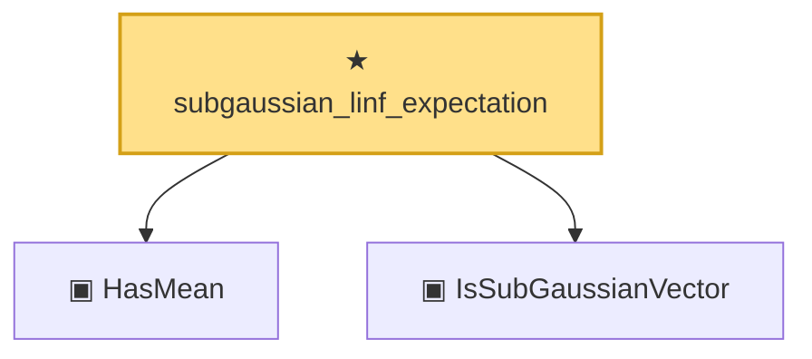

# Proof narrative — subgaussian_linf_expectation

Root: **subgaussian_linf_expectation** (theorem) `Statlib/HighDim/Concentration/SubGaussianMax.lean:144` · topic `HighDim`
Closure: 3 declarations across 2 files. Generated from `proof_graph.json` — no files were moved.

Reading order (foundations first, headline last):

  ▣ `HasMean` — structure · `Statlib/HighDim/Vocabulary/RandomVector.lean:83`  _(also used by 57: coord_mul_integral_eq_zero_of_indep, offDiagQuadForm_integral_eq_zero_of_indep, offDiagQuadForm_centered_eq_self_of_indep, …)_
  ▣ `IsSubGaussianVector` — structure · `Statlib/HighDim/Vocabulary/RandomVector.lean:52`  _(also used by 73: decoupledOffDiagQuadForm_const_right_subgaussian, decoupledOffDiagQuadForm_const_right_abs_tail_real, decoupledOffDiagQuadForm_prod_first_section_abs_tail_real, …)_
★ `subgaussian_linf_expectation` — theorem · `Statlib/HighDim/Concentration/SubGaussianMax.lean:144` **← headline**

## Dependency diagram

