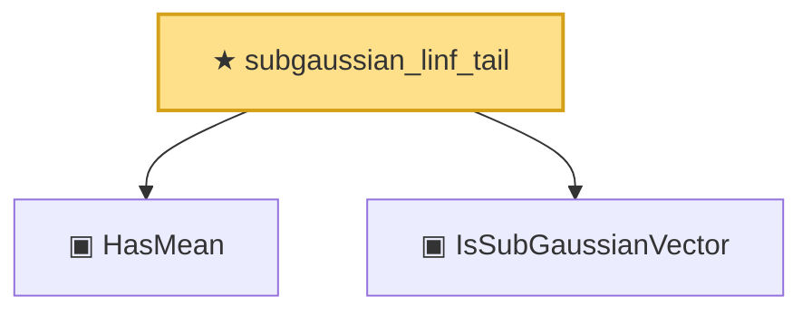

# Proof narrative — subgaussian_linf_tail

Root: **subgaussian_linf_tail** (theorem) `Statlib/HighDim/SubGaussianMax.lean:38` · topic `HighDim`
Closure: 3 declarations across 2 files. Generated from `proof_graph.json` — no files were moved.

Reading order (foundations first, headline last):

  ▣ `HasMean` — structure · `Statlib/Vocabulary/RandomVector.lean:83`  _(also used by 10: hanson_wright, hanson_wright_isotropic, secondMoment_eq_cov_centered, …)_
  ▣ `IsSubGaussianVector` — structure · `Statlib/Vocabulary/RandomVector.lean:52`  _(also used by 11: hanson_wright, hanson_wright_isotropic, subgaussian_variance_bound, …)_
★ `subgaussian_linf_tail` — theorem · `Statlib/HighDim/SubGaussianMax.lean:38` **← headline**

## Dependency diagram

