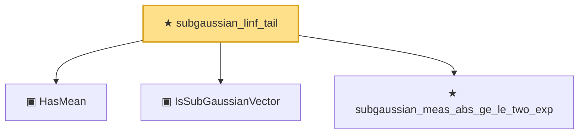

# Proof narrative — subgaussian_linf_tail

Root: **subgaussian_linf_tail** (theorem) `Statlib/HighDim/Concentration/SubGaussianMax.lean:40` · topic `HighDim`
Closure: 4 declarations across 3 files. Generated from `proof_graph.json` — no files were moved.

Reading order (foundations first, headline last):

  ▣ `HasMean` — structure · `Statlib/HighDim/Vocabulary/RandomVector.lean:83`  _(also used by 38: coord_mul_integral_eq_zero_of_indep, offDiagQuadForm_integral_eq_zero_of_indep, offDiagQuadForm_centered_eq_self_of_indep, …)_
  ▣ `IsSubGaussianVector` — structure · `Statlib/HighDim/Vocabulary/RandomVector.lean:52`  _(also used by 79: decoupledOffDiagQuadForm_const_right_subgaussian, decoupledOffDiagQuadForm_const_right_abs_tail_real, decoupledOffDiagQuadForm_prod_first_section_abs_tail_real, …)_
  ★ `subgaussian_meas_abs_ge_le_two_exp` — theorem · `Statlib/StatFoundation/RandomVariable/SubGaussian/subgaussian_meas_abs_ge_le_two_exp.lean:9`  _(also used by 4: lasso_noise_condition, subgaussian_even_moment_le, subgaussian_exp_sq_le_at_one_third, …)_
★ `subgaussian_linf_tail` — theorem · `Statlib/HighDim/Concentration/SubGaussianMax.lean:40` **← headline**

## Dependency diagram

