# Proof narrative — subgaussian_rip_sample_complexity

Root: **subgaussian_rip_sample_complexity** (theorem) `Statlib/HighDim/Geometry/RIPConstruction.lean:1619` · topic `HighDim`
Closure: 52 declarations across 17 files. Generated from `proof_graph.json` — no files were moved.

Reading order (foundations first, headline last):

    ▣ `HasCovarianceMatrix` — structure · `Statlib/HighDim/Vocabulary/RandomVector.lean:101`  _(also used by 17: cov_quadratic_deviation, secondMoment_isSymm, secondMoment_posSemidef, …)_
  ◆ `IsIsotropic` — def · `Statlib/HighDim/Vocabulary/RandomVector.lean:109`  _(also used by 6: quadratic_form_mean_isotropic, hanson_wright_isotropic, subgaussian_norm_sq_subexponential, …)_
  ▣ `IsSubGaussianVector` — structure · `Statlib/HighDim/Vocabulary/RandomVector.lean:52`  _(also used by 75: decoupledOffDiagQuadForm_const_right_subgaussian, decoupledOffDiagQuadForm_const_right_abs_tail_real, decoupledOffDiagQuadForm_prod_first_section_abs_tail_real, …)_
    ◆ `IsSparse` — def · `Statlib/HighDim/Vocabulary/Sparse.lean:36`  _(also used by 11: log_covering_number_sparse, isSparse_mono, isSparse_neg, …)_
    ◆ `l2NormSq` — noncomputable def · `Statlib/HighDim/Vocabulary/Norms.lean:13`  _(also used by 25: matrixRowVec_norm_sq, offDiagCoeffVec_norm_sq_le_frobenius, offDiagCoeffVec_norm_sq_integral_le_frobenius, …)_
  ◆ `SatisfiesRIP` — def · `Statlib/HighDim/Vocabulary/DesignMatrix.lean:62`  _(also used by 4: rip_cross_term_abs_le_half_delta_sum, rip_lower_restrictTo, rip_upper_restrictTo, …)_
    · `inner_eq_sum` — lemma · `Statlib/HighDim/Vocabulary/Norms.lean:32`  _(also used by 9: decoupledOffDiagQuadForm_eq_inner_coeff, offDiagCoeffVec_apply_eq_inner_row_zeroDiag, subgaussian_vector_coord, …)_
    · `cosh_ge_one_add_half_sq` — lemma · `Statlib/StatFoundation/RandomVariable/SubGaussian/subgaussian_fourth_moment_le.lean:8`  _(also used by 1: cosh_ge_one_add_half_sq_add_quart)_
    ★ `subgaussian_variance_le` — theorem · `Statlib/StatFoundation/RandomVariable/SubGaussian/subgaussian_variance_le.lean:8`  _(also used by 1: subgaussian_projection_second_moment_le)_
    · `euclidean_norm_sq` — lemma · `Statlib/HighDim/Vocabulary/Norms.lean:21`  _(also used by 9: matrixRowVec_norm_sq, offDiagCoeffVec_norm_sq_le_frobenius, offDiagCoeffVec_norm_sq_integral_le_frobenius, …)_
    ▣ `HasSubexponentialMGF` — structure · `Statlib/StatFoundation/Vocabulary/RandomVariable.lean:74`  _(also used by 23: coord_mul_subexponential_exists_of_indep, subexponential_mgf_const_mul, subexponential_mgf_const_mul_relaxed, …)_
    · `subgaussian_integral_eq_zero` — lemma · `Statlib/HighDim/Geometry/RIPConstruction.lean:46`  _(also used by 1: subgaussianVector_hasMean_zero)_
      · `scalar_sq_centered_exp_integrable` — lemma · `Statlib/HighDim/CovarianceMatrix/SampleCovariance.lean:393`
        · `sub_gauss_tail_abs` — lemma · `Statlib/StatFoundation/RandomVariable/SubExponential/subexp_mgf_le_of_sq_subgaussian.lean:13`  _(also used by 1: sub_gauss_tail_sq)_
        · `sq_le_two_mul_exp` — lemma · `Statlib/StatFoundation/RandomVariable/SubGaussian/sq_le_two_mul_exp.lean:10`
          ★ `subgaussian_meas_abs_ge_le_two_exp` — theorem · `Statlib/StatFoundation/RandomVariable/SubGaussian/subgaussian_meas_abs_ge_le_two_exp.lean:9`  _(also used by 3: subgaussian_linf_tail, lasso_noise_condition, subgaussian_even_moment_le)_
        ★ `subgaussian_exp_sq_le_at_one_third` — theorem · `Statlib/StatFoundation/RandomVariable/SubGaussian/subgaussian_exp_sq_le_at_one_third.lean:14`
        ★ `subgaussian_integrable_exp_sq_at_one_third` — theorem · `Statlib/StatFoundation/RandomVariable/SubGaussian/subgaussian_exp_sq_le_at_one_third.lean:166`  _(also used by 3: coord_mul_subexponential_exists_of_indep, coord_sq_centered_scaled_exp_integrable, coord_sq_centered_subexponential_exists)_
      ★ `subexp_mgf_le_of_sq_subgaussian_explicit` — theorem · `Statlib/StatFoundation/RandomVariable/SubExponential/subexp_mgf_le_of_sq_subgaussian.lean:72`  _(also used by 2: coord_sq_centered_mgf_bound_explicit, subexp_mgf_le_of_sq_subgaussian)_
    · `scalar_sq_centered_subexponential_explicit` — lemma · `Statlib/HighDim/CovarianceMatrix/SampleCovariance.lean:451`  _(also used by 3: cov_quadratic_deviation, sampleCovariance_concentration, jl_single_pair)_
    ★ `bernstein_sum_meas_abs_ge_le_two_exp` — theorem · `Statlib/StatFoundation/Concentration/ExponentialType/bernstein_sum_meas_abs_ge_le_two_exp.lean:13`  _(also used by 4: weighted_coord_sq_centered_sum_tail_explicit, diag_hanson_wright_tail_high, sampleCovariance_concentration, …)_
      ★ `covering_number_euclidean_ball` — theorem · `Statlib/HighDim/Geometry/CoveringNumbers.lean:42`
      · `euclidean_norm_eq` — lemma · `Statlib/HighDim/Vocabulary/Norms.lean:27`  _(also used by 1: log_covering_number_sparse)_
    ★ `covering_number_sparse_ball` — theorem · `Statlib/HighDim/Geometry/CoveringNumbers.lean:405`
    · `mulVec_smul_vec` — lemma · `Statlib/HighDim/Geometry/RIPConstruction.lean:217`
    · `l2NormSq_smul` — lemma · `Statlib/HighDim/Geometry/RIPConstruction.lean:209`
    ◆ `sampleSecondMoment` — noncomputable def · `Statlib/HighDim/CovarianceMatrix/SampleCovariance.lean:190`  _(also used by 7: sample_cov_min_eig_lower, sample_cov_max_eig_upper, sample_covariance_quadratic_eq_centered_projection_sum, …)_
    ◆ `restrictByEquiv` — def · `Statlib/HighDim/Vocabulary/Restrictions.lean:15`  _(also used by 4: measurable_restrictByEquiv, restrictByEquiv_hasMean_zero, restrictByEquiv_cov_identity, …)_
    ◆ `extendByEquiv` — def · `Statlib/HighDim/Vocabulary/Restrictions.lean:20`  _(also used by 1: restrictByEquiv_subgaussian)_
        · `extendByEquiv_l2NormSq` — lemma · `Statlib/HighDim/Geometry/RIPConstruction.lean:368`
    · `extendByEquiv_norm` — lemma · `Statlib/HighDim/Geometry/RIPConstruction.lean:398`  _(also used by 1: restrictByEquiv_subgaussian)_
    · `extendByEquiv_restrictByEquiv_of_support` — lemma · `Statlib/HighDim/Geometry/RIPConstruction.lean:403`
    · `restrictByEquiv_norm_of_support` — lemma · `Statlib/HighDim/Geometry/RIPConstruction.lean:420`
    · `restrictByEquiv_dist_of_support` — lemma · `Statlib/HighDim/Geometry/RIPConstruction.lean:428`
    · `restrictByEquiv_extendByEquiv` — lemma · `Statlib/HighDim/Geometry/RIPConstruction.lean:413`
    · `sampleSecondMoment_isSymm` — lemma · `Statlib/HighDim/CovarianceMatrix/SampleCovariance.lean:196`  _(also used by 2: sampleCovariance_concentration, pca_eigvec_perturbation)_
    · `real_isHermitian_of_isSymm` — lemma · `Statlib/HighDim/CovarianceMatrix/SampleCovariance.lean:178`  _(also used by 2: sampleCovariance_concentration, pca_eigvec_perturbation)_
    ◆ `toEuclidean` — noncomputable def · `Statlib/HighDim/Vocabulary/Norms.lean:41`  _(also used by 2: sample_covariance_quadratic_eq_centered_projection_sum, sampleCovariance_concentration)_
        · `hermitian_norm_eq_diagonal_eigenvalues` — lemma · `Statlib/HighDim/CovarianceMatrix/SampleCovariance.lean:38`
        · `pi_real_norm_eq_sup_abs` — lemma · `Statlib/HighDim/CovarianceMatrix/SampleCovariance.lean:58`
      · `hermitian_norm_eq_sup_abs_eigenvalues` — lemma · `Statlib/HighDim/CovarianceMatrix/SampleCovariance.lean:68`
    · `hermitian_norm_le_two_net_sup` — lemma · `Statlib/HighDim/CovarianceMatrix/SampleCovariance.lean:77`  _(also used by 1: sampleCovariance_concentration)_
      · `matrix_quadratic_eq_sum` — lemma · `Statlib/HighDim/CovarianceMatrix/SampleCovariance.lean:315`  _(also used by 1: sample_covariance_quadratic_eq_centered_projection_sum)_
        · `fin_sum_comm_three` — lemma · `Statlib/HighDim/CovarianceMatrix/SampleCovariance.lean:327`
      · `sampleSecondMoment_quadratic_eq_projection_sum` — lemma · `Statlib/HighDim/CovarianceMatrix/SampleCovariance.lean:337`  _(also used by 1: sample_covariance_quadratic_eq_centered_projection_sum)_
      · `restrictByEquiv_inner_eq` — lemma · `Statlib/HighDim/Geometry/RIPConstruction.lean:442`  _(also used by 1: restrictByEquiv_subgaussian)_
    · `restricted_sample_deviation_quadratic` — lemma · `Statlib/HighDim/Geometry/RIPConstruction.lean:490`
    · `exists_support_card_eq_of_isSparse` — lemma · `Statlib/HighDim/Geometry/RIPConstruction.lean:120`
      · `abs_rayleigh_le_l2_opNorm` — lemma · `Statlib/HighDim/SpectralPerturbation/Eigenvalues.lean:159`  _(also used by 5: inner_self_op_le_l2_opNorm_mul_norm_sq, sortedEigenvalues_zero_le_rayleigh, rayleigh_le_sortedEigenvalues_last, …)_
    · `abs_quadratic_le_opNorm_mul_norm_sq` — lemma · `Statlib/HighDim/Geometry/RIPConstruction.lean:549`
  ★ `subgaussian_rip_tail` — theorem · `Statlib/HighDim/Geometry/RIPConstruction.lean:582`
★ `subgaussian_rip_sample_complexity` — theorem · `Statlib/HighDim/Geometry/RIPConstruction.lean:1619` **← headline**

## Dependency diagram

```mermaid
flowchart TD
  n0["▣ HasCovarianceMatrix"]
  n1["◆ IsIsotropic"]
  n2["▣ IsSubGaussianVector"]
  n3["◆ IsSparse"]
  n4["◆ l2NormSq"]
  n5["◆ SatisfiesRIP"]
  n6["· inner_eq_sum"]
  n7["· cosh_ge_one_add_half_sq"]
  n8["★ subgaussian_variance_le"]
  n9["· euclidean_norm_sq"]
  n10["▣ HasSubexponentialMGF"]
  n11["· subgaussian_integral_eq_zero"]
  n12["· scalar_sq_centered_exp_integrable"]
  n13["· sub_gauss_tail_abs"]
  n14["· sq_le_two_mul_exp"]
  n15["★ subgaussian_meas_abs_ge_le_two_exp"]
  n16["★ subgaussian_exp_sq_le_at_one_third"]
  n17["★ subgaussian_integrable_exp_sq_at_one_third"]
  n18["★ subexp_mgf_le_of_sq_subgaussian_explicit"]
  n19["· scalar_sq_centered_subexponential_explicit"]
  n20["★ bernstein_sum_meas_abs_ge_le_two_exp"]
  n21["★ covering_number_euclidean_ball"]
  n22["· euclidean_norm_eq"]
  n23["★ covering_number_sparse_ball"]
  n24["· mulVec_smul_vec"]
  n25["· l2NormSq_smul"]
  n26["◆ sampleSecondMoment"]
  n27["◆ restrictByEquiv"]
  n28["◆ extendByEquiv"]
  n29["· extendByEquiv_l2NormSq"]
  n30["· extendByEquiv_norm"]
  n31["· extendByEquiv_restrictByEquiv_of_support"]
  n32["· restrictByEquiv_norm_of_support"]
  n33["· restrictByEquiv_dist_of_support"]
  n34["· restrictByEquiv_extendByEquiv"]
  n35["· sampleSecondMoment_isSymm"]
  n36["· real_isHermitian_of_isSymm"]
  n37["◆ toEuclidean"]
  n38["· hermitian_norm_eq_diagonal_eigenvalues"]
  n39["· pi_real_norm_eq_sup_abs"]
  n40["· hermitian_norm_eq_sup_abs_eigenvalues"]
  n41["· hermitian_norm_le_two_net_sup"]
  n42["· matrix_quadratic_eq_sum"]
  n43["· fin_sum_comm_three"]
  n44["· sampleSecondMoment_quadratic_eq_projection_sum"]
  n45["· restrictByEquiv_inner_eq"]
  n46["· restricted_sample_deviation_quadratic"]
  n47["· exists_support_card_eq_of_isSparse"]
  n48["· abs_rayleigh_le_l2_opNorm"]
  n49["· abs_quadratic_le_opNorm_mul_norm_sq"]
  n50["★ subgaussian_rip_tail"]
  n51["★ subgaussian_rip_sample_complexity"]
  n1 --> n0
  n5 --> n3
  n5 --> n4
  n9 --> n4
  n16 --> n15
  n17 --> n15
  n18 --> n13
  n18 --> n14
  n18 --> n16
  n18 --> n17
  n19 --> n12
  n19 --> n18
  n20 --> n10
  n22 --> n4
  n22 --> n9
  n23 --> n3
  n23 --> n21
  n23 --> n4
  n23 --> n22
  n25 --> n4
  n29 --> n4
  n29 --> n28
  n30 --> n28
  n30 --> n22
  n30 --> n29
  n31 --> n28
  n31 --> n27
  n32 --> n27
  n32 --> n30
  n32 --> n31
  n33 --> n27
  n33 --> n32
  n34 --> n27
  n34 --> n28
  n35 --> n26
  n40 --> n38
  n40 --> n39
  n41 --> n37
  n41 --> n40
  n42 --> n37
  n42 --> n6
  n44 --> n37
  n44 --> n26
  n44 --> n42
  n44 --> n43
  n44 --> n6
  n45 --> n27
  n45 --> n28
  n45 --> n6
  n46 --> n27
  n46 --> n37
  n46 --> n26
  n46 --> n4
  n46 --> n28
  n46 --> n42
  n46 --> n9
  n46 --> n44
  n46 --> n45
  n46 --> n6
  n47 --> n3
  n49 --> n37
  n49 --> n48
  n50 --> n1
  n50 --> n2
  n50 --> n5
  n50 --> n4
  n50 --> n0
  n50 --> n6
  n50 --> n7
  n50 --> n8
  n50 --> n9
  n50 --> n10
  n50 --> n11
  n50 --> n19
  n50 --> n20
  n50 --> n23
  n50 --> n24
  n50 --> n25
  n50 --> n26
  n50 --> n27
  n50 --> n32
  n50 --> n28
  n50 --> n30
  n50 --> n33
  n50 --> n34
  n50 --> n35
  n50 --> n36
  n50 --> n41
  n50 --> n37
  n50 --> n31
  n50 --> n46
  n50 --> n47
  n50 --> n49
  n51 --> n1
  n51 --> n2
  n51 --> n5
  n51 --> n50
  class n51 headline;
  classDef headline fill:#ffe08a,stroke:#d4a017,stroke-width:2px;
  classDef axiomNode fill:#ffd0d0,stroke:#c0392b,stroke-dasharray:4 2;
```

