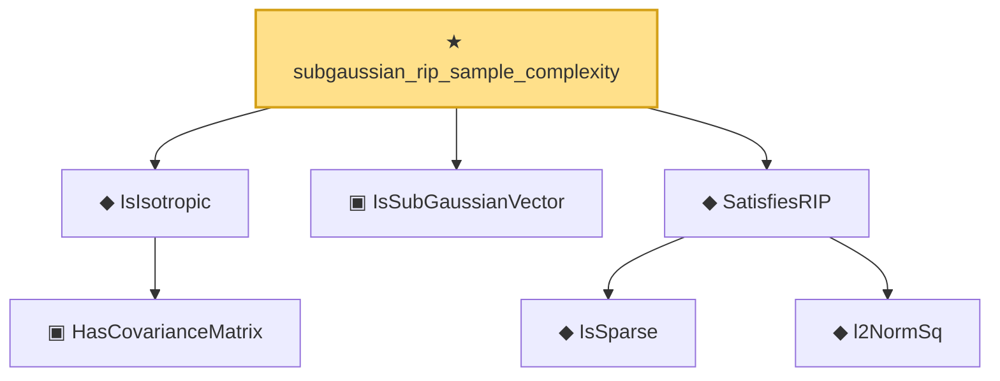

# Proof narrative — subgaussian_rip_sample_complexity

Root: **subgaussian_rip_sample_complexity** (theorem) `Statlib/HighDim/RIPConstruction.lean:67` · topic `HighDim`
Closure: 7 declarations across 5 files. Generated from `proof_graph.json` — no files were moved.

Reading order (foundations first, headline last):

    ▣ `HasCovarianceMatrix` — structure · `Statlib/Vocabulary/RandomVector.lean:101`  _(also used by 8: secondMoment_isSymm, secondMoment_posSemidef, secondMoment_eq_cov_centered, …)_
  ◆ `IsIsotropic` — def · `Statlib/Vocabulary/RandomVector.lean:109`  _(also used by 6: quadratic_form_mean_isotropic, hanson_wright_isotropic, subgaussian_norm_sq_subexponential, …)_
  ▣ `IsSubGaussianVector` — structure · `Statlib/Vocabulary/RandomVector.lean:52`  _(also used by 11: hanson_wright, hanson_wright_isotropic, subgaussian_variance_bound, …)_
    ◆ `IsSparse` — def · `Statlib/Vocabulary/Sparse.lean:36`  _(also used by 2: covering_number_sparse_ball, log_covering_number_sparse)_
    ◆ `l2NormSq` — def · `Statlib/Regression/l2NormSq.lean:14`  _(also used by 8: IsRidgeEstimator.shrinkage_bound, elasticNetLoss, elasticNetLoss_nonneg, …)_
  ◆ `SatisfiesRIP` — def · `Statlib/Vocabulary/DesignMatrix.lean:63`  _(also used by 2: subgaussian_rip_tail, rip_implies_re)_
★ `subgaussian_rip_sample_complexity` — theorem · `Statlib/HighDim/RIPConstruction.lean:67` **← headline**

## Dependency diagram

