# Proof narrative — subgaussian_rip_tail_anisotropic

Root: **subgaussian_rip_tail_anisotropic** (theorem) `Statlib/HighDim/Geometry/SubGaussianRIPTailAnisotropic.lean:381` · topic `HighDim`
Closure: 26 declarations across 7 files. Generated from `proof_graph.json` — no files were moved.

Reading order (foundations first, headline last):

  ▣ `HasCovarianceMatrix` — structure · `Statlib/HighDim/Vocabulary/RandomVector.lean:101`  _(also used by 19: cov_diagonal_concentration, cov_quadratic_deviation, cov_trace_concentration, …)_
  ▣ `IsSubGaussianVector` — structure · `Statlib/HighDim/Vocabulary/RandomVector.lean:52`  _(also used by 77: decoupledOffDiagQuadForm_const_right_subgaussian, decoupledOffDiagQuadForm_const_right_abs_tail_real, decoupledOffDiagQuadForm_prod_first_section_abs_tail_real, …)_
  ◆ `IsSparse` — def · `Statlib/HighDim/Vocabulary/Sparse.lean:36`  _(also used by 13: log_covering_number_sparse, isSparse_mono, isSparse_neg, …)_
  ◆ `l2NormSq` — noncomputable def · `Statlib/HighDim/Vocabulary/Norms.lean:13`  _(also used by 53: matrixRowVec_norm_sq, offDiagCoeffVec_norm_sq_le_frobenius, offDiagCoeffVec_norm_sq_integral_le_frobenius, …)_
    ★ `covering_number_euclidean_ball` — theorem · `Statlib/HighDim/Geometry/CoveringNumbers.lean:42`  _(also used by 1: operator_norm_subgaussian_matrix)_
  · `euclidean_norm_sq` — lemma · `Statlib/HighDim/Vocabulary/Norms.lean:21`  _(also used by 13: matrixRowVec_norm_sq, offDiagCoeffVec_norm_sq_le_frobenius, offDiagCoeffVec_norm_sq_integral_le_frobenius, …)_
    · `euclidean_norm_eq` — lemma · `Statlib/HighDim/Vocabulary/Norms.lean:27`  _(also used by 2: log_covering_number_sparse, extendByEquiv_norm)_
  ★ `covering_number_sparse_ball` — theorem · `Statlib/HighDim/Geometry/CoveringNumbers.lean:477`  _(also used by 1: subgaussian_rip_tail)_
  · `inner_eq_sum` — lemma · `Statlib/HighDim/Vocabulary/Norms.lean:32`  _(also used by 14: decoupledOffDiagQuadForm_eq_inner_coeff, offDiagCoeffVec_apply_eq_inner_row_zeroDiag, subgaussian_vector_coord, …)_
  · `projection_sq_integral_eq_cov_quadratic` — lemma · `Statlib/HighDim/CovarianceMatrix/SampleCovariance.lean:256`  _(also used by 1: sample_covariance_quadratic_eq_centered_projection_sum)_
  · `subgaussian_variance_bound` — lemma · `Statlib/HighDim/CovarianceMatrix/Properties.lean:142`  _(also used by 1: subgaussian_cov_offdiag_bound)_
  ◆ `toEuclidean` — noncomputable def · `Statlib/HighDim/Vocabulary/Norms.lean:41`  _(also used by 9: hermitian_norm_le_two_net_sup, matrix_quadratic_eq_sum, sampleSecondMoment_quadratic_eq_projection_sum, …)_
  · `bilD` — private noncomputable def · `Statlib/HighDim/Geometry/SubGaussianRIPTailAnisotropic.lean:34`
    · `bilD_diag_continuous` — private lemma · `Statlib/HighDim/Geometry/SubGaussianRIPTailAnisotropic.lean:119`
        · `row_smul` — private lemma · `Statlib/HighDim/Geometry/SubGaussianRIPTailAnisotropic.lean:42`
    · `bilD_smul_left` — private lemma · `Statlib/HighDim/Geometry/SubGaussianRIPTailAnisotropic.lean:66`
    · `bilD_zero_left` — private lemma · `Statlib/HighDim/Geometry/SubGaussianRIPTailAnisotropic.lean:142`
    · `bilD_smul_right` — private lemma · `Statlib/HighDim/Geometry/SubGaussianRIPTailAnisotropic.lean:101`
  · `bilD_diag_smul` — private lemma · `Statlib/HighDim/Geometry/SubGaussianRIPTailAnisotropic.lean:146`
      · `row_add` — private lemma · `Statlib/HighDim/Geometry/SubGaussianRIPTailAnisotropic.lean:38`
    · `bilD_add_left` — private lemma · `Statlib/HighDim/Geometry/SubGaussianRIPTailAnisotropic.lean:48`
    · `bilD_add_right` — private lemma · `Statlib/HighDim/Geometry/SubGaussianRIPTailAnisotropic.lean:83`
    · `bilD_zero_right` — private lemma · `Statlib/HighDim/Geometry/SubGaussianRIPTailAnisotropic.lean:138`
    · `bilD_polar` — private lemma · `Statlib/HighDim/Geometry/SubGaussianRIPTailAnisotropic.lean:150`
  · `sparse_quadform_net_bound` — private lemma · `Statlib/HighDim/Geometry/SubGaussianRIPTailAnisotropic.lean:163`
★ `subgaussian_rip_tail_anisotropic` — theorem · `Statlib/HighDim/Geometry/SubGaussianRIPTailAnisotropic.lean:381` **← headline**

## Dependency diagram

```mermaid
flowchart TD
  n0["▣ HasCovarianceMatrix"]
  n1["▣ IsSubGaussianVector"]
  n2["◆ IsSparse"]
  n3["◆ l2NormSq"]
  n4["★ covering_number_euclidean_ball"]
  n5["· euclidean_norm_sq"]
  n6["· euclidean_norm_eq"]
  n7["★ covering_number_sparse_ball"]
  n8["· inner_eq_sum"]
  n9["· projection_sq_integral_eq_cov_quadratic"]
  n10["· subgaussian_variance_bound"]
  n11["◆ toEuclidean"]
  n12["· bilD"]
  n13["· bilD_diag_continuous"]
  n14["· row_smul"]
  n15["· bilD_smul_left"]
  n16["· bilD_zero_left"]
  n17["· bilD_smul_right"]
  n18["· bilD_diag_smul"]
  n19["· row_add"]
  n20["· bilD_add_left"]
  n21["· bilD_add_right"]
  n22["· bilD_zero_right"]
  n23["· bilD_polar"]
  n24["· sparse_quadform_net_bound"]
  n25["★ subgaussian_rip_tail_anisotropic"]
  n5 --> n3
  n6 --> n3
  n6 --> n5
  n7 --> n2
  n7 --> n4
  n7 --> n3
  n7 --> n6
  n9 --> n0
  n9 --> n8
  n10 --> n1
  n10 --> n0
  n13 --> n12
  n15 --> n12
  n15 --> n14
  n16 --> n12
  n16 --> n15
  n17 --> n12
  n17 --> n14
  n18 --> n12
  n18 --> n15
  n18 --> n17
  n20 --> n12
  n20 --> n19
  n21 --> n12
  n21 --> n19
  n22 --> n12
  n22 --> n17
  n23 --> n12
  n23 --> n20
  n23 --> n21
  n23 --> n15
  n23 --> n17
  n24 --> n12
  n24 --> n13
  n24 --> n16
  n24 --> n18
  n24 --> n20
  n24 --> n21
  n24 --> n22
  n24 --> n15
  n24 --> n17
  n24 --> n23
  n25 --> n0
  n25 --> n1
  n25 --> n2
  n25 --> n3
  n25 --> n7
  n25 --> n9
  n25 --> n8
  n25 --> n10
  n25 --> n11
  n25 --> n5
  n25 --> n12
  n25 --> n24
  n25 --> n18
  class n25 headline;
  classDef headline fill:#ffe08a,stroke:#d4a017,stroke-width:2px;
  classDef axiomNode fill:#ffd0d0,stroke:#c0392b,stroke-dasharray:4 2;
```

