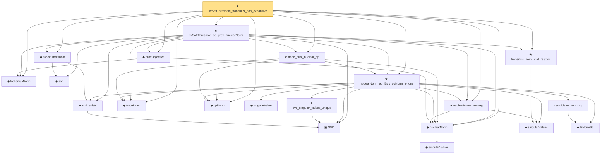

# Proof narrative — svSoftThreshold_frobenius_non_expansive

Root: **svSoftThreshold_frobenius_non_expansive** (theorem) `Statlib/HighDim/MatrixAnalysis/SvSoftThreshold.lean:886` · topic `HighDim`
Closure: 21 declarations across 7 files. Generated from `proof_graph.json` — no files were moved.

Reading order (foundations first, headline last):

  ◆ `frobeniusNorm` — def · `Statlib/HighDim/MatrixAnalysis/SvSoftThreshold.lean:26`  _(also used by 10: hard_sv_threshold_is_rank_constrained_minimizer, low_rank_frobenius_error_decomposition, nuclear_norm_le_sqrt_rank_mul_frobenius, …)_
    ▣ `SVD` — structure · `Statlib/HighDim/Vocabulary/SVD.lean:37`  _(also used by 33: sorted_svd_exists, sv_diag_singularValues, low_rank_frobenius_error_decomposition, …)_
    ★ `svd_exists` — theorem · `Statlib/HighDim/MatrixAnalysis/SVDFoundation.lean:20`  _(also used by 5: sorted_svd_exists, nuclearNorm_add_le, svd_sorted_exists, …)_
    ◆ `soft` — def · `Statlib/HighDim/MatrixAnalysis/SvSoftThreshold.lean:22`
  ◆ `svSoftThreshold` — def · `Statlib/HighDim/MatrixAnalysis/SvSoftThreshold.lean:31`
      ◆ `singularValues` — noncomputable def · `Statlib/HighDim/Vocabulary/SVD.lean:108`  _(also used by 2: svd_sorted_exists, leftSingularVectors)_
  ◆ `nuclearNorm` — noncomputable def · `Statlib/HighDim/Vocabulary/SVD.lean:151`  _(also used by 4: nuclear_norm_le_sqrt_rank_mul_frobenius, nuclearNorm_add_le, rank_constrained_denoising_frobenius_bound_s2, …)_
  ◆ `proxObjective` — def · `Statlib/HighDim/MatrixAnalysis/SvSoftThreshold.lean:37`
      ◆ `singularValues` — noncomputable def · `Statlib/HighDim/MatrixAnalysis/SingularValueProperties.lean:22`  _(also used by 20: sorted_svd_exists, ky_fan_singular_values_product, sv_diag_singularValues, …)_
  ★ `frobenius_norm_svd_relation` — theorem · `Statlib/HighDim/MatrixAnalysis/FrobeniusNormSvdRelation.lean:11`  _(also used by 2: low_rank_frobenius_error_decomposition, nuclear_norm_le_sqrt_rank_mul_frobenius)_
  ◆ `traceInner` — noncomputable def · `Statlib/HighDim/MatrixAnalysis/NuclearNormProperties.lean:18`  _(also used by 3: nuclearNorm_add_le, rank_constrained_denoising_frobenius_bound_s2, rank_constrained_denoising_frobenius_bound_s3)_
  ◆ `opNorm` — noncomputable def · `Statlib/HighDim/MatrixAnalysis/NuclearNormProperties.lean:13`  _(also used by 17: nuclearNorm_add_le, opNorm_vec_le, opNorm_eq_l2, …)_
        ◆ `singularValue` — def · `Statlib/HighDim/Vocabulary/SVD.lean:79`  _(also used by 23: nuclearNorm_add_le, von_neumann_trace_inequality, svd_rank1_decomposition, …)_
        ◆ `l2NormSq` — noncomputable def · `Statlib/HighDim/Vocabulary/Norms.lean:13`  _(also used by 220: matrixRowVec_norm_sq, offDiagCoeffVec_norm_sq_le_frobenius, offDiagCoeffVec_norm_sq_integral_le_frobenius, …)_
        · `euclidean_norm_sq` — lemma · `Statlib/HighDim/Vocabulary/Norms.lean:89`  _(also used by 31: matrixRowVec_norm_sq, offDiagCoeffVec_norm_sq_le_frobenius, offDiagCoeffVec_norm_sq_integral_le_frobenius, …)_
        ★ `svd_singular_values_unique` — theorem · `Statlib/HighDim/MatrixAnalysis/SVDFoundation.lean:663`  _(also used by 4: sv_diag_singularValues, low_rank_frobenius_error_decomposition, von_neumann_trace_inequality, …)_
  ★ `nuclearNorm_nonneg` — theorem · `Statlib/HighDim/MatrixAnalysis/NuclearNormProperties.lean:22`
  ★ `nuclearNorm_eq_iSup_opNorm_le_one` — theorem · `Statlib/HighDim/MatrixAnalysis/NuclearNormProperties.lean:1269`
  ★ `trace_dual_nuclear_op` — theorem · `Statlib/HighDim/MatrixAnalysis/NuclearNormProperties.lean:2847`  _(also used by 2: rank_constrained_denoising_frobenius_bound_s2, rank_constrained_denoising_frobenius_bound_s3)_
  ★ `svSoftThreshold_eq_prox_nuclearNorm` — theorem · `Statlib/HighDim/MatrixAnalysis/SvSoftThreshold.lean:42`
★ `svSoftThreshold_frobenius_non_expansive` — theorem · `Statlib/HighDim/MatrixAnalysis/SvSoftThreshold.lean:886` **← headline**

## Dependency diagram

