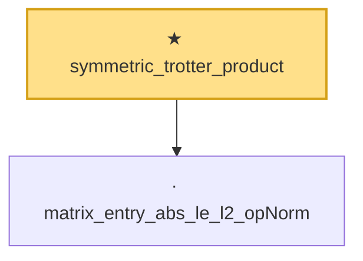

# Proof narrative — symmetric_trotter_product

Root: **symmetric_trotter_product** (theorem) `Statlib/HighDim/MatrixAnalysis/GoldenThompson.lean:44` · topic `HighDim`
Closure: 2 declarations across 2 files. Generated from `proof_graph.json` — no files were moved.

Reading order (foundations first, headline last):

  · `matrix_entry_abs_le_l2_opNorm` — lemma · `Statlib/HighDim/Concentration/HansonWright.lean:350`  _(also used by 2: diagPartMatrix_norm_le, diag_hanson_wright_tail_high)_
★ `symmetric_trotter_product` — theorem · `Statlib/HighDim/MatrixAnalysis/GoldenThompson.lean:44` **← headline**

## Dependency diagram

