# Proof narrative — tendstoInDistribution_debiasedLasso_scaledCenteredCoordinate_of_iid_scoreSum_and_l1_rowApprox_real

Root: **tendstoInDistribution_debiasedLasso_scaledCenteredCoordinate_of_iid_scoreSum_and_l1_rowApprox_real** (theorem) `Statlib/HighDim/Regression/DebiasingLasso.lean:804` · topic `HighDim`
Closure: 56 declarations across 13 files. Generated from `proof_graph.json` — no files were moved.

Reading order (foundations first, headline last):

  ◆ `standardizedSum` — abbrev · `Statlib/StatFoundation/Convergence/CentralLimitTheorem/IID.lean:21`  _(also used by 14: tendstoInDistribution_studentizedDebiasedLasso_coordinate_of_iid_scoreSum_l1_rowApprox_and_se_real, tendsto_measure_studentizedDebiasedLasso_coordinate_coverageEvent_of_iid_scoreSum_l1_rowApprox_and_se_real, tendsto_measure_debiasedLasso_waldCIHalfWidth_contains_coordinate_of_iid_scoreSum_l1_rowApprox_and_limitMeasureCalibration_real, …)_
  ◆ `HasCoordinatewiseAEMeasurable` — abbrev · `Statlib/StatFoundation/Vocabulary/FiniteCoordinate.lean:33`  _(also used by 44: tendstoInDistribution_debiasedLasso_scaledCenteredFiniteCoordinate_of_linearScore_and_l1_rowApprox_real, tendstoInDistribution_studentizedDebiasedLasso_coordinate_of_linearScore_l1_rowApprox_and_se_real, tendstoInDistribution_debiasedLasso_scaledCenteredFiniteCoordinate_of_scoreVector_and_l1_rowApprox_real, …)_
  ◆ `scaledCenteredFiniteCoordinate` — abbrev · `Statlib/StatFoundation/Vocabulary/FiniteCoordinate.lean:76`  _(also used by 35: tendstoInDistribution_debiasedLasso_scaledCenteredFiniteCoordinate_of_linearScore_and_l1_rowApprox_real, tendstoInDistribution_studentizedDebiasedLasso_coordinate_of_linearScore_l1_rowApprox_and_se_real, tendstoInDistribution_debiasedLasso_scaledCenteredFiniteCoordinate_of_scoreVector_and_l1_rowApprox_real, …)_
  ◆ `debiasedLassoEstimator` — noncomputable abbrev · `Statlib/HighDim/Vocabulary/DebiasingLasso.lean:39`  _(also used by 26: tendstoInDistribution_debiasedLasso_scaledCenteredFiniteCoordinate_of_linearScore_and_l1_rowApprox_real, tendstoInDistribution_studentizedDebiasedLasso_coordinate_of_linearScore_l1_rowApprox_and_se_real, tendstoInDistribution_debiasedLasso_scaledCenteredFiniteCoordinate_of_scoreVector_and_l1_rowApprox_real, …)_
    ◆ `debiasedLassoBiasMatrix` — noncomputable abbrev · `Statlib/HighDim/Vocabulary/DebiasingLasso.lean:22`
  ◆ `HasDebiasedLassoRowApproxError` — def · `Statlib/HighDim/Vocabulary/DebiasingLasso.lean:47`  _(also used by 26: tendstoInDistribution_debiasedLasso_scaledCenteredFiniteCoordinate_of_linearScore_and_l1_rowApprox_real, tendstoInDistribution_studentizedDebiasedLasso_coordinate_of_linearScore_l1_rowApprox_and_se_real, tendstoInDistribution_debiasedLasso_scaledCenteredFiniteCoordinate_of_scoreVector_and_l1_rowApprox_real, …)_
  ◆ `l1Norm` — noncomputable def · `Statlib/HighDim/Vocabulary/Norms.lean:17`  _(also used by 199: l1_linear_rademacher_complexity_bound, finite_l1_quadratic_rademacher_coord_bound, finite_l1_quadratic_rademacher_coord_energy_bound, …)_
  · `measurable_standardizedSum` — lemma · `Statlib/StatFoundation/Convergence/CentralLimitTheorem/IID.lean:24`  _(also used by 8: tendstoInDistribution_studentizedDebiasedLasso_coordinate_of_iid_scoreSum_l1_rowApprox_and_se_real, mle_asymptotic_normal, wald_statistic_asymptotic_chisq1, …)_
      · `lyapunov_third_moment` — lemma · `Statlib/StatFoundation/Convergence/AnalysisTools/CharacteristicFunction.lean:563`
        · `charfun_sum_indep` — lemma · `Statlib/StatFoundation/Convergence/AnalysisTools/CharacteristicFunction.lean:282`
      · `charfun_iid_sum_eq_prod` — lemma · `Statlib/StatFoundation/Convergence/AnalysisTools/CharacteristicFunction.lean:323`
      · `charFun_gaussianReal_standard` — lemma · `Statlib/StatFoundation/Convergence/AnalysisTools/CharacteristicFunction.lean:272`  _(also used by 1: lindeberg_feller_central_limit_theorem)_
            · `norm_ofReal_mul_I` — lemma · `Statlib/StatFoundation/Convergence/AnalysisTools/CharacteristicFunction.lean:16`  _(also used by 1: norm_cexp_sub_quadratic_le_third)_
          · `norm_cexp_sub_quadratic_le` — lemma · `Statlib/StatFoundation/Convergence/AnalysisTools/CharacteristicFunction.lean:22`  _(also used by 2: norm_cexp_sub_quadratic_le_sq, charfun_error_le_j)_
        · `charfun_taylor_third_moment` — lemma · `Statlib/StatFoundation/Convergence/AnalysisTools/CharacteristicFunction.lean:86`
        · `norm_prod_sub_prod_le_sum` — lemma · `Statlib/StatFoundation/Convergence/AnalysisTools/CharacteristicFunction.lean:187`
      · `charfun_prod_vs_pow_bound` — lemma · `Statlib/StatFoundation/Convergence/AnalysisTools/CharacteristicFunction.lean:419`
        · `complex_pow_approx_exp_decay` — lemma · `Statlib/StatFoundation/Convergence/AnalysisTools/CharacteristicFunction.lean:350`
      · `complex_pow_approx_exp` — lemma · `Statlib/StatFoundation/Convergence/AnalysisTools/CharacteristicFunction.lean:401`
        · `charfun_arith_aux` — lemma · `Statlib/StatFoundation/Convergence/AnalysisTools/CharacteristicFunction.lean:486`
      · `charfun_final_arithmetic` — lemma · `Statlib/StatFoundation/Convergence/AnalysisTools/CharacteristicFunction.lean:510`
    · `charfun_normalized_sum_bound` — lemma · `Statlib/StatFoundation/Convergence/AnalysisTools/CharacteristicFunction.lean:612`
        · `compl_Icc_eq_abs_gt` — lemma · `Statlib/StatFoundation/Convergence/AnalysisTools/LevyContinuity.lean:15`
          ★ `isTightMeasureSet_singleton` — theorem · `Statlib/StatFoundation/Convergence/AnalysisTools/Tightness.lean:113`  _(also used by 1: isTightMeasureSet_finiteRange)_
        ★ `isTight_finiteRange` — theorem · `Statlib/StatFoundation/Convergence/AnalysisTools/Tightness.lean:18`  _(also used by 1: isTightMeasureSet_range_map_of_isBigOInProbability_one_real)_
      ★ `isTight_of_charFun_tendsto` — theorem · `Statlib/StatFoundation/Convergence/AnalysisTools/LevyContinuity.lean:44`  _(also used by 1: isTight_of_charFun_tendsto_inner)_
        ★ `levy_forward` — theorem · `Statlib/StatFoundation/Convergence/AnalysisTools/LevyContinuity.lean:31`  _(also used by 1: cramer_wold_reverse)_
      · `charFun_eq_of_subseq` — lemma · `Statlib/StatFoundation/Convergence/AnalysisTools/LevyContinuity.lean:168`
      · `probMeasure_eq_of_charFun_eq` — lemma · `Statlib/StatFoundation/Convergence/AnalysisTools/LevyContinuity.lean:180`  _(also used by 2: t_statistic_asymptotic_normal, z_statistic_asymptotic_normal)_
    ★ `levy_continuity` — theorem · `Statlib/StatFoundation/Convergence/AnalysisTools/LevyContinuity.lean:223`  _(also used by 1: lindeberg_feller_central_limit_theorem)_
  ★ `iid_central_limit_theorem` — theorem · `Statlib/StatFoundation/Convergence/CentralLimitTheorem/IID.lean:43`  _(also used by 7: tendstoInDistribution_studentizedDebiasedLasso_coordinate_of_iid_scoreSum_l1_rowApprox_and_se_real, mle_asymptotic_normal, score_statistic_asymptotic_chisq1, …)_
      ◆ `WeakConvergence` — def · `Statlib/StatFoundation/Convergence/AnalysisTools/ConvergenceModes.lean:163`  _(also used by 8: mle_asymptotic_normal, wald_statistic_asymptotic_chisq1, score_statistic_asymptotic_chisq1, …)_
        ★ `tendstoInDistribution_iff_weakConvergence_law` — theorem · `Statlib/StatFoundation/Convergence/AnalysisTools/ConvergenceModes.lean:175`
      ★ `tendstoInDistribution_of_weakConvergence_law` — theorem · `Statlib/StatFoundation/Convergence/AnalysisTools/ConvergenceModes.lean:204`  _(also used by 2: t_statistic_asymptotic_normal, mestimator_asymptotic_normal)_
    ★ `tendstoInDistribution_of_probabilityMeasure_tendsto_and_gaussianReal_charFun` — theorem · `Statlib/StatFoundation/Convergence/AnalysisTools/LevyContinuity.lean:189`  _(also used by 6: tendstoInDistribution_studentizedDebiasedLasso_coordinate_of_scoreCoordinate_gaussian_clt_l1_rowApprox_and_se_real, tendstoInDistribution_debiasedLasso_scaledCenteredCoordinate_of_lindeberg_feller_scoreArray_and_l1_rowApprox_real, tendstoInDistribution_studentizedDebiasedLasso_coordinate_of_lindeberg_feller_scoreArray_l1_rowApprox_and_se_real, …)_
        ◆ `IsLittleOInProbability` — def · `Statlib/StatFoundation/Vocabulary/StochasticOrder.lean:58`  _(also used by 45: isLittleOInProbability_add, isLittleOInProbability_smul_rate, isLittleOInProbability_mul_rate, …)_
      ◆ `HasCoordinatewiseIsLittleOInProbability` — abbrev · `Statlib/StatFoundation/Vocabulary/FiniteCoordinate.lean:88`  _(also used by 5: tendstoInDistribution_debiasedLasso_scaledCenteredFiniteCoordinate_of_linearScore_and_l1_rowApprox_real, tendstoInDistribution_studentizedDebiasedLasso_coordinate_of_linearScore_l1_rowApprox_and_se_real, hasFiniteLinearCombinationIsLittleOInProbability_of_coordinatewise_real, …)_
      ◆ `debiasedLassoBiasRemainder` — noncomputable abbrev · `Statlib/HighDim/Vocabulary/DebiasingLasso.lean:28`  _(also used by 2: tendstoInDistribution_debiasedLasso_scaledCenteredFiniteCoordinate_of_linearScore_and_l1_rowApprox_real, tendstoInDistribution_studentizedDebiasedLasso_coordinate_of_linearScore_l1_rowApprox_and_se_real)_
          · `abs_sum_mul_le_l1Norm_mul_coord_bound` — lemma · `Statlib/HighDim/Vocabulary/Norms.lean:38`  _(also used by 6: l1_linear_rademacher_complexity_bound, finite_l1_quadratic_rademacher_coord_bound, finite_l1_quadratic_rademacher_sample_envelope_entrywise_good_bound, …)_
        ★ `debiasedLasso_biasRemainder_coordinate_abs_le_l1_real` — theorem · `Statlib/HighDim/Regression/DebiasingLasso.lean:47`
          ◆ `IsBigOInProbability` — def · `Statlib/StatFoundation/Vocabulary/StochasticOrder.lean:48`  _(also used by 52: isBigOInProbability_add, isBigOInProbability_finset_sum, isBigOInProbability_const_smul, …)_
            · `smul_rate_tail_subset` — private lemma · `Statlib/StatFoundation/Convergence/AnalysisTools/StochasticOrder/AlgebraDeterministicScale.lean:18`  _(also used by 1: isLittleOInProbability_smul_rate)_
          ★ `isBigOInProbability_smul_rate` — theorem · `Statlib/StatFoundation/Convergence/AnalysisTools/StochasticOrder/AlgebraDeterministicScale.lean:35`
        ★ `isBigOInProbability_mul_rate` — theorem · `Statlib/StatFoundation/Convergence/AnalysisTools/StochasticOrder/AlgebraDeterministicScale.lean:62`
          ★ `isLittleOInProbability_of_isBigOInProbability_of_rate_isLittleO` — theorem · `Statlib/StatFoundation/Convergence/AnalysisTools/StochasticOrder/RateRefinement.lean:15`
        ★ `isLittleOInProbability_one_of_isBigOInProbability_tendsto_zero` — theorem · `Statlib/StatFoundation/Convergence/AnalysisTools/StochasticOrder/RateRefinement.lean:62`  _(also used by 3: tendstoInMeasure_zero_of_isBigOInProbability_tendsto_zero, inProbabilityConvergence_zero_of_isBigOInProbability_tendsto_zero, isBoundedInProbability_of_isBigOInProbability_tendsto_zero)_
        · `isLittleOInProbability_of_norm_eventuallyLE` — lemma · `Statlib/StatFoundation/Convergence/AnalysisTools/StochasticOrder/Basic.lean:94`  _(also used by 1: isLittleOInProbability_neg)_
      ★ `hasCoordinatewiseIsLittleOInProbability_debiasedLasso_scaledBiasRemainder_of_l1Error_and_rowApproxError_real` — theorem · `Statlib/HighDim/Regression/DebiasingLasso.lean:80`  _(also used by 2: tendstoInDistribution_debiasedLasso_scaledCenteredFiniteCoordinate_of_linearScore_and_l1_rowApprox_real, tendstoInDistribution_studentizedDebiasedLasso_coordinate_of_linearScore_l1_rowApprox_and_se_real)_
      ★ `debiasedLasso_scaledCentered_decomposition_real` — theorem · `Statlib/HighDim/Regression/DebiasingLasso.lean:35`  _(also used by 2: tendstoInDistribution_debiasedLasso_scaledCenteredFiniteCoordinate_of_linearScore_and_l1_rowApprox_real, tendstoInDistribution_studentizedDebiasedLasso_coordinate_of_linearScore_l1_rowApprox_and_se_real)_
      ★ `isLittleOInProbability_congr` — theorem · `Statlib/StatFoundation/Convergence/AnalysisTools/StochasticOrder/Basic.lean:139`
        ★ `tendstoInMeasure_iff_norm` — theorem · `Statlib/StatFoundation/Convergence/AnalysisTools/ConvergenceModes.lean:584`  _(also used by 1: z_estimator_linearization_from_mvt)_
      ★ `isLittleOInProbability_one_iff_tendstoInMeasure_zero` — theorem · `Statlib/StatFoundation/Convergence/AnalysisTools/StochasticOrder/Basic.lean:201`  _(also used by 5: tendstoInDistribution_debiasedLasso_scaledCenteredFiniteCoordinate_of_linearScore_and_l1_rowApprox_real, isLittleOInProbability_implies_inProbabilityConvergence_zero, isLittleOInProbability_one_of_inProbabilityConvergence_zero, …)_
      ★ `tendstoInDistribution_of_tendstoInMeasure_sub` — theorem · `Statlib/StatFoundation/Convergence/AnalysisTools/ConvergenceModes.lean:354`  _(also used by 12: tendstoInDistribution_add_of_tendstoInMeasure_zero_left, tendstoInDistribution_add_of_tendstoInMeasure_zero_right, tendstoInDistribution_sub_of_tendstoInMeasure_zero_right, …)_
    ★ `tendstoInDistribution_debiasedLasso_scaledCenteredCoordinate_of_scoreCoordinate_and_l1_rowApprox_real` — theorem · `Statlib/HighDim/Regression/DebiasingLasso.lean:423`  _(also used by 2: tendstoInDistribution_studentizedDebiasedLasso_coordinate_of_scoreCoordinate_l1_rowApprox_and_se_real, tendstoInDistribution_debiasedLasso_scaledCenteredCoordinate_of_lindeberg_feller_scoreArray_and_l1_rowApprox_real)_
  ★ `tendstoInDistribution_debiasedLasso_scaledCenteredCoordinate_of_scoreCoordinate_gaussian_clt_and_l1_rowApprox_real` — theorem · `Statlib/HighDim/Regression/DebiasingLasso.lean:545`
★ `tendstoInDistribution_debiasedLasso_scaledCenteredCoordinate_of_iid_scoreSum_and_l1_rowApprox_real` — theorem · `Statlib/HighDim/Regression/DebiasingLasso.lean:804` **← headline**

## Dependency diagram

```mermaid
flowchart TD
  n0["◆ standardizedSum"]
  n1["◆ HasCoordinatewiseAEMeasurable"]
  n2["◆ scaledCenteredFiniteCoordinate"]
  n3["◆ debiasedLassoEstimator"]
  n4["◆ debiasedLassoBiasMatrix"]
  n5["◆ HasDebiasedLassoRowApproxError"]
  n6["◆ l1Norm"]
  n7["· measurable_standardizedSum"]
  n8["· lyapunov_third_moment"]
  n9["· charfun_sum_indep"]
  n10["· charfun_iid_sum_eq_prod"]
  n11["· charFun_gaussianReal_standard"]
  n12["· norm_ofReal_mul_I"]
  n13["· norm_cexp_sub_quadratic_le"]
  n14["· charfun_taylor_third_moment"]
  n15["· norm_prod_sub_prod_le_sum"]
  n16["· charfun_prod_vs_pow_bound"]
  n17["· complex_pow_approx_exp_decay"]
  n18["· complex_pow_approx_exp"]
  n19["· charfun_arith_aux"]
  n20["· charfun_final_arithmetic"]
  n21["· charfun_normalized_sum_bound"]
  n22["· compl_Icc_eq_abs_gt"]
  n23["★ isTightMeasureSet_singleton"]
  n24["★ isTight_finiteRange"]
  n25["★ isTight_of_charFun_tendsto"]
  n26["★ levy_forward"]
  n27["· charFun_eq_of_subseq"]
  n28["· probMeasure_eq_of_charFun_eq"]
  n29["★ levy_continuity"]
  n30["★ iid_central_limit_theorem"]
  n31["◆ WeakConvergence"]
  n32["★ tendstoInDistribution_iff_weakConvergence_law"]
  n33["★ tendstoInDistribution_of_weakConvergence_law"]
  n34["★ tendstoInDistribution_of_probabilityMeasure_tendsto_and_gaussianReal_charFun"]
  n35["◆ IsLittleOInProbability"]
  n36["◆ HasCoordinatewiseIsLittleOInProbability"]
  n37["◆ debiasedLassoBiasRemainder"]
  n38["· abs_sum_mul_le_l1Norm_mul_coord_bound"]
  n39["★ debiasedLasso_biasRemainder_coordinate_abs_le_l1_real"]
  n40["◆ IsBigOInProbability"]
  n41["· smul_rate_tail_subset"]
  n42["★ isBigOInProbability_smul_rate"]
  n43["★ isBigOInProbability_mul_rate"]
  n44["★ isLittleOInProbability_of_isBigOInProbability_of_rate_isLittleO"]
  n45["★ isLittleOInProbability_one_of_isBigOInProbability_tendsto_zero"]
  n46["· isLittleOInProbability_of_norm_eventuallyLE"]
  n47["★ hasCoordinatewiseIsLittleOInProbability_debiasedLasso_scaledBiasRemainder_of_l1Error_and_rowApproxError_real"]
  n48["★ debiasedLasso_scaledCentered_decomposition_real"]
  n49["★ isLittleOInProbability_congr"]
  n50["★ tendstoInMeasure_iff_norm"]
  n51["★ isLittleOInProbability_one_iff_tendstoInMeasure_zero"]
  n52["★ tendstoInDistribution_of_tendstoInMeasure_sub"]
  n53["★ tendstoInDistribution_debiasedLasso_scaledCenteredCoordinate_of_scoreCoordinate_and_l1_rowApprox_real"]
  n54["★ tendstoInDistribution_debiasedLasso_scaledCenteredCoordinate_of_scoreCoordinate_gaussian_clt_and_l1_rowApprox_real"]
  n55["★ tendstoInDistribution_debiasedLasso_scaledCenteredCoordinate_of_iid_scoreSum_and_l1_rowApprox_real"]
  n5 --> n4
  n7 --> n0
  n10 --> n9
  n13 --> n12
  n14 --> n13
  n16 --> n14
  n16 --> n15
  n18 --> n17
  n20 --> n19
  n21 --> n8
  n21 --> n10
  n21 --> n11
  n21 --> n16
  n21 --> n18
  n21 --> n20
  n24 --> n23
  n25 --> n22
  n25 --> n24
  n27 --> n26
  n29 --> n25
  n29 --> n27
  n29 --> n28
  n30 --> n0
  n30 --> n7
  n30 --> n21
  n30 --> n29
  n32 --> n31
  n33 --> n31
  n33 --> n32
  n34 --> n28
  n34 --> n33
  n34 --> n31
  n36 --> n35
  n37 --> n4
  n38 --> n6
  n39 --> n5
  n39 --> n37
  n39 --> n6
  n39 --> n4
  n39 --> n38
  n42 --> n40
  n42 --> n41
  n43 --> n40
  n43 --> n42
  n44 --> n40
  n44 --> n35
  n45 --> n40
  n45 --> n35
  n45 --> n44
  n46 --> n35
  n47 --> n5
  n47 --> n6
  n47 --> n36
  n47 --> n37
  n47 --> n39
  n47 --> n43
  n47 --> n4
  n47 --> n45
  n47 --> n46
  n48 --> n3
  n48 --> n37
  n48 --> n4
  n49 --> n35
  n51 --> n35
  n51 --> n50
  n53 --> n1
  n53 --> n2
  n53 --> n3
  n53 --> n5
  n53 --> n6
  n53 --> n36
  n53 --> n37
  n53 --> n47
  n53 --> n48
  n53 --> n49
  n53 --> n51
  n53 --> n52
  n54 --> n1
  n54 --> n2
  n54 --> n3
  n54 --> n5
  n54 --> n6
  n54 --> n34
  n54 --> n53
  n55 --> n0
  n55 --> n1
  n55 --> n2
  n55 --> n3
  n55 --> n5
  n55 --> n6
  n55 --> n30
  n55 --> n7
  n55 --> n54
  class n55 headline;
  classDef headline fill:#ffe08a,stroke:#d4a017,stroke-width:2px;
  classDef axiomNode fill:#ffd0d0,stroke:#c0392b,stroke-dasharray:4 2;
```

