# Proof narrative — tendstoInDistribution_debiasedLasso_scaledCenteredFiniteCoordinate_of_scoreVector_and_l1_rowApprox_real

Root: **tendstoInDistribution_debiasedLasso_scaledCenteredFiniteCoordinate_of_scoreVector_and_l1_rowApprox_real** (theorem) `Statlib/HighDim/Regression/DebiasingLasso.lean:323` · topic `HighDim`
Closure: 55 declarations across 16 files. Generated from `proof_graph.json` — no files were moved.

Reading order (foundations first, headline last):

  ◆ `HasCoordinatewiseAEMeasurable` — abbrev · `Statlib/StatFoundation/Vocabulary/FiniteCoordinate.lean:33`  _(also used by 41: tendstoInDistribution_studentizedDebiasedLasso_coordinate_of_linearScore_l1_rowApprox_and_se_real, tendstoInDistribution_studentizedDebiasedLasso_coordinate_of_scoreVector_l1_rowApprox_and_se_real, tendstoInDistribution_debiasedLasso_scaledCenteredCoordinate_of_scoreCoordinate_and_l1_rowApprox_real, …)_
  ◆ `scaledCenteredFiniteCoordinate` — abbrev · `Statlib/StatFoundation/Vocabulary/FiniteCoordinate.lean:76`  _(also used by 35: tendstoInDistribution_studentizedDebiasedLasso_coordinate_of_linearScore_l1_rowApprox_and_se_real, tendstoInDistribution_studentizedDebiasedLasso_coordinate_of_scoreVector_l1_rowApprox_and_se_real, tendstoInDistribution_debiasedLasso_scaledCenteredCoordinate_of_scoreCoordinate_and_l1_rowApprox_real, …)_
  ◆ `debiasedLassoEstimator` — noncomputable abbrev · `Statlib/HighDim/Vocabulary/DebiasingLasso.lean:39`  _(also used by 27: tendstoInDistribution_studentizedDebiasedLasso_coordinate_of_linearScore_l1_rowApprox_and_se_real, tendstoInDistribution_studentizedDebiasedLasso_coordinate_of_scoreVector_l1_rowApprox_and_se_real, tendstoInDistribution_debiasedLasso_scaledCenteredCoordinate_of_scoreCoordinate_and_l1_rowApprox_real, …)_
  ◆ `HasCoordinatewiseAEMeasurableLimit` — abbrev · `Statlib/StatFoundation/Vocabulary/FiniteCoordinate.lean:38`  _(also used by 15: tendstoInDistribution_studentizedDebiasedLasso_coordinate_of_linearScore_l1_rowApprox_and_se_real, tendstoInDistribution_studentizedDebiasedLasso_coordinate_of_scoreVector_l1_rowApprox_and_se_real, tendstoInDistribution_scaledCenteredFiniteCoordinate_of_coordinatewise_remainder_isBigOInProbability_real, …)_
  ◆ `finiteCoordinateVector` — noncomputable abbrev · `Statlib/StatFoundation/Vocabulary/FiniteCoordinate.lean:25`  _(also used by 16: tendstoInDistribution_studentizedDebiasedLasso_coordinate_of_scoreVector_l1_rowApprox_and_se_real, tendstoInDistribution_scaledCenteredFiniteCoordinate_of_coordinatewise_remainder_isBigOInProbability_real, tendstoInDistribution_scaledCenteredFiniteCoordinate_of_coordinatewise_remainder_isLittleOInProbability_real, …)_
    ◆ `debiasedLassoBiasMatrix` — noncomputable abbrev · `Statlib/HighDim/Vocabulary/DebiasingLasso.lean:22`
  ◆ `HasDebiasedLassoRowApproxError` — def · `Statlib/HighDim/Vocabulary/DebiasingLasso.lean:47`  _(also used by 27: tendstoInDistribution_studentizedDebiasedLasso_coordinate_of_linearScore_l1_rowApprox_and_se_real, tendstoInDistribution_studentizedDebiasedLasso_coordinate_of_scoreVector_l1_rowApprox_and_se_real, tendstoInDistribution_debiasedLasso_scaledCenteredCoordinate_of_scoreCoordinate_and_l1_rowApprox_real, …)_
  ◆ `l1Norm` — noncomputable def · `Statlib/HighDim/Vocabulary/Norms.lean:17`  _(also used by 200: l1_linear_rademacher_complexity_bound, finite_l1_quadratic_rademacher_coord_bound, finite_l1_quadratic_rademacher_coord_energy_bound, …)_
    ◆ `finiteLinearCombination` — noncomputable abbrev · `Statlib/StatFoundation/Vocabulary/FiniteCoordinate.lean:29`  _(also used by 11: hasFiniteLinearCombinationIsBigOInProbability_of_coordinatewise_real, tendstoInDistribution_toLp_of_finiteLinearCombination_remainder_isBigOInProbability_real, tendstoInDistribution_toLp_of_finiteLinearCombination_remainder_isLittleOInProbability_real, …)_
  ◆ `HasFiniteLinearCombinationTendstoInDistribution` — abbrev · `Statlib/StatFoundation/Vocabulary/FiniteCoordinate.lean:43`  _(also used by 18: tendstoInDistribution_studentizedDebiasedLasso_coordinate_of_linearScore_l1_rowApprox_and_se_real, tendstoInDistribution_studentizedDebiasedLasso_coordinate_of_scoreVector_l1_rowApprox_and_se_real, tendstoInDistribution_scaledCenteredFiniteCoordinate_of_coordinatewise_remainder_isBigOInProbability_real, …)_
          ★ `levy_forward` — theorem · `Statlib/StatFoundation/Convergence/AnalysisTools/LevyContinuity.lean:31`  _(also used by 1: charFun_eq_of_subseq)_
          · `charFun_map_innerSL` — lemma · `Statlib/StatFoundation/Convergence/AnalysisTools/CramerWold.lean:22`
          · `continuous_charFun` — lemma · `Statlib/StatFoundation/Convergence/AnalysisTools/CramerWold.lean:39`
            · `compl_Icc_eq_abs_gt` — lemma · `Statlib/StatFoundation/Convergence/AnalysisTools/LevyContinuity.lean:15`
            ★ `isTightMeasureSet_singleton` — theorem · `Statlib/StatFoundation/Convergence/AnalysisTools/Tightness.lean:113`  _(also used by 1: isTightMeasureSet_finiteRange)_
            ★ `isTight_finiteRange` — theorem · `Statlib/StatFoundation/Convergence/AnalysisTools/Tightness.lean:18`  _(also used by 1: isTightMeasureSet_range_map_of_isBigOInProbability_one_real)_
            ★ `isTight_of_charFun_tendsto` — theorem · `Statlib/StatFoundation/Convergence/AnalysisTools/LevyContinuity.lean:44`  _(also used by 1: levy_continuity)_
            · `isTight_of_charFun_tendsto_inner` — lemma · `Statlib/StatFoundation/Convergence/AnalysisTools/CramerWold.lean:131`
            ★ `levy_forward_inner` — theorem · `Statlib/StatFoundation/Convergence/AnalysisTools/CramerWold.lean:61`
            · `charFun_eq_of_subseq_inner` — lemma · `Statlib/StatFoundation/Convergence/AnalysisTools/CramerWold.lean:99`
          · `probMeasure_eq_of_charFun_eq_inner` — lemma · `Statlib/StatFoundation/Convergence/AnalysisTools/CramerWold.lean:114`
          ★ `cramer_wold_charFun` — theorem · `Statlib/StatFoundation/Convergence/AnalysisTools/CramerWold.lean:261`
        ★ `cramer_wold_reverse` — theorem · `Statlib/StatFoundation/Convergence/AnalysisTools/CramerWold.lean:297`  _(also used by 1: cramer_wold_iff)_
      ★ `tendstoInDistribution_of_forall_inner_real` — theorem · `Statlib/StatFoundation/Convergence/AnalysisTools/CramerWold.lean:348`  _(also used by 1: tendstoInDistribution_iff_forall_inner_real)_
    ★ `tendstoInDistribution_toLp_of_finiteLinearCombination_real` — theorem · `Statlib/StatFoundation/Convergence/AnalysisTools/CramerWold.lean:409`  _(also used by 3: standardizedPartialSumVec_tendstoInDistribution, maxCoord_standardizedPartialSum_tendsto, maxAbsCoord_standardizedPartialSum_tendsto)_
  ★ `tendstoInDistribution_toLp_iff_finiteLinearCombination_real` — theorem · `Statlib/StatFoundation/Convergence/AnalysisTools/CramerWold.lean:430`  _(also used by 2: tendstoInDistribution_studentizedDebiasedLasso_coordinate_of_scoreVector_l1_rowApprox_and_se_real, mestimator_asymptotic_normal_of_linearization)_
      ◆ `IsLittleOInProbability` — def · `Statlib/StatFoundation/Vocabulary/StochasticOrder.lean:58`  _(also used by 41: isLittleOInProbability_smul_rate, isLittleOInProbability_mul_rate, isLittleOInProbability_continuousLinearMap, …)_
    ◆ `HasCoordinatewiseIsLittleOInProbability` — abbrev · `Statlib/StatFoundation/Vocabulary/FiniteCoordinate.lean:88`  _(also used by 4: tendstoInDistribution_studentizedDebiasedLasso_coordinate_of_linearScore_l1_rowApprox_and_se_real, tendstoInDistribution_debiasedLasso_scaledCenteredCoordinate_of_scoreCoordinate_and_l1_rowApprox_real, tendstoInDistribution_scaledCenteredFiniteCoordinate_of_coordinatewise_remainder_isLittleOInProbability_real, …)_
    ◆ `debiasedLassoBiasRemainder` — noncomputable abbrev · `Statlib/HighDim/Vocabulary/DebiasingLasso.lean:28`  _(also used by 2: tendstoInDistribution_studentizedDebiasedLasso_coordinate_of_linearScore_l1_rowApprox_and_se_real, tendstoInDistribution_debiasedLasso_scaledCenteredCoordinate_of_scoreCoordinate_and_l1_rowApprox_real)_
        · `abs_sum_mul_le_l1Norm_mul_coord_bound` — lemma · `Statlib/HighDim/Vocabulary/Norms.lean:38`  _(also used by 6: l1_linear_rademacher_complexity_bound, finite_l1_quadratic_rademacher_coord_bound, finite_l1_quadratic_rademacher_sample_envelope_entrywise_good_bound, …)_
      ★ `debiasedLasso_biasRemainder_coordinate_abs_le_l1_real` — theorem · `Statlib/HighDim/Regression/DebiasingLasso.lean:47`
        ◆ `IsBigOInProbability` — def · `Statlib/StatFoundation/Vocabulary/StochasticOrder.lean:48`  _(also used by 52: isBigOInProbability_add, isBigOInProbability_finset_sum, isBigOInProbability_const_smul, …)_
          · `smul_rate_tail_subset` — private lemma · `Statlib/StatFoundation/Convergence/AnalysisTools/StochasticOrder/AlgebraDeterministicScale.lean:18`  _(also used by 1: isLittleOInProbability_smul_rate)_
        ★ `isBigOInProbability_smul_rate` — theorem · `Statlib/StatFoundation/Convergence/AnalysisTools/StochasticOrder/AlgebraDeterministicScale.lean:35`
      ★ `isBigOInProbability_mul_rate` — theorem · `Statlib/StatFoundation/Convergence/AnalysisTools/StochasticOrder/AlgebraDeterministicScale.lean:62`
        ★ `isLittleOInProbability_of_isBigOInProbability_of_rate_isLittleO` — theorem · `Statlib/StatFoundation/Convergence/AnalysisTools/StochasticOrder/RateRefinement.lean:15`
      ★ `isLittleOInProbability_one_of_isBigOInProbability_tendsto_zero` — theorem · `Statlib/StatFoundation/Convergence/AnalysisTools/StochasticOrder/RateRefinement.lean:62`  _(also used by 3: tendstoInMeasure_zero_of_isBigOInProbability_tendsto_zero, inProbabilityConvergence_zero_of_isBigOInProbability_tendsto_zero, isBoundedInProbability_of_isBigOInProbability_tendsto_zero)_
      · `isLittleOInProbability_of_norm_eventuallyLE` — lemma · `Statlib/StatFoundation/Convergence/AnalysisTools/StochasticOrder/Basic.lean:94`  _(also used by 1: isLittleOInProbability_neg)_
    ★ `hasCoordinatewiseIsLittleOInProbability_debiasedLasso_scaledBiasRemainder_of_l1Error_and_rowApproxError_real` — theorem · `Statlib/HighDim/Regression/DebiasingLasso.lean:80`  _(also used by 2: tendstoInDistribution_studentizedDebiasedLasso_coordinate_of_linearScore_l1_rowApprox_and_se_real, tendstoInDistribution_debiasedLasso_scaledCenteredCoordinate_of_scoreCoordinate_and_l1_rowApprox_real)_
    ★ `debiasedLasso_scaledCentered_decomposition_real` — theorem · `Statlib/HighDim/Regression/DebiasingLasso.lean:35`  _(also used by 2: tendstoInDistribution_studentizedDebiasedLasso_coordinate_of_linearScore_l1_rowApprox_and_se_real, tendstoInDistribution_debiasedLasso_scaledCenteredCoordinate_of_scoreCoordinate_and_l1_rowApprox_real)_
    ◆ `HasFiniteLinearCombinationIsLittleOInProbability` — abbrev · `Statlib/StatFoundation/Vocabulary/FiniteCoordinate.lean:67`  _(also used by 2: tendstoInDistribution_scaledCenteredFiniteCoordinate_of_coordinatewise_remainder_isLittleOInProbability_real, tendstoInDistribution_toLp_of_finiteLinearCombination_remainder_isLittleOInProbability_real)_
        · `isLittleOInProbability_zero` — lemma · `Statlib/StatFoundation/Convergence/AnalysisTools/StochasticOrder/Basic.lean:33`
        ★ `isLittleOInProbability_add` — theorem · `Statlib/StatFoundation/Convergence/AnalysisTools/StochasticOrder/AlgebraAddLittle.lean:13`
      ★ `isLittleOInProbability_finset_sum` — theorem · `Statlib/StatFoundation/Convergence/AnalysisTools/StochasticOrder/AlgebraFiniteSum.lean:34`
      ★ `isLittleOInProbability_const_smul` — theorem · `Statlib/StatFoundation/Convergence/AnalysisTools/StochasticOrder/AlgebraMap.lean:46`
    ★ `hasFiniteLinearCombinationIsLittleOInProbability_of_coordinatewise_real` — theorem · `Statlib/StatFoundation/Convergence/AnalysisTools/AsymptoticLinear.lean:41`  _(also used by 1: tendstoInDistribution_scaledCenteredFiniteCoordinate_of_coordinatewise_remainder_isLittleOInProbability_real)_
    ◆ `HasFiniteLinearCombinationTendstoInMeasureZero` — abbrev · `Statlib/StatFoundation/Vocabulary/FiniteCoordinate.lean:52`  _(also used by 4: mestimator_asymptotic_normal_of_linearization, mle_asymptotic_normal_vec, mle_asymptotic_normal_vec_cov, …)_
      ★ `tendstoInMeasure_iff_norm` — theorem · `Statlib/StatFoundation/Convergence/AnalysisTools/ConvergenceModes.lean:584`  _(also used by 1: z_estimator_linearization_from_mvt)_
    ★ `isLittleOInProbability_one_iff_tendstoInMeasure_zero` — theorem · `Statlib/StatFoundation/Convergence/AnalysisTools/StochasticOrder/Basic.lean:201`  _(also used by 5: tendstoInDistribution_debiasedLasso_scaledCenteredCoordinate_of_scoreCoordinate_and_l1_rowApprox_real, isLittleOInProbability_implies_inProbabilityConvergence_zero, isLittleOInProbability_one_of_inProbabilityConvergence_zero, …)_
        ★ `tendstoInMeasure_congr_left` — theorem · `Statlib/StatFoundation/Convergence/AnalysisTools/ConvergenceModes.lean:830`  _(also used by 7: inProbabilityConvergence_congr_left, tendstoInDistribution_add_of_isBigOInProbability_tendsto_zero_left, tendstoInDistribution_add_of_isBigOInProbability_tendsto_zero_right, …)_
        ★ `tendstoInDistribution_of_tendstoInMeasure_sub` — theorem · `Statlib/StatFoundation/Convergence/AnalysisTools/ConvergenceModes.lean:354`  _(also used by 12: tendstoInDistribution_debiasedLasso_scaledCenteredCoordinate_of_scoreCoordinate_and_l1_rowApprox_real, tendstoInDistribution_add_of_tendstoInMeasure_zero_left, tendstoInDistribution_add_of_tendstoInMeasure_zero_right, …)_
      ★ `tendstoInDistribution_toLp_of_finiteLinearCombination_remainder_tendstoInMeasure_real` — theorem · `Statlib/StatFoundation/Convergence/AnalysisTools/CramerWold.lean:454`  _(also used by 2: tendstoInDistribution_toLp_of_finiteLinearCombination_remainder_isBigOInProbability_real, tendstoInDistribution_toLp_of_finiteLinearCombination_remainder_isLittleOInProbability_real)_
    ★ `tendstoInDistribution_scaledCenteredFiniteCoordinate_of_remainder_tendstoInMeasure_real` — theorem · `Statlib/StatFoundation/Convergence/AnalysisTools/AsymptoticLinear.lean:56`  _(also used by 2: mestimator_asymptotic_normal_of_linearization, mle_asymptotic_normal_vec)_
  ★ `tendstoInDistribution_debiasedLasso_scaledCenteredFiniteCoordinate_of_linearScore_and_l1_rowApprox_real` — theorem · `Statlib/HighDim/Regression/DebiasingLasso.lean:175`
★ `tendstoInDistribution_debiasedLasso_scaledCenteredFiniteCoordinate_of_scoreVector_and_l1_rowApprox_real` — theorem · `Statlib/HighDim/Regression/DebiasingLasso.lean:323` **← headline**

## Dependency diagram

```mermaid
flowchart TD
  n0["◆ HasCoordinatewiseAEMeasurable"]
  n1["◆ scaledCenteredFiniteCoordinate"]
  n2["◆ debiasedLassoEstimator"]
  n3["◆ HasCoordinatewiseAEMeasurableLimit"]
  n4["◆ finiteCoordinateVector"]
  n5["◆ debiasedLassoBiasMatrix"]
  n6["◆ HasDebiasedLassoRowApproxError"]
  n7["◆ l1Norm"]
  n8["◆ finiteLinearCombination"]
  n9["◆ HasFiniteLinearCombinationTendstoInDistribution"]
  n10["★ levy_forward"]
  n11["· charFun_map_innerSL"]
  n12["· continuous_charFun"]
  n13["· compl_Icc_eq_abs_gt"]
  n14["★ isTightMeasureSet_singleton"]
  n15["★ isTight_finiteRange"]
  n16["★ isTight_of_charFun_tendsto"]
  n17["· isTight_of_charFun_tendsto_inner"]
  n18["★ levy_forward_inner"]
  n19["· charFun_eq_of_subseq_inner"]
  n20["· probMeasure_eq_of_charFun_eq_inner"]
  n21["★ cramer_wold_charFun"]
  n22["★ cramer_wold_reverse"]
  n23["★ tendstoInDistribution_of_forall_inner_real"]
  n24["★ tendstoInDistribution_toLp_of_finiteLinearCombination_real"]
  n25["★ tendstoInDistribution_toLp_iff_finiteLinearCombination_real"]
  n26["◆ IsLittleOInProbability"]
  n27["◆ HasCoordinatewiseIsLittleOInProbability"]
  n28["◆ debiasedLassoBiasRemainder"]
  n29["· abs_sum_mul_le_l1Norm_mul_coord_bound"]
  n30["★ debiasedLasso_biasRemainder_coordinate_abs_le_l1_real"]
  n31["◆ IsBigOInProbability"]
  n32["· smul_rate_tail_subset"]
  n33["★ isBigOInProbability_smul_rate"]
  n34["★ isBigOInProbability_mul_rate"]
  n35["★ isLittleOInProbability_of_isBigOInProbability_of_rate_isLittleO"]
  n36["★ isLittleOInProbability_one_of_isBigOInProbability_tendsto_zero"]
  n37["· isLittleOInProbability_of_norm_eventuallyLE"]
  n38["★ hasCoordinatewiseIsLittleOInProbability_debiasedLasso_scaledBiasRemainder_of_l1Error_and_rowApproxError_real"]
  n39["★ debiasedLasso_scaledCentered_decomposition_real"]
  n40["◆ HasFiniteLinearCombinationIsLittleOInProbability"]
  n41["· isLittleOInProbability_zero"]
  n42["★ isLittleOInProbability_add"]
  n43["★ isLittleOInProbability_finset_sum"]
  n44["★ isLittleOInProbability_const_smul"]
  n45["★ hasFiniteLinearCombinationIsLittleOInProbability_of_coordinatewise_real"]
  n46["◆ HasFiniteLinearCombinationTendstoInMeasureZero"]
  n47["★ tendstoInMeasure_iff_norm"]
  n48["★ isLittleOInProbability_one_iff_tendstoInMeasure_zero"]
  n49["★ tendstoInMeasure_congr_left"]
  n50["★ tendstoInDistribution_of_tendstoInMeasure_sub"]
  n51["★ tendstoInDistribution_toLp_of_finiteLinearCombination_remainder_tendstoInMeasure_real"]
  n52["★ tendstoInDistribution_scaledCenteredFiniteCoordinate_of_remainder_tendstoInMeasure_real"]
  n53["★ tendstoInDistribution_debiasedLasso_scaledCenteredFiniteCoordinate_of_linearScore_and_l1_rowApprox_real"]
  n54["★ tendstoInDistribution_debiasedLasso_scaledCenteredFiniteCoordinate_of_scoreVector_and_l1_rowApprox_real"]
  n6 --> n5
  n9 --> n8
  n15 --> n14
  n16 --> n13
  n16 --> n15
  n17 --> n16
  n17 --> n11
  n19 --> n18
  n21 --> n17
  n21 --> n19
  n21 --> n20
  n22 --> n10
  n22 --> n11
  n22 --> n12
  n22 --> n21
  n22 --> n20
  n23 --> n22
  n24 --> n0
  n24 --> n3
  n24 --> n9
  n24 --> n4
  n24 --> n23
  n24 --> n8
  n25 --> n0
  n25 --> n3
  n25 --> n4
  n25 --> n9
  n25 --> n8
  n25 --> n24
  n27 --> n26
  n28 --> n5
  n29 --> n7
  n30 --> n6
  n30 --> n28
  n30 --> n7
  n30 --> n5
  n30 --> n29
  n33 --> n31
  n33 --> n32
  n34 --> n31
  n34 --> n33
  n35 --> n31
  n35 --> n26
  n36 --> n31
  n36 --> n26
  n36 --> n35
  n37 --> n26
  n38 --> n6
  n38 --> n7
  n38 --> n27
  n38 --> n28
  n38 --> n30
  n38 --> n34
  n38 --> n5
  n38 --> n36
  n38 --> n37
  n39 --> n2
  n39 --> n28
  n39 --> n5
  n40 --> n26
  n40 --> n8
  n41 --> n26
  n42 --> n26
  n43 --> n26
  n43 --> n41
  n43 --> n42
  n44 --> n26
  n45 --> n27
  n45 --> n40
  n45 --> n8
  n45 --> n43
  n45 --> n44
  n46 --> n8
  n48 --> n26
  n48 --> n47
  n51 --> n0
  n51 --> n3
  n51 --> n9
  n51 --> n46
  n51 --> n4
  n51 --> n24
  n51 --> n8
  n51 --> n49
  n51 --> n50
  n52 --> n0
  n52 --> n1
  n52 --> n3
  n52 --> n9
  n52 --> n46
  n52 --> n4
  n52 --> n51
  n53 --> n0
  n53 --> n1
  n53 --> n2
  n53 --> n3
  n53 --> n9
  n53 --> n6
  n53 --> n7
  n53 --> n4
  n53 --> n27
  n53 --> n28
  n53 --> n38
  n53 --> n39
  n53 --> n40
  n53 --> n45
  n53 --> n46
  n53 --> n48
  n53 --> n8
  n53 --> n52
  n54 --> n0
  n54 --> n1
  n54 --> n2
  n54 --> n3
  n54 --> n4
  n54 --> n6
  n54 --> n7
  n54 --> n9
  n54 --> n25
  n54 --> n53
  class n54 headline;
  classDef headline fill:#ffe08a,stroke:#d4a017,stroke-width:2px;
  classDef axiomNode fill:#ffd0d0,stroke:#c0392b,stroke-dasharray:4 2;
```

