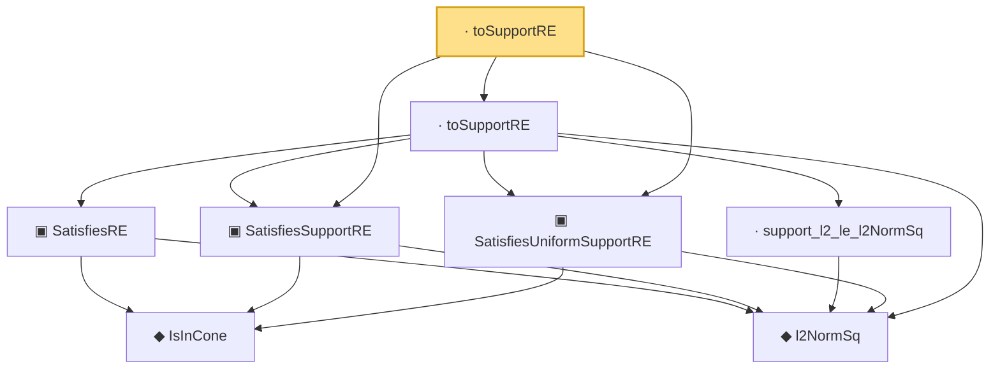

# Proof narrative — toSupportRE

Root: **toSupportRE** (lemma) `Statlib/HighDim/Vocabulary/DesignMatrix.lean:127` · topic `HighDim`
Closure: 8 declarations across 3 files. Generated from `proof_graph.json` — no files were moved.

Reading order (foundations first, headline last):

      ◆ `IsInCone` — def · `Statlib/HighDim/Vocabulary/Sparse.lean:49`  _(also used by 11: rip_implies_uniformRE, lasso_cone_condition, lasso_oracle_prediction_of_supportRE, …)_
    ◆ `l2NormSq` — noncomputable def · `Statlib/HighDim/Vocabulary/Norms.lean:13`  _(also used by 52: matrixRowVec_norm_sq, offDiagCoeffVec_norm_sq_le_frobenius, offDiagCoeffVec_norm_sq_integral_le_frobenius, …)_
    ▣ `SatisfiesRE` — structure · `Statlib/HighDim/Vocabulary/DesignMatrix.lean:65`  _(also used by 8: lasso_oracle_prediction, lasso_oracle_l1, lasso_oracle_support_l2, …)_
  ▣ `SatisfiesSupportRE` — structure · `Statlib/HighDim/Vocabulary/DesignMatrix.lean:50`  _(also used by 4: lasso_oracle_prediction_of_supportRE, lasso_oracle_l1_of_supportRE, lasso_oracle_support_l2_of_supportRE, …)_
    · `support_l2_le_l2NormSq` — lemma · `Statlib/HighDim/Vocabulary/Sparse.lean:54`  _(also used by 2: toUniformSupportRE, l1RSE_to_uniformRE)_
  ▣ `SatisfiesUniformSupportRE` — structure · `Statlib/HighDim/Vocabulary/DesignMatrix.lean:82`  _(also used by 5: lasso_oracle_prediction_of_uniformSupportRE, lasso_oracle_l1_of_uniformSupportRE, lasso_oracle_support_l2_of_uniformSupportRE, …)_
  · `toSupportRE` — lemma · `Statlib/HighDim/Vocabulary/DesignMatrix.lean:110`  _(also used by 7: lasso_oracle_prediction_of_uniformSupportRE, lasso_oracle_prediction, lasso_oracle_l1_of_uniformSupportRE, …)_
· `toSupportRE` — lemma · `Statlib/HighDim/Vocabulary/DesignMatrix.lean:127` **← headline**

## Dependency diagram

