# Proof narrative — trace_exp_add_log_simpleFunc_jensen_posDef

Root: **trace_exp_add_log_simpleFunc_jensen_posDef** (theorem) `Statlib/HighDim/MatrixAnalysis/LiebTraceConcavity.lean:198` · topic `HighDim`
Closure: 43 declarations across 11 files. Generated from `proof_graph.json` — no files were moved.

Reading order (foundations first, headline last):

        ★ `matrix_posDef_weighted_add` — theorem · `Statlib/HighDim/MatrixAnalysis/LiebTraceConcavity.lean:43`
      ★ `matrix_posDef_cone_convex` — theorem · `Statlib/HighDim/MatrixAnalysis/LiebTraceConcavity.lean:59`
        ★ `posDef_convex_combo` — private theorem · `Statlib/HighDim/MatrixAnalysis/LiebTraceConcavity.lean:27`
        ◆ `quantumRelativeEntropy` — noncomputable def · `Statlib/HighDim/Vocabulary/Quantum.lean:17`
          ★ `real_log_matrix_isHermitian_of_posDef` — theorem · `Statlib/HighDim/MatrixAnalysis/TraceExp.lean:89`  _(also used by 1: matrix_lieb_one_step_trace)_
            ★ `hermitian_exp_posSemidef` — theorem · `Statlib/HighDim/MatrixAnalysis/TraceExp.lean:74`  _(also used by 2: matrix_exp_integrable_of_trace_integrable, matrix_laplace_one_step_of_trace_exp_add_le)_
          ★ `hermitian_exp_posDef` — theorem · `Statlib/HighDim/MatrixAnalysis/TraceExp.lean:83`  _(also used by 3: matrix_exp_integral_posDef, matrix_lieb_pair_trace_posDef, matrix_lieb_one_step_trace)_
          · `add_hermitian` — lemma · `Statlib/HighDim/SpectralPerturbation/Eigenvalues.lean:582`  _(also used by 1: exists_perturbed_unit_eigenvector_near)_
          ★ `klein_trace_exp_variational_lb` — theorem · `Statlib/HighDim/MatrixAnalysis/KleinTraceExpVariationalLb.lean:9`
        ★ `trace_exp_variational_formula` — theorem · `Statlib/HighDim/MatrixAnalysis/TraceExpVariationalFormula.lean:13`
            ◆ `perspectiveInner` — noncomputable def · `Statlib/HighDim/MatrixAnalysis/RelativeEntropyJointConvex.lean:101`
            ◆ `leftMulKronecker` — def · `Statlib/HighDim/MatrixAnalysis/RelativeEntropyJointConvex.lean:16`
            ◆ `rightMulKronecker` — def · `Statlib/HighDim/MatrixAnalysis/RelativeEntropyJointConvex.lean:22`
            ◆ `hilbertSchmidtVecOne` — def · `Statlib/HighDim/MatrixAnalysis/RelativeEntropyJointConvex.lean:27`
            · `leftMulKronecker_posDef` — lemma · `Statlib/HighDim/MatrixAnalysis/RelativeEntropyJointConvex.lean:66`
            · `rightMulKronecker_posDef` — lemma · `Statlib/HighDim/MatrixAnalysis/RelativeEntropyJointConvex.lean:70`
            · `leftMulKronecker_comm_rightMulKronecker` — lemma · `Statlib/HighDim/MatrixAnalysis/RelativeEntropyJointConvex.lean:77`
            ★ `real_matrix_exp_log_of_posDef` — theorem · `Statlib/HighDim/MatrixAnalysis/TraceExp.lean:94`  _(also used by 1: matrix_lieb_one_step_trace)_
            · `leftMulKronecker_mulVec_vec` — lemma · `Statlib/HighDim/MatrixAnalysis/RelativeEntropyJointConvex.lean:30`
            · `rightMulKronecker_mulVec_vec` — lemma · `Statlib/HighDim/MatrixAnalysis/RelativeEntropyJointConvex.lean:35`
            · `quantumRelativeEntropy_eq_perspectiveInner` — lemma · `Statlib/HighDim/MatrixAnalysis/RelativeEntropyJointConvex.lean:115`
            · `leftMulKronecker_add` — lemma · `Statlib/HighDim/MatrixAnalysis/RelativeEntropyJointConvex.lean:40`
            · `leftMulKronecker_smul` — lemma · `Statlib/HighDim/MatrixAnalysis/RelativeEntropyJointConvex.lean:44`
            · `leftMulKronecker_convex` — lemma · `Statlib/HighDim/MatrixAnalysis/RelativeEntropyJointConvex.lean:56`
            · `rightMulKronecker_add` — lemma · `Statlib/HighDim/MatrixAnalysis/RelativeEntropyJointConvex.lean:48`
            · `rightMulKronecker_smul` — lemma · `Statlib/HighDim/MatrixAnalysis/RelativeEntropyJointConvex.lean:52`
            · `rightMulKronecker_convex` — lemma · `Statlib/HighDim/MatrixAnalysis/RelativeEntropyJointConvex.lean:61`
            ★ `matrix_integrable_of_entry_integrable` — theorem · `Statlib/HighDim/MatrixAnalysis/TraceExp.lean:316`  _(also used by 5: matrix_integral_eq_zero_of_hasZeroMean, matrix_lieb_one_step_trace, single_exp_integral_le_quadratic_matrix, …)_
            ★ `matrix_entry_abs_le_l2_opNorm_rect` — private theorem · `Statlib/HighDim/MatrixAnalysis/TraceExp.lean:274`
            ◆ `matrixEntryCLM` — private def · `Statlib/HighDim/MatrixAnalysis/TraceExp.lean:299`
            ★ `matrix_integral_apply_of_integrable` — theorem · `Statlib/HighDim/MatrixAnalysis/TraceExp.lean:309`  _(also used by 7: matrix_integral_eq_zero_of_hasZeroMean, matrix_integral_posDef_of_ae, matrix_trace_integral_of_integrable, …)_
            ★ `matrix_log_integral_rep` — theorem · `Statlib/HighDim/MatrixAnalysis/MatrixLogIntegralRep.lean:8`
            ★ `lieb_ruskai_conj_inv_jointly_convex` — theorem · `Statlib/HighDim/MatrixAnalysis/LiebRuskaiConjInvJointlyConvex.lean:7`
            ★ `matrix_integral_posSemidef_of_ae` — theorem · `Statlib/HighDim/MatrixAnalysis/TraceExp.lean:334`  _(also used by 4: matrix_integral_posDef_of_ae, matrix_integral_sub_posSemidef_of_ae, matrix_laplace_one_step_of_trace_exp_add_le, …)_
            ★ `op_convex_mul_log` — theorem · `Statlib/HighDim/MatrixAnalysis/OperatorConvexMulLog.lean:14`
            ★ `hansen_pedersen_jensen_mul_log` — theorem · `Statlib/HighDim/MatrixAnalysis/HansenPedersenJensenMulLog.lean:28`  _(also used by 1: hp_jensen_mul_log)_
            · `perspectiveInner_jointConvex` — lemma · `Statlib/HighDim/MatrixAnalysis/RelativeEntropyJointConvex.lean:388`
          ★ `quantumRelativeEntropy_jointConvex` — theorem · `Statlib/HighDim/MatrixAnalysis/RelativeEntropyJointConvex.lean:990`
        ★ `relative_entropy_joint_convex` — theorem · `Statlib/HighDim/MatrixAnalysis/RelativeEntropyJointConvex.lean:1053`
      ★ `trace_exp_add_log_concave_two_point` — theorem · `Statlib/HighDim/MatrixAnalysis/LiebTraceConcavity.lean:75`
    ★ `trace_exp_add_log_concave` — theorem · `Statlib/HighDim/MatrixAnalysis/LiebTraceConcavity.lean:143`  _(also used by 1: trace_exp_add_log_jensen_integral_posDef)_
  ★ `trace_exp_add_log_finset_jensen_posDef` — theorem · `Statlib/HighDim/MatrixAnalysis/LiebTraceConcavity.lean:165`
★ `trace_exp_add_log_simpleFunc_jensen_posDef` — theorem · `Statlib/HighDim/MatrixAnalysis/LiebTraceConcavity.lean:198` **← headline**

## Dependency diagram

```mermaid
flowchart TD
  n0["★ matrix_posDef_weighted_add"]
  n1["★ matrix_posDef_cone_convex"]
  n2["★ posDef_convex_combo"]
  n3["◆ quantumRelativeEntropy"]
  n4["★ real_log_matrix_isHermitian_of_posDef"]
  n5["★ hermitian_exp_posSemidef"]
  n6["★ hermitian_exp_posDef"]
  n7["· add_hermitian"]
  n8["★ klein_trace_exp_variational_lb"]
  n9["★ trace_exp_variational_formula"]
  n10["◆ perspectiveInner"]
  n11["◆ leftMulKronecker"]
  n12["◆ rightMulKronecker"]
  n13["◆ hilbertSchmidtVecOne"]
  n14["· leftMulKronecker_posDef"]
  n15["· rightMulKronecker_posDef"]
  n16["· leftMulKronecker_comm_rightMulKronecker"]
  n17["★ real_matrix_exp_log_of_posDef"]
  n18["· leftMulKronecker_mulVec_vec"]
  n19["· rightMulKronecker_mulVec_vec"]
  n20["· quantumRelativeEntropy_eq_perspectiveInner"]
  n21["· leftMulKronecker_add"]
  n22["· leftMulKronecker_smul"]
  n23["· leftMulKronecker_convex"]
  n24["· rightMulKronecker_add"]
  n25["· rightMulKronecker_smul"]
  n26["· rightMulKronecker_convex"]
  n27["★ matrix_integrable_of_entry_integrable"]
  n28["★ matrix_entry_abs_le_l2_opNorm_rect"]
  n29["◆ matrixEntryCLM"]
  n30["★ matrix_integral_apply_of_integrable"]
  n31["★ matrix_log_integral_rep"]
  n32["★ lieb_ruskai_conj_inv_jointly_convex"]
  n33["★ matrix_integral_posSemidef_of_ae"]
  n34["★ op_convex_mul_log"]
  n35["★ hansen_pedersen_jensen_mul_log"]
  n36["· perspectiveInner_jointConvex"]
  n37["★ quantumRelativeEntropy_jointConvex"]
  n38["★ relative_entropy_joint_convex"]
  n39["★ trace_exp_add_log_concave_two_point"]
  n40["★ trace_exp_add_log_concave"]
  n41["★ trace_exp_add_log_finset_jensen_posDef"]
  n42["★ trace_exp_add_log_simpleFunc_jensen_posDef"]
  n1 --> n0
  n6 --> n5
  n8 --> n6
  n9 --> n3
  n9 --> n4
  n9 --> n6
  n9 --> n7
  n9 --> n8
  n14 --> n11
  n15 --> n12
  n16 --> n11
  n16 --> n12
  n18 --> n11
  n19 --> n12
  n20 --> n3
  n20 --> n10
  n20 --> n11
  n20 --> n12
  n20 --> n13
  n20 --> n14
  n20 --> n15
  n20 --> n16
  n20 --> n4
  n20 --> n17
  n20 --> n18
  n20 --> n19
  n21 --> n11
  n22 --> n11
  n23 --> n11
  n23 --> n21
  n23 --> n22
  n24 --> n12
  n25 --> n12
  n26 --> n12
  n26 --> n24
  n26 --> n25
  n29 --> n28
  n30 --> n29
  n31 --> n27
  n31 --> n30
  n33 --> n30
  n33 --> n29
  n34 --> n31
  n34 --> n32
  n34 --> n33
  n35 --> n34
  n35 --> n4
  n35 --> n17
  n35 --> n31
  n35 --> n30
  n35 --> n33
  n36 --> n10
  n36 --> n11
  n36 --> n12
  n36 --> n13
  n36 --> n14
  n36 --> n15
  n36 --> n23
  n36 --> n26
  n36 --> n16
  n36 --> n4
  n36 --> n35
  n37 --> n3
  n37 --> n10
  n37 --> n11
  n37 --> n12
  n37 --> n13
  n37 --> n20
  n37 --> n36
  n38 --> n3
  n38 --> n37
  n39 --> n2
  n39 --> n9
  n39 --> n3
  n39 --> n38
  n40 --> n1
  n40 --> n39
  n41 --> n40
  n42 --> n41
  class n42 headline;
  classDef headline fill:#ffe08a,stroke:#d4a017,stroke-width:2px;
  classDef axiomNode fill:#ffd0d0,stroke:#c0392b,stroke-dasharray:4 2;
```

