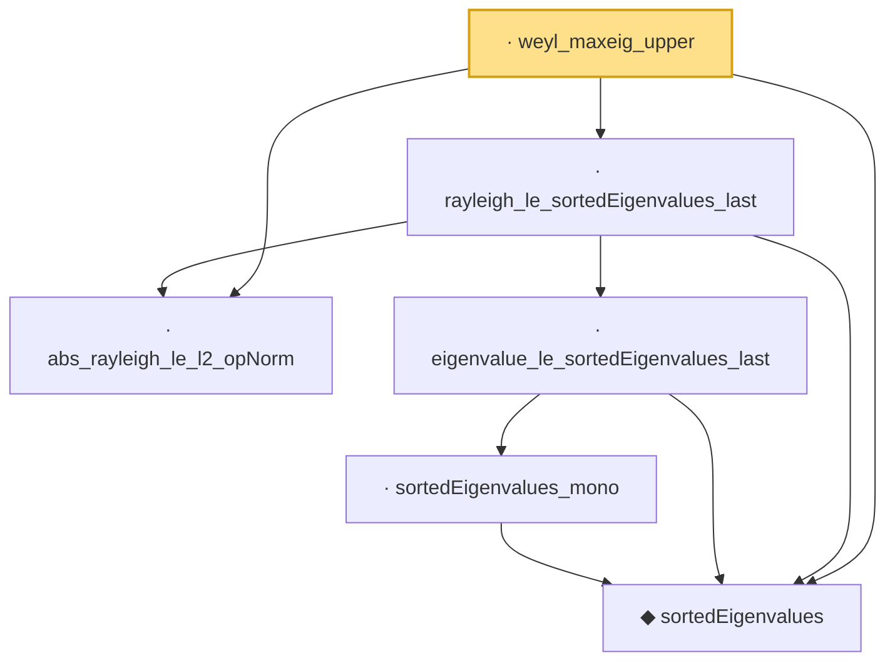

# Proof narrative — weyl_maxeig_upper

Root: **weyl_maxeig_upper** (lemma) `Statlib/HighDim/SpectralPerturbation/Weyl.lean:66` · topic `HighDim`
Closure: 6 declarations across 3 files. Generated from `proof_graph.json` — no files were moved.

Reading order (foundations first, headline last):

  ◆ `sortedEigenvalues` — noncomputable def · `Statlib/HighDim/Vocabulary/Spectral.lean:11`  _(also used by 15: sortedEigenvalues_le_of_add_posSemidef, hermitian_trace_exp_mono_of_sub_posSemidef, davis_kahan_subspace, …)_
  · `abs_rayleigh_le_l2_opNorm` — lemma · `Statlib/HighDim/SpectralPerturbation/Eigenvalues.lean:161`  _(also used by 4: abs_quadratic_le_opNorm_mul_norm_sq, inner_self_op_le_l2_opNorm_mul_norm_sq, sortedEigenvalues_zero_le_rayleigh, …)_
      · `sortedEigenvalues_mono` — lemma · `Statlib/HighDim/SpectralPerturbation/Eigenvalues.lean:40`  _(also used by 3: sortedEigenvalues_zero_le_eigenvalue, sortedEigenvalues_lt_card_le_sorted, card_eigen_le_of_sorted_gt)_
    · `eigenvalue_le_sortedEigenvalues_last` — lemma · `Statlib/HighDim/SpectralPerturbation/Eigenvalues.lean:59`
  · `rayleigh_le_sortedEigenvalues_last` — lemma · `Statlib/HighDim/SpectralPerturbation/Eigenvalues.lean:893`
· `weyl_maxeig_upper` — lemma · `Statlib/HighDim/SpectralPerturbation/Weyl.lean:66` **← headline**

## Dependency diagram

