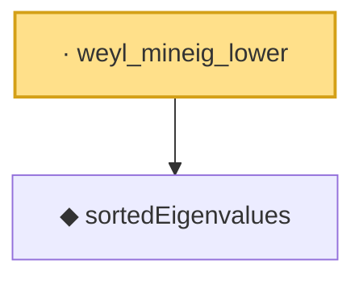

# Proof narrative — weyl_mineig_lower

Root: **weyl_mineig_lower** (lemma) `Statlib/HighDim/SpectralPerturbation.lean:66` · topic `HighDim`
Closure: 2 declarations across 1 files. Generated from `proof_graph.json` — no files were moved.

Reading order (foundations first, headline last):

  ◆ `sortedEigenvalues` — noncomputable def · `Statlib/HighDim/SpectralPerturbation.lean:40`  _(also used by 5: sortedEigenvalues_mono, sortedEigenvalues_perm, weyl_maxeig_upper, …)_
· `weyl_mineig_lower` — lemma · `Statlib/HighDim/SpectralPerturbation.lean:66` **← headline**

## Dependency diagram

