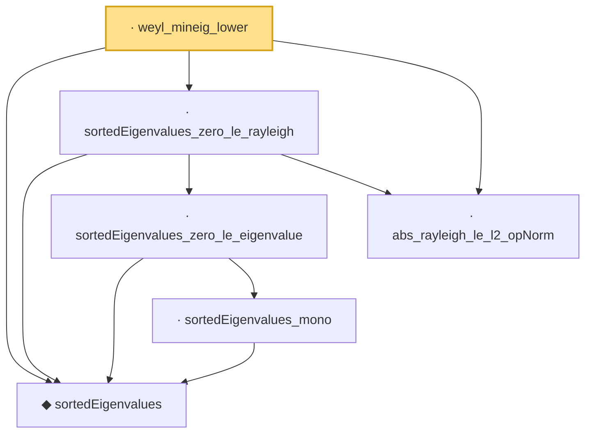

# Proof narrative — weyl_mineig_lower

Root: **weyl_mineig_lower** (lemma) `Statlib/HighDim/SpectralPerturbation/Weyl.lean:21` · topic `HighDim`
Closure: 6 declarations across 3 files. Generated from `proof_graph.json` — no files were moved.

Reading order (foundations first, headline last):

  ◆ `sortedEigenvalues` — noncomputable def · `Statlib/HighDim/Vocabulary/Spectral.lean:11`  _(also used by 15: sortedEigenvalues_le_of_add_posSemidef, hermitian_trace_exp_mono_of_sub_posSemidef, davis_kahan_subspace, …)_
      · `sortedEigenvalues_mono` — lemma · `Statlib/HighDim/SpectralPerturbation/Eigenvalues.lean:41`  _(also used by 3: eigenvalue_le_sortedEigenvalues_last, sortedEigenvalues_lt_card_le_sorted, card_eigen_le_of_sorted_gt)_
    · `sortedEigenvalues_zero_le_eigenvalue` — lemma · `Statlib/HighDim/SpectralPerturbation/Eigenvalues.lean:51`
  · `abs_rayleigh_le_l2_opNorm` — lemma · `Statlib/HighDim/SpectralPerturbation/Eigenvalues.lean:162`  _(also used by 4: abs_quadratic_le_opNorm_mul_norm_sq, inner_self_op_le_l2_opNorm_mul_norm_sq, rayleigh_le_sortedEigenvalues_last, …)_
  · `sortedEigenvalues_zero_le_rayleigh` — lemma · `Statlib/HighDim/SpectralPerturbation/Eigenvalues.lean:855`
· `weyl_mineig_lower` — lemma · `Statlib/HighDim/SpectralPerturbation/Weyl.lean:21` **← headline**

## Dependency diagram

