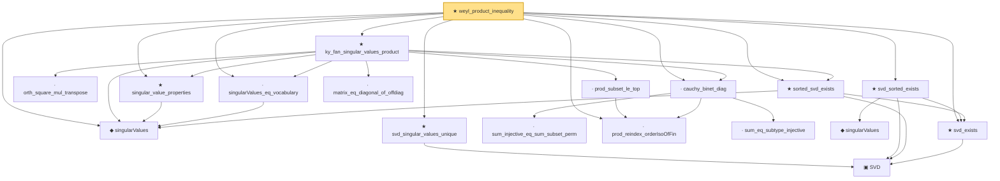

# Proof narrative — weyl_product_inequality

Root: **weyl_product_inequality** (theorem) `Statlib/HighDim/MatrixAnalysis/Weyl.lean:21` · topic `HighDim`
Closure: 18 declarations across 6 files. Generated from `proof_graph.json` — no files were moved.

Reading order (foundations first, headline last):

  ◆ `singularValues` — noncomputable def · `Statlib/HighDim/MatrixAnalysis/SingularValueProperties.lean:22`  _(also used by 18: frobenius_norm_svd_relation, sv_diag_singularValues, low_rank_frobenius_error_decomposition, …)_
    ▣ `SVD` — structure · `Statlib/HighDim/Vocabulary/SVD.lean:37`  _(also used by 33: sv_diag_singularValues, low_rank_frobenius_error_decomposition, nuclearNorm_add_le, …)_
  ★ `svd_exists` — theorem · `Statlib/HighDim/MatrixAnalysis/SVDFoundation.lean:20`  _(also used by 5: nuclearNorm_add_le, nuclearNorm_eq_iSup_opNorm_le_one, svSoftThreshold, …)_
  ★ `sorted_svd_exists` — theorem · `Statlib/HighDim/MatrixAnalysis/KyFan.lean:17`  _(also used by 2: sv_diag_singularValues, low_rank_frobenius_error_decomposition)_
    · `orth_square_mul_transpose` — lemma · `Statlib/HighDim/MatrixAnalysis/KyFan.lean:439`  _(also used by 1: low_rank_frobenius_error_decomposition)_
  · `singularValues_eq_vocabulary` — lemma · `Statlib/HighDim/MatrixAnalysis/SingularValueProperties.lean:30`  _(also used by 6: sv_diag_singularValues, low_rank_frobenius_error_decomposition, nuclear_norm_le_sqrt_rank_mul_frobenius, …)_
  ★ `singular_value_properties` — theorem · `Statlib/HighDim/MatrixAnalysis/SingularValueProperties.lean:39`  _(also used by 5: sv_diag_singularValues, low_rank_frobenius_error_decomposition, von_neumann_trace_inequality, …)_
      · `sum_injective_eq_sum_subset_perm` — lemma · `Statlib/HighDim/MatrixAnalysis/KyFan.lean:511`
  · `prod_reindex_orderIsoOfFin` — lemma · `Statlib/HighDim/MatrixAnalysis/KyFan.lean:466`
      · `sum_eq_subtype_injective` — lemma · `Statlib/HighDim/MatrixAnalysis/KyFan.lean:490`
  · `cauchy_binet_diag` — lemma · `Statlib/HighDim/MatrixAnalysis/KyFan.lean:611`
    · `matrix_eq_diagonal_of_offdiag` — lemma · `Statlib/HighDim/MatrixAnalysis/KyFan.lean:425`
    · `prod_subset_le_top` — lemma · `Statlib/HighDim/MatrixAnalysis/KyFan.lean:930`
  ★ `ky_fan_singular_values_product` — theorem · `Statlib/HighDim/MatrixAnalysis/KyFan.lean:994`
    ◆ `singularValues` — noncomputable def · `Statlib/HighDim/Vocabulary/SVD.lean:108`  _(also used by 2: leftSingularVectors, nuclearNorm)_
  ★ `svd_sorted_exists` — theorem · `Statlib/HighDim/MatrixAnalysis/SvdSortedExists.lean:13`
  ★ `svd_singular_values_unique` — theorem · `Statlib/HighDim/MatrixAnalysis/SVDFoundation.lean:663`  _(also used by 4: sv_diag_singularValues, low_rank_frobenius_error_decomposition, nuclearNorm_eq_iSup_opNorm_le_one, …)_
★ `weyl_product_inequality` — theorem · `Statlib/HighDim/MatrixAnalysis/Weyl.lean:21` **← headline**

## Dependency diagram

