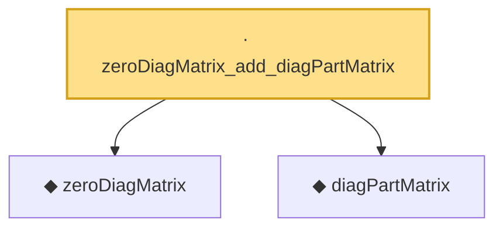

# Proof narrative — zeroDiagMatrix_add_diagPartMatrix

Root: **zeroDiagMatrix_add_diagPartMatrix** (lemma) `Statlib/HighDim/Concentration/HansonWright.lean:693` · topic `HighDim`
Closure: 3 declarations across 2 files. Generated from `proof_graph.json` — no files were moved.

Reading order (foundations first, headline last):

  ◆ `zeroDiagMatrix` — def · `Statlib/HighDim/Vocabulary/QuadraticForms.lean:52`  _(also used by 42: offDiagCoeff_eq_zeroDiagMatrix_mulVec, offDiagCoeff_norm_le_zeroDiag, offDiagCoeffVec_eq_zeroDiagMatrix_mulVec, …)_
  ◆ `diagPartMatrix` — def · `Statlib/HighDim/Vocabulary/QuadraticForms.lean:57`  _(also used by 2: diagPartMatrix_norm_le, zeroDiagMatrix_norm_le_two)_
· `zeroDiagMatrix_add_diagPartMatrix` — lemma · `Statlib/HighDim/Concentration/HansonWright.lean:693` **← headline**

## Dependency diagram

