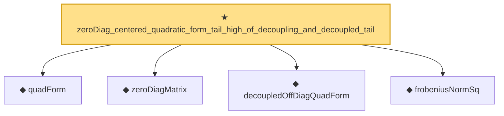

# Proof narrative — zeroDiag_centered_quadratic_form_tail_high_of_decoupling_and_decoupled_tail

Root: **zeroDiag_centered_quadratic_form_tail_high_of_decoupling_and_decoupled_tail** (theorem) `Statlib/HighDim/Concentration/HansonWright.lean:3031` · topic `HighDim`
Closure: 5 declarations across 3 files. Generated from `proof_graph.json` — no files were moved.

Reading order (foundations first, headline last):

  ◆ `quadForm` — noncomputable def · `Statlib/HighDim/Vocabulary/QuadraticForms.lean:15`  _(also used by 33: quadForm_eq_diag_add_offdiag, quadForm_zeroDiagMatrix_eq_offDiagQuadForm, quadForm_centered_eq_diag_offdiag_centered, …)_
  ◆ `zeroDiagMatrix` — def · `Statlib/HighDim/Vocabulary/QuadraticForms.lean:52`  _(also used by 42: offDiagCoeff_eq_zeroDiagMatrix_mulVec, offDiagCoeff_norm_le_zeroDiag, offDiagCoeffVec_eq_zeroDiagMatrix_mulVec, …)_
  ◆ `decoupledOffDiagQuadForm` — noncomputable def · `Statlib/HighDim/Vocabulary/QuadraticForms.lean:33`  _(also used by 50: decoupledOffDiagQuadForm_eq_sum_coeff, decoupledOffDiagQuadForm_eq_inner_coeff, decoupledOffDiagQuadForm_const_right_eq_inner_coeffVec, …)_
  ◆ `frobeniusNormSq` — noncomputable def · `Statlib/HighDim/Vocabulary/Norms.lean:37`  _(also used by 45: diag_sq_sum_le_frobeniusNormSq, frobeniusNormSq_zeroDiagMatrix_le, frobeniusNormSq_nonneg, …)_
★ `zeroDiag_centered_quadratic_form_tail_high_of_decoupling_and_decoupled_tail` — theorem · `Statlib/HighDim/Concentration/HansonWright.lean:3031` **← headline**

## Dependency diagram

