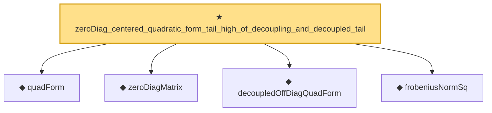

# Proof narrative — zeroDiag_centered_quadratic_form_tail_high_of_decoupling_and_decoupled_tail

Root: **zeroDiag_centered_quadratic_form_tail_high_of_decoupling_and_decoupled_tail** (theorem) `Statlib/HighDim/Concentration/HansonWright.lean:2930` · topic `HighDim`
Closure: 5 declarations across 3 files. Generated from `proof_graph.json` — no files were moved.

Reading order (foundations first, headline last):

  ◆ `quadForm` — noncomputable def · `Statlib/HighDim/Vocabulary/QuadraticForms.lean:15`  _(also used by 33: frobenius_norm_sq_subgaussian_concentration, gaussian_quadratic_form_concentration, quadForm_eq_diag_add_offdiag, …)_
  ◆ `zeroDiagMatrix` — def · `Statlib/HighDim/Vocabulary/QuadraticForms.lean:52`  _(also used by 42: frobenius_norm_sq_subgaussian_concentration, gaussian_quadratic_form_concentration, offDiagCoeff_eq_zeroDiagMatrix_mulVec, …)_
  ◆ `decoupledOffDiagQuadForm` — noncomputable def · `Statlib/HighDim/Vocabulary/QuadraticForms.lean:33`  _(also used by 50: frobenius_norm_sq_subgaussian_concentration, gaussian_quadratic_form_concentration, decoupledOffDiagQuadForm_eq_sum_coeff, …)_
  ◆ `frobeniusNormSq` — noncomputable def · `Statlib/HighDim/Vocabulary/Norms.lean:105`  _(also used by 56: frobenius_norm_sq_subgaussian_concentration, gaussian_quadratic_form_concentration, diag_sq_sum_le_frobeniusNormSq, …)_
★ `zeroDiag_centered_quadratic_form_tail_high_of_decoupling_and_decoupled_tail` — theorem · `Statlib/HighDim/Concentration/HansonWright.lean:2930` **← headline**

## Dependency diagram

```mermaid
flowchart TD
  n0["◆ quadForm"]
  n1["◆ zeroDiagMatrix"]
  n2["◆ decoupledOffDiagQuadForm"]
  n3["◆ frobeniusNormSq"]
  n4["★ zeroDiag_centered_quadratic_form_tail_high_of_decoupling_and_decoupled_tail"]
  n4 --> n0
  n4 --> n1
  n4 --> n2
  n4 --> n3
  class n4 headline;
  classDef headline fill:#ffe08a,stroke:#d4a017,stroke-width:2px;
  classDef axiomNode fill:#ffd0d0,stroke:#c0392b,stroke-dasharray:4 2;
```
