# Proof narrative — zeroDiag_centered_quadratic_form_tail_high_of_decoupling_norm_bernstein_absorb

Root: **zeroDiag_centered_quadratic_form_tail_high_of_decoupling_norm_bernstein_absorb** (theorem) `Statlib/HighDim/Concentration/HansonWright.lean:3387` · topic `HighDim`
Closure: 56 declarations across 11 files. Generated from `proof_graph.json` — no files were moved.

Reading order (foundations first, headline last):

  ▣ `IsSubGaussianVector` — structure · `Statlib/HighDim/Vocabulary/RandomVector.lean:52`  _(also used by 61: decoupledOffDiagQuadForm_const_right_abs_tail_real, decoupledOffDiagQuadForm_prod_first_section_abs_tail_real, subgaussian_projection_sq_integrable, …)_
  ◆ `frobeniusNormSq` — noncomputable def · `Statlib/HighDim/Vocabulary/Norms.lean:37`  _(also used by 45: diag_sq_sum_le_frobeniusNormSq, frobeniusNormSq_zeroDiagMatrix_le, frobeniusNormSq_nonneg, …)_
  ◆ `quadForm` — noncomputable def · `Statlib/HighDim/Vocabulary/QuadraticForms.lean:15`  _(also used by 32: quadForm_eq_diag_add_offdiag, quadForm_zeroDiagMatrix_eq_offDiagQuadForm, quadForm_centered_eq_diag_offdiag_centered, …)_
  ◆ `zeroDiagMatrix` — def · `Statlib/HighDim/Vocabulary/QuadraticForms.lean:52`  _(also used by 37: offDiagCoeff_eq_zeroDiagMatrix_mulVec, offDiagCoeff_norm_le_zeroDiag, diagQuadForm_zeroDiagMatrix, …)_
  ◆ `decoupledOffDiagQuadForm` — noncomputable def · `Statlib/HighDim/Vocabulary/QuadraticForms.lean:33`  _(also used by 37: decoupledOffDiagQuadForm_const_right_abs_tail_real, decoupledOffDiagQuadForm_prod_mk_eq_const_right, decoupledOffDiagQuadForm_prod_first_section_abs_tail_real, …)_
          ◆ `l2NormSq` — noncomputable def · `Statlib/HighDim/Vocabulary/Norms.lean:13`  _(also used by 31: matrixRowVec_norm_sq, offDiagCoeffVec_norm_sq_le_frobenius, offDiagCoeffVec_norm_sq_integral_le_frobenius, …)_
          · `euclidean_norm_sq` — lemma · `Statlib/HighDim/Vocabulary/Norms.lean:21`  _(also used by 10: matrixRowVec_norm_sq, offDiagCoeffVec_norm_sq_le_frobenius, offDiagCoeffVec_norm_sq_integral_le_frobenius, …)_
            · `inner_eq_sum` — lemma · `Statlib/HighDim/Vocabulary/Norms.lean:32`  _(also used by 11: offDiagCoeffVec_apply_eq_inner_row_zeroDiag, cov_quadratic_deviation, projection_mean_zero, …)_
          · `subgaussian_vector_coord` — lemma · `Statlib/HighDim/Concentration/HansonWright.lean:1389`  _(also used by 13: coord_mul_subexponential_exists_of_indep, coord_sq_centered_mgf_bound, diagQuadForm_centered_tail_bernstein_explicit, …)_
            ★ `subgaussian_variance_le` — theorem · `Statlib/StatFoundation/RandomVariable/SubGaussian/subgaussian_variance_le.lean:8`  _(also used by 1: subgaussian_rip_tail)_
            · `subgaussian_projection_second_moment_le` — lemma · `Statlib/HighDim/Concentration/HansonWright.lean:519`  _(also used by 1: offDiagCoeffVec_norm_sq_integral_le_frobenius)_
          · `subgaussian_norm_sq_mean_le_dim` — lemma · `Statlib/HighDim/Concentration/HansonWright.lean:2396`
            ▣ `HasSubexponentialMGF` — structure · `Statlib/StatFoundation/Vocabulary/RandomVariable.lean:74`  _(also used by 22: coord_mul_subexponential_exists_of_indep, subexponential_mgf_const_mul, subexponential_mgf_const_mul_relaxed, …)_
            ★ `subgaussian_meas_abs_ge_le_two_exp` — theorem · `Statlib/StatFoundation/RandomVariable/SubGaussian/subgaussian_meas_abs_ge_le_two_exp.lean:9`  _(also used by 3: subgaussian_linf_tail, lasso_noise_condition, subgaussian_even_moment_le)_
            ★ `subgaussian_integrable_exp_sq_at_one_third` — theorem · `Statlib/StatFoundation/RandomVariable/SubGaussian/subgaussian_exp_sq_le_at_one_third.lean:165`  _(also used by 2: coord_mul_subexponential_exists_of_indep, coord_sq_centered_subexponential_exists)_
            · `coord_sq_centered_scaled_exp_integrable` — lemma · `Statlib/HighDim/Concentration/HansonWright.lean:2101`
            · `sub_gauss_tail_abs` — lemma · `Statlib/StatFoundation/RandomVariable/SubExponential/subexp_mgf_le_of_sq_subgaussian.lean:13`  _(also used by 1: sub_gauss_tail_sq)_
            · `sq_le_two_mul_exp` — lemma · `Statlib/StatFoundation/RandomVariable/SubGaussian/sq_le_two_mul_exp.lean:10`
            ★ `subgaussian_exp_sq_le_at_one_third` — theorem · `Statlib/StatFoundation/RandomVariable/SubGaussian/subgaussian_exp_sq_le_at_one_third.lean:14`
            ★ `subexp_mgf_le_of_sq_subgaussian_explicit` — theorem · `Statlib/StatFoundation/RandomVariable/SubExponential/subexp_mgf_le_of_sq_subgaussian.lean:72`  _(also used by 2: scalar_sq_centered_subexponential_explicit, subexp_mgf_le_of_sq_subgaussian)_
            · `coord_sq_centered_mgf_bound_explicit` — lemma · `Statlib/HighDim/Concentration/HansonWright.lean:2038`  _(also used by 1: coord_sq_centered_scaled_mgf_bound_explicit)_
            · `coord_sq_centered_scaled_subexponential_explicit_of_range` — lemma · `Statlib/HighDim/Concentration/HansonWright.lean:2182`  _(also used by 2: diag_hanson_wright_tail_high, subgaussian_norm_sq_subexponential)_
            ★ `bernstein_sum_meas_abs_ge_le_two_exp` — theorem · `Statlib/StatFoundation/Concentration/ExponentialType/bernstein_sum_meas_abs_ge_le_two_exp.lean:13`  _(also used by 4: diag_hanson_wright_tail_high, sampleCovariance_concentration, jl_single_pair, …)_
          · `weighted_coord_sq_centered_sum_tail_explicit` — lemma · `Statlib/HighDim/Concentration/HansonWright.lean:2238`  _(also used by 1: diagQuadForm_centered_tail_bernstein_explicit)_
        · `subgaussian_norm_sq_tail_bernstein_explicit` — lemma · `Statlib/HighDim/Concentration/HansonWright.lean:2436`
            ◆ `offDiagCoeffVec` — noncomputable def · `Statlib/HighDim/Vocabulary/QuadraticForms.lean:46`  _(also used by 11: decoupledOffDiagQuadForm_const_right_abs_tail_real, decoupledOffDiagQuadForm_prod_first_section_abs_tail_real, offDiagCoeffVec_apply_eq_inner_row_zeroDiag, …)_
            · `decoupledOffDiagQuadForm_measurable` — lemma · `Statlib/HighDim/Concentration/HansonWright.lean:86`
            · `decoupledOffDiagQuadForm_prod_measurable` — lemma · `Statlib/HighDim/Concentration/HansonWright.lean:95`
            · `decoupledOffDiagQuadForm_prod_tail_measurableSet` — lemma · `Statlib/HighDim/Concentration/HansonWright.lean:105`  _(also used by 2: decoupledOffDiagQuadForm_prod_tail_le_lintegral_spectral, decoupledOffDiagQuadForm_prod_tail_le_lintegral_frobenius)_
            · `offDiagCoeffVec_comp_measurable` — lemma · `Statlib/HighDim/Concentration/HansonWright.lean:670`
            · `offDiagCoeffVec_norm_sq_measurable` — lemma · `Statlib/HighDim/Concentration/HansonWright.lean:678`
            · `subgaussian_mgf_mono_param` — lemma · `Statlib/HighDim/Concentration/HansonWright.lean:156`  _(also used by 2: decoupledOffDiagQuadForm_const_right_abs_tail_real_spectral, decoupledOffDiagQuadForm_const_right_abs_tail_real_frobenius)_
            ◆ `offDiagCoeff` — noncomputable def · `Statlib/HighDim/Vocabulary/QuadraticForms.lean:39`  _(also used by 4: offDiagCoeff_eq_zeroDiagMatrix_mulVec, offDiagCoeff_norm_le_zeroDiag, offDiagCoeff_norm_le, …)_
            · `decoupledOffDiagQuadForm_eq_sum_coeff` — lemma · `Statlib/HighDim/Concentration/HansonWright.lean:42`
            · `decoupledOffDiagQuadForm_eq_inner_coeff` — lemma · `Statlib/HighDim/Concentration/HansonWright.lean:61`
            · `offDiagCoeff_const` — lemma · `Statlib/HighDim/Concentration/HansonWright.lean:35`
            · `decoupledOffDiagQuadForm_const_right_eq_inner_coeffVec` — lemma · `Statlib/HighDim/Concentration/HansonWright.lean:69`
            · `decoupledOffDiagQuadForm_const_right_subgaussian` — lemma · `Statlib/HighDim/Concentration/HansonWright.lean:76`  _(also used by 3: decoupledOffDiagQuadForm_const_right_abs_tail_real, decoupledOffDiagQuadForm_const_right_abs_tail_real_spectral, decoupledOffDiagQuadForm_const_right_abs_tail_real_frobenius)_
            · `subgaussian_abs_tail_real` — lemma · `Statlib/HighDim/Concentration/HansonWright.lean:122`  _(also used by 3: decoupledOffDiagQuadForm_const_right_abs_tail_real, decoupledOffDiagQuadForm_const_right_abs_tail_real_spectral, decoupledOffDiagQuadForm_const_right_abs_tail_real_frobenius)_
            · `decoupledOffDiagQuadForm_const_right_abs_tail_real_of_coeff_norm_sq_le` — lemma · `Statlib/HighDim/Concentration/HansonWright.lean:846`
            · `measure_le_ofReal_of_measureReal_le` — lemma · `Statlib/HighDim/Concentration/HansonWright.lean:114`  _(also used by 3: offDiagCoeffVec_norm_sq_tail_le_frobenius, decoupledOffDiagQuadForm_prod_tail_le_lintegral_spectral, decoupledOffDiagQuadForm_prod_tail_le_lintegral_frobenius)_
          · `decoupledOffDiagQuadForm_prod_tail_le_bad_plus_good` — lemma · `Statlib/HighDim/Concentration/HansonWright.lean:1021`  _(also used by 1: decoupledOffDiagQuadForm_prod_tail_le_markov_plus_good)_
            · `offDiagCoeffVec_eq_zeroDiagMatrix_mulVec` — lemma · `Statlib/HighDim/Concentration/HansonWright.lean:251`  _(also used by 1: offDiagCoeffVec_apply_eq_inner_row_zeroDiag)_
            · `offDiagCoeffVec_norm_le_zeroDiag` — lemma · `Statlib/HighDim/Concentration/HansonWright.lean:276`
            ◆ `diagPartMatrix` — def · `Statlib/HighDim/Vocabulary/QuadraticForms.lean:57`  _(also used by 1: zeroDiagMatrix_add_diagPartMatrix)_
            · `matrix_entry_abs_le_l2_opNorm` — lemma · `Statlib/HighDim/Concentration/HansonWright.lean:398`  _(also used by 1: diag_hanson_wright_tail_high)_
            · `diagPartMatrix_norm_le` — lemma · `Statlib/HighDim/Concentration/HansonWright.lean:685`
            · `zeroDiagMatrix_norm_le_two` — lemma · `Statlib/HighDim/Concentration/HansonWright.lean:704`  _(also used by 2: offDiagCoeff_norm_le, zeroDiag_hanson_scale_half_le)_
            · `offDiagCoeffVec_norm_le` — lemma · `Statlib/HighDim/Concentration/HansonWright.lean:733`
            · `offDiagCoeffVec_norm_sq_le` — lemma · `Statlib/HighDim/Concentration/HansonWright.lean:752`  _(also used by 1: decoupled_const_right_subgaussian_parameter_le_spectral)_
          · `offDiagCoeffVec_norm_sq_tail_le_norm_sq` — lemma · `Statlib/HighDim/Concentration/HansonWright.lean:1170`
        · `decoupledOffDiagQuadForm_prod_tail_le_norm_bad_plus_good` — lemma · `Statlib/HighDim/Concentration/HansonWright.lean:1202`
      · `decoupledOffDiagQuadForm_prod_tail_le_norm_bernstein_plus_good_ofReal` — lemma · `Statlib/HighDim/Concentration/HansonWright.lean:2517`
    · `decoupled_zeroDiag_quadratic_form_tail_high_norm_bernstein` — lemma · `Statlib/HighDim/Concentration/HansonWright.lean:2592`  _(also used by 2: decoupled_zeroDiag_quadratic_form_tail_high_norm_bernstein_absorb, zeroDiag_centered_quadratic_form_tail_high_norm_bernstein_of_const_decoupling)_
  ★ `zeroDiag_centered_quadratic_form_tail_high_norm_bernstein_of_decoupling` — theorem · `Statlib/HighDim/Concentration/HansonWright.lean:3154`  _(also used by 1: offdiag_hanson_wright_tail_high_norm_bernstein_of_decoupling)_
★ `zeroDiag_centered_quadratic_form_tail_high_of_decoupling_norm_bernstein_absorb` — theorem · `Statlib/HighDim/Concentration/HansonWright.lean:3387` **← headline**

## Dependency diagram

```mermaid
flowchart TD
  n0["▣ IsSubGaussianVector"]
  n1["◆ frobeniusNormSq"]
  n2["◆ quadForm"]
  n3["◆ zeroDiagMatrix"]
  n4["◆ decoupledOffDiagQuadForm"]
  n5["◆ l2NormSq"]
  n6["· euclidean_norm_sq"]
  n7["· inner_eq_sum"]
  n8["· subgaussian_vector_coord"]
  n9["★ subgaussian_variance_le"]
  n10["· subgaussian_projection_second_moment_le"]
  n11["· subgaussian_norm_sq_mean_le_dim"]
  n12["▣ HasSubexponentialMGF"]
  n13["★ subgaussian_meas_abs_ge_le_two_exp"]
  n14["★ subgaussian_integrable_exp_sq_at_one_third"]
  n15["· coord_sq_centered_scaled_exp_integrable"]
  n16["· sub_gauss_tail_abs"]
  n17["· sq_le_two_mul_exp"]
  n18["★ subgaussian_exp_sq_le_at_one_third"]
  n19["★ subexp_mgf_le_of_sq_subgaussian_explicit"]
  n20["· coord_sq_centered_mgf_bound_explicit"]
  n21["· coord_sq_centered_scaled_subexponential_explicit_of_range"]
  n22["★ bernstein_sum_meas_abs_ge_le_two_exp"]
  n23["· weighted_coord_sq_centered_sum_tail_explicit"]
  n24["· subgaussian_norm_sq_tail_bernstein_explicit"]
  n25["◆ offDiagCoeffVec"]
  n26["· decoupledOffDiagQuadForm_measurable"]
  n27["· decoupledOffDiagQuadForm_prod_measurable"]
  n28["· decoupledOffDiagQuadForm_prod_tail_measurableSet"]
  n29["· offDiagCoeffVec_comp_measurable"]
  n30["· offDiagCoeffVec_norm_sq_measurable"]
  n31["· subgaussian_mgf_mono_param"]
  n32["◆ offDiagCoeff"]
  n33["· decoupledOffDiagQuadForm_eq_sum_coeff"]
  n34["· decoupledOffDiagQuadForm_eq_inner_coeff"]
  n35["· offDiagCoeff_const"]
  n36["· decoupledOffDiagQuadForm_const_right_eq_inner_coeffVec"]
  n37["· decoupledOffDiagQuadForm_const_right_subgaussian"]
  n38["· subgaussian_abs_tail_real"]
  n39["· decoupledOffDiagQuadForm_const_right_abs_tail_real_of_coeff_norm_sq_le"]
  n40["· measure_le_ofReal_of_measureReal_le"]
  n41["· decoupledOffDiagQuadForm_prod_tail_le_bad_plus_good"]
  n42["· offDiagCoeffVec_eq_zeroDiagMatrix_mulVec"]
  n43["· offDiagCoeffVec_norm_le_zeroDiag"]
  n44["◆ diagPartMatrix"]
  n45["· matrix_entry_abs_le_l2_opNorm"]
  n46["· diagPartMatrix_norm_le"]
  n47["· zeroDiagMatrix_norm_le_two"]
  n48["· offDiagCoeffVec_norm_le"]
  n49["· offDiagCoeffVec_norm_sq_le"]
  n50["· offDiagCoeffVec_norm_sq_tail_le_norm_sq"]
  n51["· decoupledOffDiagQuadForm_prod_tail_le_norm_bad_plus_good"]
  n52["· decoupledOffDiagQuadForm_prod_tail_le_norm_bernstein_plus_good_ofReal"]
  n53["· decoupled_zeroDiag_quadratic_form_tail_high_norm_bernstein"]
  n54["★ zeroDiag_centered_quadratic_form_tail_high_norm_bernstein_of_decoupling"]
  n55["★ zeroDiag_centered_quadratic_form_tail_high_of_decoupling_norm_bernstein_absorb"]
  n6 --> n5
  n8 --> n0
  n8 --> n7
  n10 --> n0
  n10 --> n9
  n11 --> n0
  n11 --> n6
  n11 --> n5
  n11 --> n8
  n11 --> n7
  n11 --> n10
  n14 --> n13
  n15 --> n0
  n15 --> n8
  n15 --> n14
  n18 --> n13
  n19 --> n16
  n19 --> n17
  n19 --> n18
  n19 --> n14
  n20 --> n0
  n20 --> n8
  n20 --> n19
  n21 --> n0
  n21 --> n12
  n21 --> n15
  n21 --> n20
  n22 --> n12
  n23 --> n0
  n23 --> n12
  n23 --> n21
  n23 --> n8
  n23 --> n22
  n24 --> n0
  n24 --> n11
  n24 --> n8
  n24 --> n6
  n24 --> n5
  n24 --> n23
  n26 --> n4
  n27 --> n4
  n27 --> n26
  n28 --> n4
  n28 --> n27
  n29 --> n25
  n30 --> n25
  n30 --> n29
  n33 --> n4
  n33 --> n32
  n34 --> n4
  n34 --> n32
  n34 --> n33
  n34 --> n7
  n35 --> n32
  n35 --> n25
  n36 --> n4
  n36 --> n25
  n36 --> n34
  n36 --> n35
  n37 --> n0
  n37 --> n4
  n37 --> n25
  n37 --> n36
  n39 --> n0
  n39 --> n25
  n39 --> n4
  n39 --> n31
  n39 --> n37
  n39 --> n38
  n41 --> n0
  n41 --> n4
  n41 --> n25
  n41 --> n28
  n41 --> n30
  n41 --> n39
  n41 --> n40
  n42 --> n25
  n42 --> n3
  n43 --> n25
  n43 --> n3
  n43 --> n42
  n46 --> n44
  n46 --> n45
  n47 --> n3
  n47 --> n44
  n47 --> n46
  n48 --> n25
  n48 --> n3
  n48 --> n43
  n48 --> n47
  n49 --> n25
  n49 --> n48
  n50 --> n25
  n50 --> n49
  n51 --> n0
  n51 --> n4
  n51 --> n41
  n51 --> n50
  n52 --> n0
  n52 --> n4
  n52 --> n24
  n52 --> n51
  n53 --> n0
  n53 --> n4
  n53 --> n52
  n54 --> n0
  n54 --> n2
  n54 --> n3
  n54 --> n4
  n54 --> n53
  n55 --> n0
  n55 --> n1
  n55 --> n2
  n55 --> n3
  n55 --> n4
  n55 --> n54
  class n55 headline;
  classDef headline fill:#ffe08a,stroke:#d4a017,stroke-width:2px;
  classDef axiomNode fill:#ffd0d0,stroke:#c0392b,stroke-dasharray:4 2;
```

