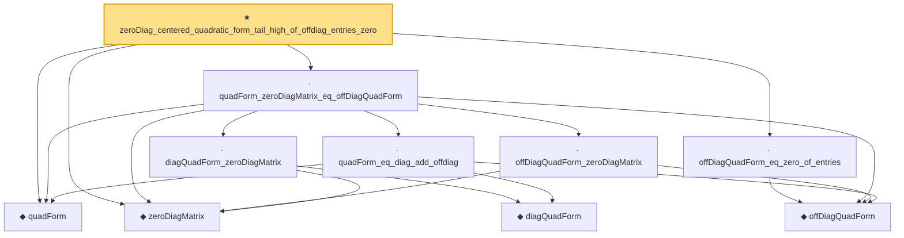

# Proof narrative — zeroDiag_centered_quadratic_form_tail_high_of_offdiag_entries_zero

Root: **zeroDiag_centered_quadratic_form_tail_high_of_offdiag_entries_zero** (theorem) `Statlib/HighDim/Concentration/HansonWright.lean:4473` · topic `HighDim`
Closure: 10 declarations across 2 files. Generated from `proof_graph.json` — no files were moved.

Reading order (foundations first, headline last):

  ◆ `quadForm` — noncomputable def · `Statlib/HighDim/Vocabulary/QuadraticForms.lean:15`  _(also used by 31: quadForm_centered_eq_diag_offdiag_centered, quadForm_centered_tail_le_diag_offdiag_tail, quadForm_centered_tail_le_two_mul_of_diag_offdiag_tail_bounds, …)_
  ◆ `zeroDiagMatrix` — def · `Statlib/HighDim/Vocabulary/QuadraticForms.lean:52`  _(also used by 39: offDiagCoeff_eq_zeroDiagMatrix_mulVec, offDiagCoeff_norm_le_zeroDiag, offDiagCoeffVec_eq_zeroDiagMatrix_mulVec, …)_
    ◆ `offDiagQuadForm` — noncomputable def · `Statlib/HighDim/Vocabulary/QuadraticForms.lean:27`  _(also used by 19: quadForm_centered_eq_diag_offdiag_centered, offDiagQuadForm_integrable_of_coord_sq_integrable, offDiagQuadForm_integral_eq_zero_of_indep, …)_
      ◆ `diagQuadForm` — noncomputable def · `Statlib/HighDim/Vocabulary/QuadraticForms.lean:21`  _(also used by 8: quadForm_centered_eq_diag_offdiag_centered, diagQuadForm_centered_eq_sum, quadForm_centered_tail_le_diag_offdiag_tail, …)_
    · `quadForm_eq_diag_add_offdiag` — lemma · `Statlib/HighDim/Concentration/HansonWright.lean:284`  _(also used by 1: quadForm_centered_eq_diag_offdiag_centered)_
    · `diagQuadForm_zeroDiagMatrix` — lemma · `Statlib/HighDim/Concentration/HansonWright.lean:302`
    · `offDiagQuadForm_zeroDiagMatrix` — lemma · `Statlib/HighDim/Concentration/HansonWright.lean:308`
  · `quadForm_zeroDiagMatrix_eq_offDiagQuadForm` — lemma · `Statlib/HighDim/Concentration/HansonWright.lean:319`  _(also used by 1: offdiag_tail_of_zeroDiag_centered_quad_tail)_
  · `offDiagQuadForm_eq_zero_of_entries` — lemma · `Statlib/HighDim/Concentration/HansonWright.lean:328`  _(also used by 1: offdiag_hanson_wright_tail_high_of_offdiag_entries_zero)_
★ `zeroDiag_centered_quadratic_form_tail_high_of_offdiag_entries_zero` — theorem · `Statlib/HighDim/Concentration/HansonWright.lean:4473` **← headline**

## Dependency diagram

