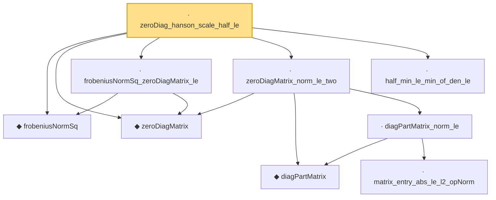

# Proof narrative — zeroDiag_hanson_scale_half_le

Root: **zeroDiag_hanson_scale_half_le** (lemma) `Statlib/HighDim/Concentration/HansonWright.lean:1202` · topic `HighDim`
Closure: 9 declarations across 3 files. Generated from `proof_graph.json` — no files were moved.

Reading order (foundations first, headline last):

  ◆ `frobeniusNormSq` — noncomputable def · `Statlib/HighDim/Vocabulary/Norms.lean:37`  _(also used by 42: diag_sq_sum_le_frobeniusNormSq, frobeniusNormSq_nonneg, offDiagCoeffVec_norm_sq_le_frobenius, …)_
  ◆ `zeroDiagMatrix` — def · `Statlib/HighDim/Vocabulary/QuadraticForms.lean:52`  _(also used by 38: offDiagCoeff_eq_zeroDiagMatrix_mulVec, offDiagCoeff_norm_le_zeroDiag, offDiagCoeffVec_eq_zeroDiagMatrix_mulVec, …)_
  · `frobeniusNormSq_zeroDiagMatrix_le` — lemma · `Statlib/HighDim/Concentration/HansonWright.lean:388`  _(also used by 2: offDiagCoeffVec_norm_sq_le_frobenius, offDiagCoeffVec_norm_sq_integral_le_frobenius)_
    ◆ `diagPartMatrix` — def · `Statlib/HighDim/Vocabulary/QuadraticForms.lean:57`  _(also used by 1: zeroDiagMatrix_add_diagPartMatrix)_
      · `matrix_entry_abs_le_l2_opNorm` — lemma · `Statlib/HighDim/Concentration/HansonWright.lean:350`  _(also used by 1: diag_hanson_wright_tail_high)_
    · `diagPartMatrix_norm_le` — lemma · `Statlib/HighDim/Concentration/HansonWright.lean:637`
  · `zeroDiagMatrix_norm_le_two` — lemma · `Statlib/HighDim/Concentration/HansonWright.lean:656`  _(also used by 2: offDiagCoeff_norm_le, offDiagCoeffVec_norm_le)_
  · `half_min_le_min_of_den_le` — lemma · `Statlib/HighDim/Concentration/HansonWright.lean:1176`
· `zeroDiag_hanson_scale_half_le` — lemma · `Statlib/HighDim/Concentration/HansonWright.lean:1202` **← headline**

## Dependency diagram

