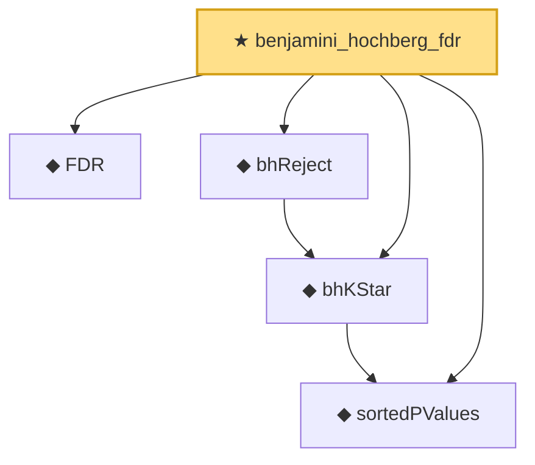

# Proof narrative — benjamini_hochberg_fdr

Root: **benjamini_hochberg_fdr** (theorem) `Statlib/HypothesisTesting/MultipleTesting/BenjaminiHochberg.lean:38` · topic `HypothesisTesting`
Closure: 5 declarations across 2 files. Generated from `proof_graph.json` — no files were moved.

Reading order (foundations first, headline last):

  ◆ `FDR` — noncomputable def · `Statlib/HypothesisTesting/Vocabulary.lean:302`
  ◆ `sortedPValues` — noncomputable def · `Statlib/HypothesisTesting/MultipleTesting/BenjaminiHochberg.lean:15`
  ◆ `bhKStar` — noncomputable def · `Statlib/HypothesisTesting/MultipleTesting/BenjaminiHochberg.lean:22`
  ◆ `bhReject` — noncomputable def · `Statlib/HypothesisTesting/MultipleTesting/BenjaminiHochberg.lean:31`
★ `benjamini_hochberg_fdr` — theorem · `Statlib/HypothesisTesting/MultipleTesting/BenjaminiHochberg.lean:38` **← headline**

## Dependency diagram

