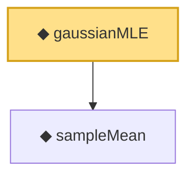

# Proof narrative — gaussianMLE

Root: **gaussianMLE** (noncomputable abbrev) `Statlib/HypothesisTesting/Asymptotic/Vocabulary.lean:46` · topic `HypothesisTesting`
Closure: 2 declarations across 2 files. Generated from `proof_graph.json` — no files were moved.

Reading order (foundations first, headline last):

  ◆ `sampleMean` — def · `Statlib/HypothesisTesting/NormalTheory/VarianceTest.lean:15`  _(also used by 22: mle_asymptotic_normal, wald_statistic_asymptotic_chisq1, tStatistic_aemeasurable, …)_
◆ `gaussianMLE` — noncomputable abbrev · `Statlib/HypothesisTesting/Asymptotic/Vocabulary.lean:46` **← headline**

## Dependency diagram

