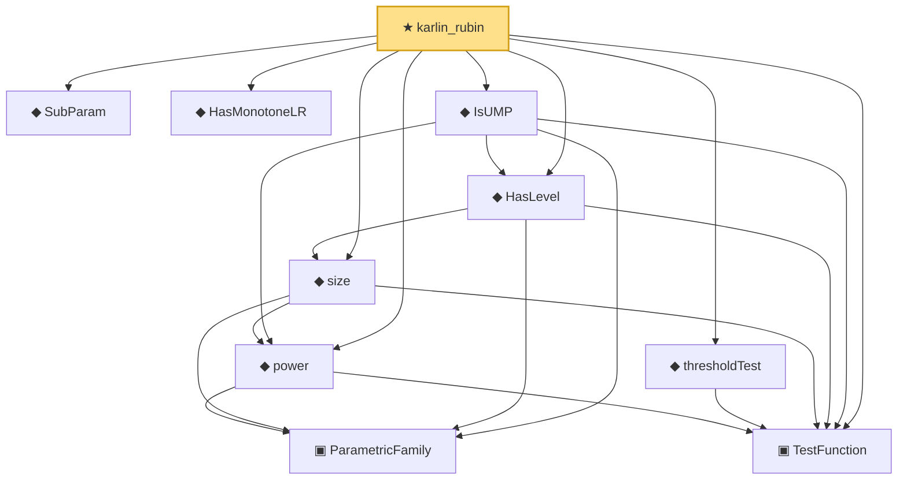

# Proof narrative — karlin_rubin

Root: **karlin_rubin** (theorem) `Statlib/HypothesisTesting/MLR/KarlinRubin.lean:75` · topic `HypothesisTesting`
Closure: 10 declarations across 3 files. Generated from `proof_graph.json` — no files were moved.

Reading order (foundations first, headline last):

  ◆ `SubParam` — abbrev · `Statlib/HypothesisTesting/MLR/KarlinRubin.lean:13`  _(also used by 2: mlr_stochastic_order, karlin_rubin_power_monotone)_
  ◆ `HasMonotoneLR` — def · `Statlib/HypothesisTesting/Vocabulary.lean:257`  _(also used by 3: mlr_stochastic_order, karlin_rubin_power_monotone, mlr_anchor_nonstrict)_
    ▣ `ParametricFamily` — structure · `Statlib/StatFoundation/Vocabulary/ParametricFamily.lean:22`  _(also used by 7: typeIError, typeIIError, IsUnbiasedTest, …)_
  ▣ `TestFunction` — structure · `Statlib/HypothesisTesting/Vocabulary.lean:39`  _(also used by 19: power_add_typeII_eq_one, integrable_test_density, neyman_pearson_complete, …)_
  ◆ `power` — noncomputable def · `Statlib/HypothesisTesting/Vocabulary.lean:85`  _(also used by 15: power_add_typeII_eq_one, karlin_rubin_power_monotone, neyman_pearson_complete, …)_
  ◆ `thresholdTest` — noncomputable def · `Statlib/HypothesisTesting/MLR/KarlinRubin.lean:18`  _(also used by 1: karlin_rubin_power_monotone)_
  ◆ `size` — noncomputable def · `Statlib/HypothesisTesting/Vocabulary.lean:106`  _(also used by 5: neyman_pearson_complete, pvalue_threshold_test_has_level, ump_implies_umpu, …)_
  ◆ `HasLevel` — def · `Statlib/HypothesisTesting/Vocabulary.lean:114`  _(also used by 5: pvalue_threshold_test_has_level, ump_implies_umpu, unbiased_has_level, …)_
  ◆ `IsUMP` — def · `Statlib/HypothesisTesting/Vocabulary.lean:131`  _(also used by 1: ump_implies_umpu)_
★ `karlin_rubin` — theorem · `Statlib/HypothesisTesting/MLR/KarlinRubin.lean:75` **← headline**

## Dependency diagram

