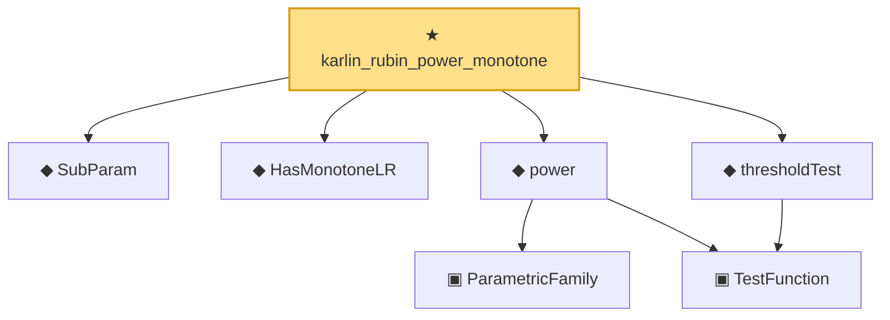

# Proof narrative — karlin_rubin_power_monotone

Root: **karlin_rubin_power_monotone** (theorem) `Statlib/HypothesisTesting/MLR/KarlinRubin.lean:1096` · topic `HypothesisTesting`
Closure: 7 declarations across 3 files. Generated from `proof_graph.json` — no files were moved.

Reading order (foundations first, headline last):

  ◆ `SubParam` — abbrev · `Statlib/HypothesisTesting/MLR/KarlinRubin.lean:13`  _(also used by 2: karlin_rubin, mlr_stochastic_order)_
  ◆ `HasMonotoneLR` — def · `Statlib/HypothesisTesting/Vocabulary.lean:257`  _(also used by 3: karlin_rubin, mlr_stochastic_order, mlr_anchor_nonstrict)_
    ▣ `ParametricFamily` — structure · `Statlib/StatFoundation/Vocabulary/ParametricFamily.lean:22`  _(also used by 10: typeIError, typeIIError, size, …)_
    ▣ `TestFunction` — structure · `Statlib/HypothesisTesting/Vocabulary.lean:39`  _(also used by 23: power_add_typeII_eq_one, integrable_test_density, karlin_rubin, …)_
  ◆ `power` — noncomputable def · `Statlib/HypothesisTesting/Vocabulary.lean:85`  _(also used by 17: power_add_typeII_eq_one, karlin_rubin, neyman_pearson_complete, …)_
  ◆ `thresholdTest` — noncomputable def · `Statlib/HypothesisTesting/MLR/KarlinRubin.lean:18`  _(also used by 1: karlin_rubin)_
★ `karlin_rubin_power_monotone` — theorem · `Statlib/HypothesisTesting/MLR/KarlinRubin.lean:1096` **← headline**

## Dependency diagram

