# Proof narrative — lrt_statistic_asymptotic_chisq1

Root: **lrt_statistic_asymptotic_chisq1** (theorem) `Statlib/HypothesisTesting/Asymptotic/ChiSquareAsymptotics.lean:1052` · topic `HypothesisTesting`
Closure: 38 declarations across 10 files. Generated from `proof_graph.json` — no files were moved.

Reading order (foundations first, headline last):

  ◆ `WeakConvergence` — def · `Statlib/StatFoundation/Convergence/AnalysisTools/ConvergenceModes.lean:163`  _(also used by 9: mle_asymptotic_normal, wald_statistic_asymptotic_chisq1, t_statistic_asymptotic_normal, …)_
  ◆ `logLikelihoodRatio` — noncomputable def · `Statlib/HypothesisTesting/Vocabulary.lean:235`
  ◆ `gaussianLogLikelihood` — noncomputable def · `Statlib/HypothesisTesting/Asymptotic/Vocabulary.lean:25`
  · `lrtStatistic_aemeasurable` — lemma · `Statlib/HypothesisTesting/Asymptotic/ChiSquareAsymptotics.lean:917`
  ◆ `chiSquaredMeasure` — noncomputable def · `Statlib/StatFoundation/Probability/ChiSquared.lean:22`  _(also used by 10: wald_statistic_asymptotic_chisq1, chiSquared_variance_test, two_sample_pooled_variance_chiSquared, …)_
  · `chiSquared_isProbabilityMeasure` — lemma · `Statlib/StatFoundation/Probability/ChiSquared.lean:39`  _(also used by 3: wald_statistic_asymptotic_chisq1, chiSquared_variance_test, variance_test_size)_
  ◆ `gaussianScoreFunction` — noncomputable def · `Statlib/HypothesisTesting/Asymptotic/Vocabulary.lean:32`
  ◆ `gaussianFisherInformation` — noncomputable def · `Statlib/HypothesisTesting/Asymptotic/Vocabulary.lean:37`
  · `scoreStatistic_aemeasurable` — lemma · `Statlib/HypothesisTesting/Asymptotic/ChiSquareAsymptotics.lean:703`
    ◆ `standardizedSum` — abbrev · `Statlib/StatFoundation/Convergence/CentralLimitTheorem/IID.lean:21`  _(also used by 14: tendstoInDistribution_debiasedLasso_scaledCenteredCoordinate_of_iid_scoreSum_and_l1_rowApprox_real, tendstoInDistribution_studentizedDebiasedLasso_coordinate_of_iid_scoreSum_l1_rowApprox_and_se_real, tendsto_measure_studentizedDebiasedLasso_coordinate_coverageEvent_of_iid_scoreSum_l1_rowApprox_and_se_real, …)_
    · `measurable_standardizedSum` — lemma · `Statlib/StatFoundation/Convergence/CentralLimitTheorem/IID.lean:24`  _(also used by 8: tendstoInDistribution_debiasedLasso_scaledCenteredCoordinate_of_iid_scoreSum_and_l1_rowApprox_real, tendstoInDistribution_studentizedDebiasedLasso_coordinate_of_iid_scoreSum_l1_rowApprox_and_se_real, mle_asymptotic_normal, …)_
        · `lyapunov_third_moment` — lemma · `Statlib/StatFoundation/Convergence/AnalysisTools/CharacteristicFunction.lean:563`
          · `charfun_sum_indep` — lemma · `Statlib/StatFoundation/Convergence/AnalysisTools/CharacteristicFunction.lean:282`
        · `charfun_iid_sum_eq_prod` — lemma · `Statlib/StatFoundation/Convergence/AnalysisTools/CharacteristicFunction.lean:323`
        · `charFun_gaussianReal_standard` — lemma · `Statlib/StatFoundation/Convergence/AnalysisTools/CharacteristicFunction.lean:272`  _(also used by 1: lindeberg_feller_central_limit_theorem)_
            · `norm_ofReal_mul_I` — lemma · `Statlib/StatFoundation/Convergence/AnalysisTools/CharacteristicFunction.lean:16`  _(also used by 1: norm_cexp_sub_quadratic_le_third)_
            · `norm_cexp_sub_quadratic_le` — lemma · `Statlib/StatFoundation/Convergence/AnalysisTools/CharacteristicFunction.lean:22`  _(also used by 2: norm_cexp_sub_quadratic_le_sq, charfun_error_le_j)_
          · `charfun_taylor_third_moment` — lemma · `Statlib/StatFoundation/Convergence/AnalysisTools/CharacteristicFunction.lean:86`
          · `norm_prod_sub_prod_le_sum` — lemma · `Statlib/StatFoundation/Convergence/AnalysisTools/CharacteristicFunction.lean:187`
        · `charfun_prod_vs_pow_bound` — lemma · `Statlib/StatFoundation/Convergence/AnalysisTools/CharacteristicFunction.lean:419`
          · `complex_pow_approx_exp_decay` — lemma · `Statlib/StatFoundation/Convergence/AnalysisTools/CharacteristicFunction.lean:350`
        · `complex_pow_approx_exp` — lemma · `Statlib/StatFoundation/Convergence/AnalysisTools/CharacteristicFunction.lean:401`
          · `charfun_arith_aux` — lemma · `Statlib/StatFoundation/Convergence/AnalysisTools/CharacteristicFunction.lean:486`
        · `charfun_final_arithmetic` — lemma · `Statlib/StatFoundation/Convergence/AnalysisTools/CharacteristicFunction.lean:510`
      · `charfun_normalized_sum_bound` — lemma · `Statlib/StatFoundation/Convergence/AnalysisTools/CharacteristicFunction.lean:612`
          · `compl_Icc_eq_abs_gt` — lemma · `Statlib/StatFoundation/Convergence/AnalysisTools/LevyContinuity.lean:15`
            ★ `isTightMeasureSet_singleton` — theorem · `Statlib/StatFoundation/Convergence/AnalysisTools/Tightness.lean:113`  _(also used by 1: isTightMeasureSet_finiteRange)_
          ★ `isTight_finiteRange` — theorem · `Statlib/StatFoundation/Convergence/AnalysisTools/Tightness.lean:18`  _(also used by 1: isTightMeasureSet_range_map_of_isBigOInProbability_one_real)_
        ★ `isTight_of_charFun_tendsto` — theorem · `Statlib/StatFoundation/Convergence/AnalysisTools/LevyContinuity.lean:44`  _(also used by 1: isTight_of_charFun_tendsto_inner)_
          ★ `levy_forward` — theorem · `Statlib/StatFoundation/Convergence/AnalysisTools/LevyContinuity.lean:31`  _(also used by 1: cramer_wold_reverse)_
        · `charFun_eq_of_subseq` — lemma · `Statlib/StatFoundation/Convergence/AnalysisTools/LevyContinuity.lean:168`
        · `probMeasure_eq_of_charFun_eq` — lemma · `Statlib/StatFoundation/Convergence/AnalysisTools/LevyContinuity.lean:180`  _(also used by 3: t_statistic_asymptotic_normal, z_statistic_asymptotic_normal, tendstoInDistribution_of_probabilityMeasure_tendsto_and_gaussianReal_charFun)_
      ★ `levy_continuity` — theorem · `Statlib/StatFoundation/Convergence/AnalysisTools/LevyContinuity.lean:223`  _(also used by 1: lindeberg_feller_central_limit_theorem)_
    ★ `iid_central_limit_theorem` — theorem · `Statlib/StatFoundation/Convergence/CentralLimitTheorem/IID.lean:43`  _(also used by 7: tendstoInDistribution_debiasedLasso_scaledCenteredCoordinate_of_iid_scoreSum_and_l1_rowApprox_real, tendstoInDistribution_studentizedDebiasedLasso_coordinate_of_iid_scoreSum_l1_rowApprox_and_se_real, mle_asymptotic_normal, …)_
    ◆ `standardReal` — abbrev · `Statlib/StatFoundation/RandomVariable/Gaussian/Standard.lean:31`  _(also used by 80: wald_statistic_asymptotic_chisq1, t_statistic_asymptotic_normal, z_statistic_asymptotic_normal, …)_
    ★ `single_square_law` — theorem · `Statlib/HypothesisTesting/Asymptotic/ChiSquareAsymptotics.lean:40`  _(also used by 1: wald_statistic_asymptotic_chisq1)_
  ★ `score_statistic_asymptotic_chisq1` — theorem · `Statlib/HypothesisTesting/Asymptotic/ChiSquareAsymptotics.lean:717`
★ `lrt_statistic_asymptotic_chisq1` — theorem · `Statlib/HypothesisTesting/Asymptotic/ChiSquareAsymptotics.lean:1052` **← headline**

## Dependency diagram

```mermaid
flowchart TD
  n0["◆ WeakConvergence"]
  n1["◆ logLikelihoodRatio"]
  n2["◆ gaussianLogLikelihood"]
  n3["· lrtStatistic_aemeasurable"]
  n4["◆ chiSquaredMeasure"]
  n5["· chiSquared_isProbabilityMeasure"]
  n6["◆ gaussianScoreFunction"]
  n7["◆ gaussianFisherInformation"]
  n8["· scoreStatistic_aemeasurable"]
  n9["◆ standardizedSum"]
  n10["· measurable_standardizedSum"]
  n11["· lyapunov_third_moment"]
  n12["· charfun_sum_indep"]
  n13["· charfun_iid_sum_eq_prod"]
  n14["· charFun_gaussianReal_standard"]
  n15["· norm_ofReal_mul_I"]
  n16["· norm_cexp_sub_quadratic_le"]
  n17["· charfun_taylor_third_moment"]
  n18["· norm_prod_sub_prod_le_sum"]
  n19["· charfun_prod_vs_pow_bound"]
  n20["· complex_pow_approx_exp_decay"]
  n21["· complex_pow_approx_exp"]
  n22["· charfun_arith_aux"]
  n23["· charfun_final_arithmetic"]
  n24["· charfun_normalized_sum_bound"]
  n25["· compl_Icc_eq_abs_gt"]
  n26["★ isTightMeasureSet_singleton"]
  n27["★ isTight_finiteRange"]
  n28["★ isTight_of_charFun_tendsto"]
  n29["★ levy_forward"]
  n30["· charFun_eq_of_subseq"]
  n31["· probMeasure_eq_of_charFun_eq"]
  n32["★ levy_continuity"]
  n33["★ iid_central_limit_theorem"]
  n34["◆ standardReal"]
  n35["★ single_square_law"]
  n36["★ score_statistic_asymptotic_chisq1"]
  n37["★ lrt_statistic_asymptotic_chisq1"]
  n3 --> n1
  n3 --> n2
  n5 --> n4
  n8 --> n6
  n8 --> n7
  n10 --> n9
  n13 --> n12
  n16 --> n15
  n17 --> n16
  n19 --> n17
  n19 --> n18
  n21 --> n20
  n23 --> n22
  n24 --> n11
  n24 --> n13
  n24 --> n14
  n24 --> n19
  n24 --> n21
  n24 --> n23
  n27 --> n26
  n28 --> n25
  n28 --> n27
  n30 --> n29
  n32 --> n28
  n32 --> n30
  n32 --> n31
  n33 --> n9
  n33 --> n10
  n33 --> n24
  n33 --> n32
  n35 --> n34
  n35 --> n4
  n36 --> n0
  n36 --> n6
  n36 --> n7
  n36 --> n8
  n36 --> n4
  n36 --> n5
  n36 --> n33
  n36 --> n34
  n36 --> n35
  n36 --> n9
  n36 --> n10
  n37 --> n0
  n37 --> n1
  n37 --> n2
  n37 --> n3
  n37 --> n4
  n37 --> n5
  n37 --> n36
  n37 --> n6
  n37 --> n7
  n37 --> n8
  class n37 headline;
  classDef headline fill:#ffe08a,stroke:#d4a017,stroke-width:2px;
  classDef axiomNode fill:#ffd0d0,stroke:#c0392b,stroke-dasharray:4 2;
```

