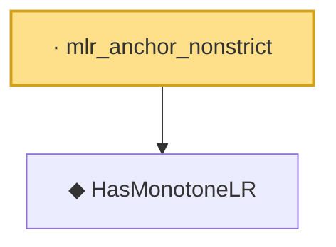

# Proof narrative — mlr_anchor_nonstrict

Root: **mlr_anchor_nonstrict** (lemma) `Statlib/HypothesisTesting/MLR/NPConditions.lean:34` · topic `HypothesisTesting`
Closure: 2 declarations across 2 files. Generated from `proof_graph.json` — no files were moved.

Reading order (foundations first, headline last):

  ◆ `HasMonotoneLR` — def · `Statlib/HypothesisTesting/Vocabulary.lean:257`  _(also used by 3: karlin_rubin, mlr_stochastic_order, karlin_rubin_power_monotone)_
· `mlr_anchor_nonstrict` — lemma · `Statlib/HypothesisTesting/MLR/NPConditions.lean:34` **← headline**

## Dependency diagram

