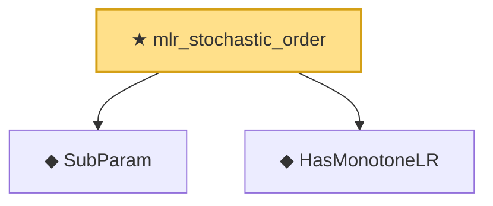

# Proof narrative — mlr_stochastic_order

Root: **mlr_stochastic_order** (theorem) `Statlib/HypothesisTesting/MLR/KarlinRubin.lean:961` · topic `HypothesisTesting`
Closure: 3 declarations across 2 files. Generated from `proof_graph.json` — no files were moved.

Reading order (foundations first, headline last):

  ◆ `SubParam` — abbrev · `Statlib/HypothesisTesting/MLR/KarlinRubin.lean:13`  _(also used by 2: karlin_rubin, karlin_rubin_power_monotone)_
  ◆ `HasMonotoneLR` — def · `Statlib/HypothesisTesting/Vocabulary.lean:257`  _(also used by 3: karlin_rubin, karlin_rubin_power_monotone, mlr_anchor_nonstrict)_
★ `mlr_stochastic_order` — theorem · `Statlib/HypothesisTesting/MLR/KarlinRubin.lean:961` **← headline**

## Dependency diagram

