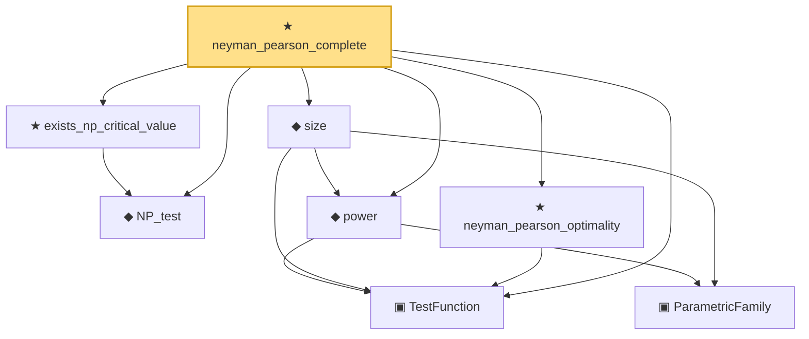

# Proof narrative — neyman_pearson_complete

Root: **neyman_pearson_complete** (theorem) `Statlib/HypothesisTesting/NeymanPearson/Complete.lean:22` · topic `HypothesisTesting`
Closure: 8 declarations across 5 files. Generated from `proof_graph.json` — no files were moved.

Reading order (foundations first, headline last):

  ▣ `TestFunction` — structure · `Statlib/HypothesisTesting/Vocabulary.lean:39`  _(also used by 20: power_add_typeII_eq_one, integrable_test_density, thresholdTest, …)_
  ◆ `NP_test` — noncomputable def · `Statlib/HypothesisTesting/NeymanPearson/Existence.lean:11`
    ▣ `ParametricFamily` — structure · `Statlib/StatFoundation/Vocabulary/ParametricFamily.lean:22`  _(also used by 9: typeIError, typeIIError, HasLevel, …)_
  ◆ `power` — noncomputable def · `Statlib/HypothesisTesting/Vocabulary.lean:85`  _(also used by 16: power_add_typeII_eq_one, karlin_rubin, karlin_rubin_power_monotone, …)_
  ◆ `size` — noncomputable def · `Statlib/HypothesisTesting/Vocabulary.lean:106`  _(also used by 6: karlin_rubin, pvalue_threshold_test_has_level, ump_implies_umpu, …)_
  ★ `exists_np_critical_value` — theorem · `Statlib/HypothesisTesting/NeymanPearson/Existence.lean:20`
  ★ `neyman_pearson_optimality` — theorem · `Statlib/HypothesisTesting/NeymanPearson/Optimality.lean:20`
★ `neyman_pearson_complete` — theorem · `Statlib/HypothesisTesting/NeymanPearson/Complete.lean:22` **← headline**

## Dependency diagram

