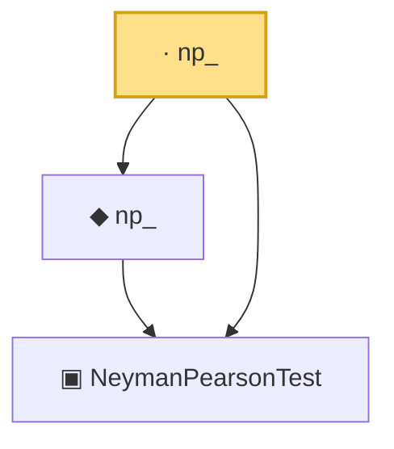

# Proof narrative — np_

Root: **np_** (lemma) `Statlib/HypothesisTesting/NeymanPearson/ToTestFunction.lean:41` · topic `HypothesisTesting`
Closure: 3 declarations across 2 files. Generated from `proof_graph.json` — no files were moved.

Reading order (foundations first, headline last):

  ▣ `NeymanPearsonTest` — structure · `Statlib/HypothesisTesting/Vocabulary.lean:201`  _(also used by 2: np_, np_toTestFunction)_
  ◆ `np_` — noncomputable def · `Statlib/HypothesisTesting/NeymanPearson/ToTestFunction.lean:25`  _(also used by 2: np_, np_toTestFunction)_
· `np_` — lemma · `Statlib/HypothesisTesting/NeymanPearson/ToTestFunction.lean:41` **← headline**

## Dependency diagram

