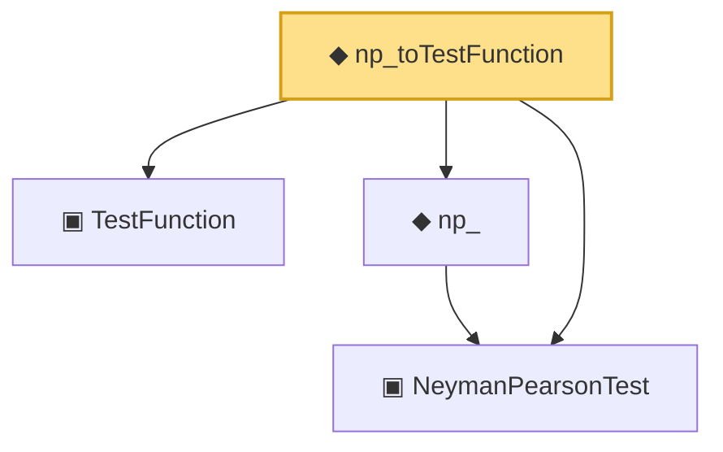

# Proof narrative — np_toTestFunction

Root: **np_toTestFunction** (noncomputable def) `Statlib/HypothesisTesting/NeymanPearson/ToTestFunction.lean:64` · topic `HypothesisTesting`
Closure: 4 declarations across 2 files. Generated from `proof_graph.json` — no files were moved.

Reading order (foundations first, headline last):

  ▣ `NeymanPearsonTest` — structure · `Statlib/HypothesisTesting/Vocabulary.lean:201`  _(also used by 1: np_)_
  ▣ `TestFunction` — structure · `Statlib/HypothesisTesting/Vocabulary.lean:39`  _(also used by 23: power_add_typeII_eq_one, integrable_test_density, thresholdTest, …)_
  ◆ `np_` — noncomputable def · `Statlib/HypothesisTesting/NeymanPearson/ToTestFunction.lean:25`  _(also used by 1: np_)_
◆ `np_toTestFunction` — noncomputable def · `Statlib/HypothesisTesting/NeymanPearson/ToTestFunction.lean:64` **← headline**

## Dependency diagram

