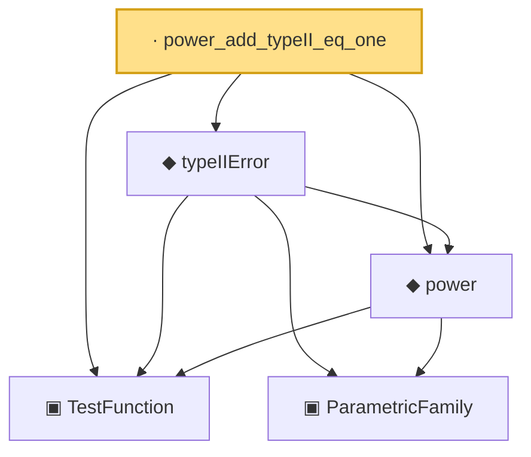

# Proof narrative — power_add_typeII_eq_one

Root: **power_add_typeII_eq_one** (lemma) `Statlib/HypothesisTesting/Bridge.lean:29` · topic `HypothesisTesting`
Closure: 5 declarations across 3 files. Generated from `proof_graph.json` — no files were moved.

Reading order (foundations first, headline last):

  ▣ `TestFunction` — structure · `Statlib/HypothesisTesting/Vocabulary.lean:39`  _(also used by 21: integrable_test_density, thresholdTest, karlin_rubin, …)_
    ▣ `ParametricFamily` — structure · `Statlib/StatFoundation/Vocabulary/ParametricFamily.lean:22`  _(also used by 9: typeIError, size, HasLevel, …)_
  ◆ `power` — noncomputable def · `Statlib/HypothesisTesting/Vocabulary.lean:85`  _(also used by 16: karlin_rubin, karlin_rubin_power_monotone, neyman_pearson_complete, …)_
  ◆ `typeIIError` — noncomputable def · `Statlib/HypothesisTesting/Vocabulary.lean:95`
· `power_add_typeII_eq_one` — lemma · `Statlib/HypothesisTesting/Bridge.lean:29` **← headline**

## Dependency diagram

