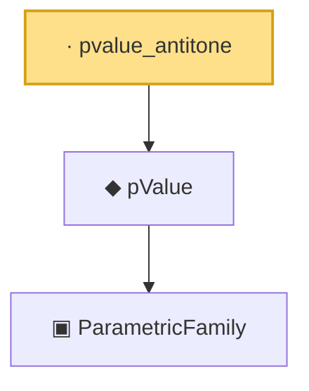

# Proof narrative — pvalue_antitone

Root: **pvalue_antitone** (lemma) `Statlib/HypothesisTesting/PValue/DecisionRule.lean:133` · topic `HypothesisTesting`
Closure: 3 declarations across 3 files. Generated from `proof_graph.json` — no files were moved.

Reading order (foundations first, headline last):

    ▣ `ParametricFamily` — structure · `Statlib/StatFoundation/Vocabulary/ParametricFamily.lean:22`  _(also used by 10: power, typeIError, typeIIError, …)_
  ◆ `pValue` — noncomputable def · `Statlib/HypothesisTesting/Vocabulary.lean:178`  _(also used by 1: pvalue_is_valid)_
· `pvalue_antitone` — lemma · `Statlib/HypothesisTesting/PValue/DecisionRule.lean:133` **← headline**

## Dependency diagram

