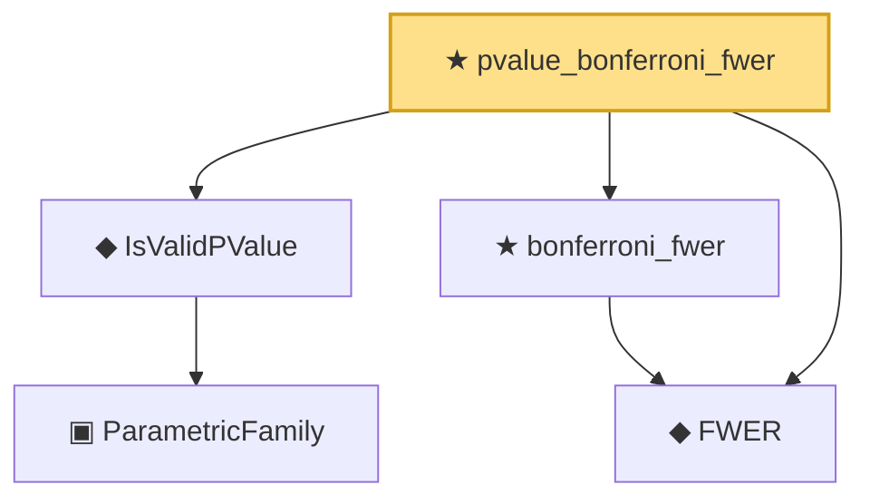

# Proof narrative — pvalue_bonferroni_fwer

Root: **pvalue_bonferroni_fwer** (theorem) `Statlib/HypothesisTesting/MultipleTesting/Bonferroni.lean:67` · topic `HypothesisTesting`
Closure: 5 declarations across 3 files. Generated from `proof_graph.json` — no files were moved.

Reading order (foundations first, headline last):

    ▣ `ParametricFamily` — structure · `Statlib/StatFoundation/Vocabulary/ParametricFamily.lean:22`  _(also used by 10: power, typeIError, typeIIError, …)_
  ◆ `IsValidPValue` — def · `Statlib/HypothesisTesting/Vocabulary.lean:280`  _(also used by 6: pvalue_threshold_test_has_level, pvalue_is_valid, pvalue_stochastically_geq_uniform, …)_
  ◆ `FWER` — noncomputable def · `Statlib/HypothesisTesting/Vocabulary.lean:291`
  ★ `bonferroni_fwer` — theorem · `Statlib/HypothesisTesting/MultipleTesting/Bonferroni.lean:12`
★ `pvalue_bonferroni_fwer` — theorem · `Statlib/HypothesisTesting/MultipleTesting/Bonferroni.lean:67` **← headline**

## Dependency diagram

