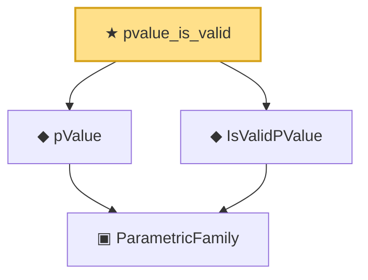

# Proof narrative — pvalue_is_valid

Root: **pvalue_is_valid** (theorem) `Statlib/HypothesisTesting/PValue/Validity.lean:31` · topic `HypothesisTesting`
Closure: 4 declarations across 3 files. Generated from `proof_graph.json` — no files were moved.

Reading order (foundations first, headline last):

    ▣ `ParametricFamily` — structure · `Statlib/StatFoundation/Vocabulary/ParametricFamily.lean:22`  _(also used by 9: power, typeIError, typeIIError, …)_
  ◆ `pValue` — noncomputable def · `Statlib/HypothesisTesting/Vocabulary.lean:178`  _(also used by 1: pvalue_antitone)_
  ◆ `IsValidPValue` — def · `Statlib/HypothesisTesting/Vocabulary.lean:280`  _(also used by 6: pvalue_bonferroni_fwer, pvalue_threshold_test_has_level, pvalue_stochastically_geq_uniform, …)_
★ `pvalue_is_valid` — theorem · `Statlib/HypothesisTesting/PValue/Validity.lean:31` **← headline**

## Dependency diagram

