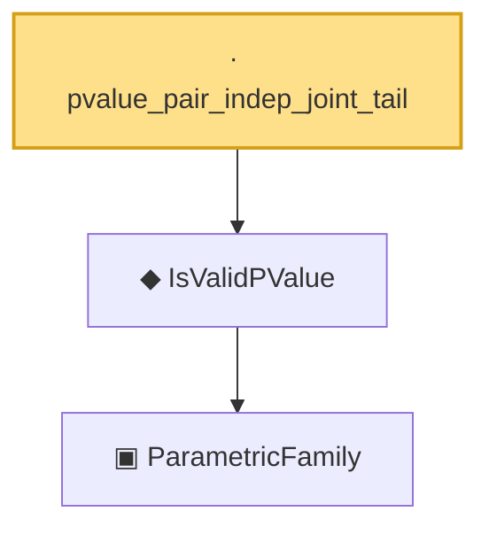

# Proof narrative — pvalue_pair_indep_joint_tail

Root: **pvalue_pair_indep_joint_tail** (lemma) `Statlib/HypothesisTesting/PValue/Validity.lean:561` · topic `HypothesisTesting`
Closure: 3 declarations across 3 files. Generated from `proof_graph.json` — no files were moved.

Reading order (foundations first, headline last):

    ▣ `ParametricFamily` — structure · `Statlib/StatFoundation/Vocabulary/ParametricFamily.lean:22`  _(also used by 10: power, typeIError, typeIIError, …)_
  ◆ `IsValidPValue` — def · `Statlib/HypothesisTesting/Vocabulary.lean:280`  _(also used by 6: pvalue_bonferroni_fwer, pvalue_threshold_test_has_level, pvalue_is_valid, …)_
· `pvalue_pair_indep_joint_tail` — lemma · `Statlib/HypothesisTesting/PValue/Validity.lean:561` **← headline**

## Dependency diagram

