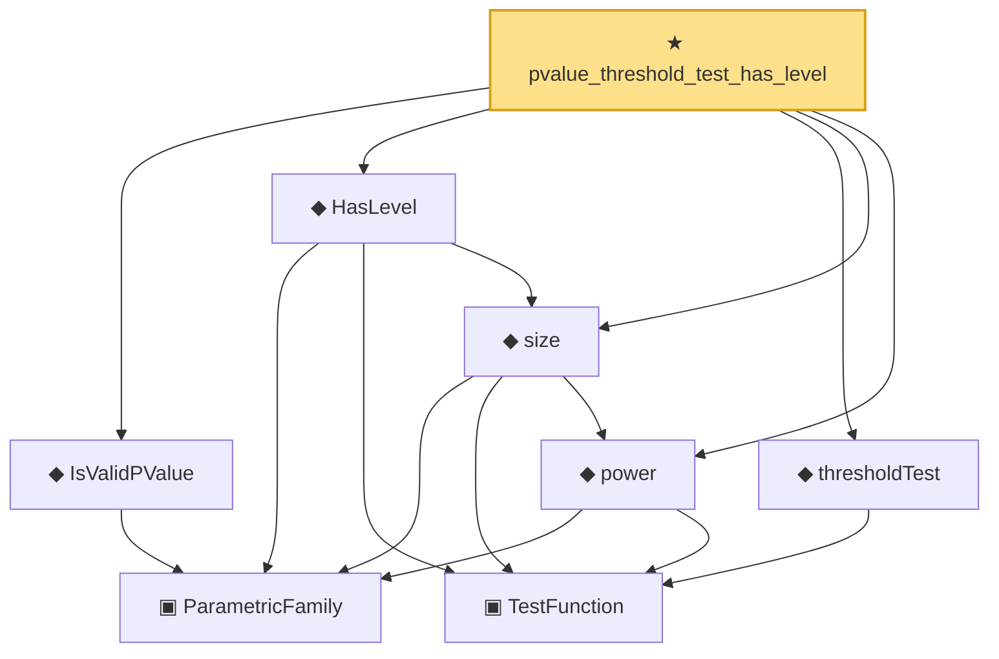

# Proof narrative — pvalue_threshold_test_has_level

Root: **pvalue_threshold_test_has_level** (theorem) `Statlib/HypothesisTesting/PValue/DecisionRule.lean:39` · topic `HypothesisTesting`
Closure: 8 declarations across 3 files. Generated from `proof_graph.json` — no files were moved.

Reading order (foundations first, headline last):

    ▣ `ParametricFamily` — structure · `Statlib/StatFoundation/Vocabulary/ParametricFamily.lean:22`  _(also used by 7: typeIError, typeIIError, IsUMP, …)_
  ◆ `IsValidPValue` — def · `Statlib/HypothesisTesting/Vocabulary.lean:280`  _(also used by 6: pvalue_bonferroni_fwer, pvalue_is_valid, pvalue_stochastically_geq_uniform, …)_
    ▣ `TestFunction` — structure · `Statlib/HypothesisTesting/Vocabulary.lean:39`  _(also used by 21: power_add_typeII_eq_one, integrable_test_density, thresholdTest, …)_
  ◆ `power` — noncomputable def · `Statlib/HypothesisTesting/Vocabulary.lean:85`  _(also used by 16: power_add_typeII_eq_one, karlin_rubin, karlin_rubin_power_monotone, …)_
  ◆ `size` — noncomputable def · `Statlib/HypothesisTesting/Vocabulary.lean:106`  _(also used by 5: karlin_rubin, neyman_pearson_complete, ump_implies_umpu, …)_
  ◆ `HasLevel` — def · `Statlib/HypothesisTesting/Vocabulary.lean:114`  _(also used by 6: karlin_rubin, ump_implies_umpu, unbiased_has_level, …)_
  ◆ `thresholdTest` — noncomputable def · `Statlib/HypothesisTesting/PValue/DecisionRule.lean:26`  _(also used by 2: pvalue_threshold_power, threshold_test_power_mono)_
★ `pvalue_threshold_test_has_level` — theorem · `Statlib/HypothesisTesting/PValue/DecisionRule.lean:39` **← headline**

## Dependency diagram

