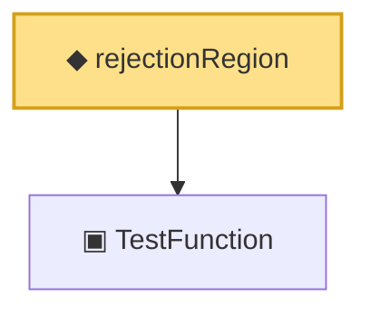

# Proof narrative — rejectionRegion

Root: **rejectionRegion** (def) `Statlib/HypothesisTesting/Vocabulary.lean:53` · topic `HypothesisTesting`
Closure: 2 declarations across 1 files. Generated from `proof_graph.json` — no files were moved.

Reading order (foundations first, headline last):

  ▣ `TestFunction` — structure · `Statlib/HypothesisTesting/Vocabulary.lean:39`  _(also used by 23: power_add_typeII_eq_one, integrable_test_density, thresholdTest, …)_
◆ `rejectionRegion` — def · `Statlib/HypothesisTesting/Vocabulary.lean:53` **← headline**

## Dependency diagram

