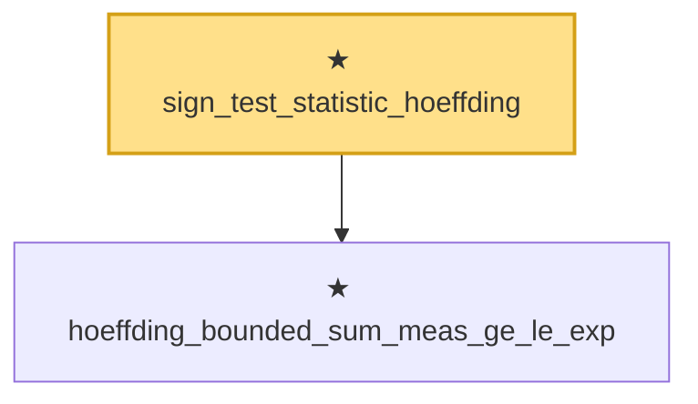

# Proof narrative — sign_test_statistic_hoeffding

Root: **sign_test_statistic_hoeffding** (theorem) `Statlib/HypothesisTesting/Nonparametric/SignTest.lean:16` · topic `HypothesisTesting`
Closure: 2 declarations across 2 files. Generated from `proof_graph.json` — no files were moved.

Reading order (foundations first, headline last):

  ★ `hoeffding_bounded_sum_meas_ge_le_exp` — theorem · `Statlib/StatFoundation/Concentration/ExponentialType/hoeffding_bounded_sum_meas_ge_le_exp.lean:10`  _(also used by 1: indicator_sum_ge_of_prob_le)_
★ `sign_test_statistic_hoeffding` — theorem · `Statlib/HypothesisTesting/Nonparametric/SignTest.lean:16` **← headline**

## Dependency diagram

