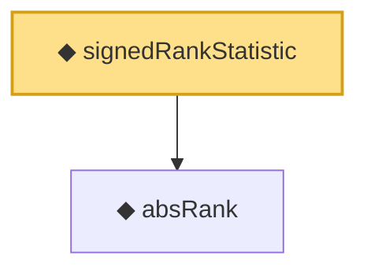

# Proof narrative — signedRankStatistic

Root: **signedRankStatistic** (def) `Statlib/HypothesisTesting/Nonparametric/SignedRank.lean:17` · topic `HypothesisTesting`
Closure: 2 declarations across 1 files. Generated from `proof_graph.json` — no files were moved.

Reading order (foundations first, headline last):

  ◆ `absRank` — def · `Statlib/HypothesisTesting/Nonparametric/SignedRank.lean:12`
◆ `signedRankStatistic` — def · `Statlib/HypothesisTesting/Nonparametric/SignedRank.lean:17` **← headline**

## Dependency diagram

