# Proof narrative — t_statistic_asymptotic_normal

Root: **t_statistic_asymptotic_normal** (theorem) `Statlib/HypothesisTesting/Asymptotic/TTestAsymptotic.lean:45` · topic `HypothesisTesting`
Closure: 36 declarations across 9 files. Generated from `proof_graph.json` — no files were moved.

Reading order (foundations first, headline last):

  ◆ `WeakConvergence` — def · `Statlib/StatFoundation/Convergence/AnalysisTools/ConvergenceModes.lean:163`  _(also used by 7: mle_asymptotic_normal, wald_statistic_asymptotic_chisq1, score_statistic_asymptotic_chisq1, …)_
  ◆ `sampleMean` — def · `Statlib/HypothesisTesting/NormalTheory/VarianceTest.lean:15`  _(also used by 20: mle_asymptotic_normal, wald_statistic_asymptotic_chisq1, t_test_consistent, …)_
  ◆ `sampleVariance` — def · `Statlib/HypothesisTesting/NormalTheory/VarianceTest.lean:19`  _(also used by 15: t_test_consistent, one_sample_t_confidence_interval, two_sample_t_confidence_interval, …)_
  · `tStatistic_aemeasurable` — lemma · `Statlib/HypothesisTesting/Asymptotic/TTestAsymptotic.lean:33`
  ◆ `standardReal` — abbrev · `Statlib/StatFoundation/RandomVariable/Gaussian/Standard.lean:31`  _(also used by 81: single_square_law, wald_statistic_asymptotic_chisq1, score_statistic_asymptotic_chisq1, …)_
  ◆ `standardizedSum` — abbrev · `Statlib/StatFoundation/Convergence/CentralLimitTheorem/IID.lean:21`  _(also used by 14: tendstoInDistribution_debiasedLasso_scaledCenteredCoordinate_of_iid_scoreSum_and_l1_rowApprox_real, tendstoInDistribution_studentizedDebiasedLasso_coordinate_of_iid_scoreSum_l1_rowApprox_and_se_real, tendsto_measure_studentizedDebiasedLasso_coordinate_coverageEvent_of_iid_scoreSum_l1_rowApprox_and_se_real, …)_
  · `measurable_standardizedSum` — lemma · `Statlib/StatFoundation/Convergence/CentralLimitTheorem/IID.lean:24`  _(also used by 8: tendstoInDistribution_debiasedLasso_scaledCenteredCoordinate_of_iid_scoreSum_and_l1_rowApprox_real, tendstoInDistribution_studentizedDebiasedLasso_coordinate_of_iid_scoreSum_l1_rowApprox_and_se_real, mle_asymptotic_normal, …)_
      · `lyapunov_third_moment` — lemma · `Statlib/StatFoundation/Convergence/AnalysisTools/CharacteristicFunction.lean:563`
        · `charfun_sum_indep` — lemma · `Statlib/StatFoundation/Convergence/AnalysisTools/CharacteristicFunction.lean:282`
      · `charfun_iid_sum_eq_prod` — lemma · `Statlib/StatFoundation/Convergence/AnalysisTools/CharacteristicFunction.lean:323`
      · `charFun_gaussianReal_standard` — lemma · `Statlib/StatFoundation/Convergence/AnalysisTools/CharacteristicFunction.lean:272`  _(also used by 1: lindeberg_feller_central_limit_theorem)_
            · `norm_ofReal_mul_I` — lemma · `Statlib/StatFoundation/Convergence/AnalysisTools/CharacteristicFunction.lean:16`  _(also used by 1: norm_cexp_sub_quadratic_le_third)_
          · `norm_cexp_sub_quadratic_le` — lemma · `Statlib/StatFoundation/Convergence/AnalysisTools/CharacteristicFunction.lean:22`  _(also used by 2: norm_cexp_sub_quadratic_le_sq, charfun_error_le_j)_
        · `charfun_taylor_third_moment` — lemma · `Statlib/StatFoundation/Convergence/AnalysisTools/CharacteristicFunction.lean:86`
        · `norm_prod_sub_prod_le_sum` — lemma · `Statlib/StatFoundation/Convergence/AnalysisTools/CharacteristicFunction.lean:187`
      · `charfun_prod_vs_pow_bound` — lemma · `Statlib/StatFoundation/Convergence/AnalysisTools/CharacteristicFunction.lean:419`
        · `complex_pow_approx_exp_decay` — lemma · `Statlib/StatFoundation/Convergence/AnalysisTools/CharacteristicFunction.lean:350`
      · `complex_pow_approx_exp` — lemma · `Statlib/StatFoundation/Convergence/AnalysisTools/CharacteristicFunction.lean:401`
        · `charfun_arith_aux` — lemma · `Statlib/StatFoundation/Convergence/AnalysisTools/CharacteristicFunction.lean:486`
      · `charfun_final_arithmetic` — lemma · `Statlib/StatFoundation/Convergence/AnalysisTools/CharacteristicFunction.lean:510`
    · `charfun_normalized_sum_bound` — lemma · `Statlib/StatFoundation/Convergence/AnalysisTools/CharacteristicFunction.lean:612`
        · `compl_Icc_eq_abs_gt` — lemma · `Statlib/StatFoundation/Convergence/AnalysisTools/LevyContinuity.lean:15`
          ★ `isTightMeasureSet_singleton` — theorem · `Statlib/StatFoundation/Convergence/AnalysisTools/Tightness.lean:113`  _(also used by 1: isTightMeasureSet_finiteRange)_
        ★ `isTight_finiteRange` — theorem · `Statlib/StatFoundation/Convergence/AnalysisTools/Tightness.lean:18`  _(also used by 1: isTightMeasureSet_range_map_of_isBigOInProbability_one_real)_
      ★ `isTight_of_charFun_tendsto` — theorem · `Statlib/StatFoundation/Convergence/AnalysisTools/LevyContinuity.lean:44`  _(also used by 1: isTight_of_charFun_tendsto_inner)_
        ★ `levy_forward` — theorem · `Statlib/StatFoundation/Convergence/AnalysisTools/LevyContinuity.lean:31`  _(also used by 1: cramer_wold_reverse)_
      · `charFun_eq_of_subseq` — lemma · `Statlib/StatFoundation/Convergence/AnalysisTools/LevyContinuity.lean:168`
  · `probMeasure_eq_of_charFun_eq` — lemma · `Statlib/StatFoundation/Convergence/AnalysisTools/LevyContinuity.lean:180`  _(also used by 2: z_statistic_asymptotic_normal, tendstoInDistribution_of_probabilityMeasure_tendsto_and_gaussianReal_charFun)_
    ★ `levy_continuity` — theorem · `Statlib/StatFoundation/Convergence/AnalysisTools/LevyContinuity.lean:223`  _(also used by 1: lindeberg_feller_central_limit_theorem)_
  ★ `iid_central_limit_theorem` — theorem · `Statlib/StatFoundation/Convergence/CentralLimitTheorem/IID.lean:43`  _(also used by 7: tendstoInDistribution_debiasedLasso_scaledCenteredCoordinate_of_iid_scoreSum_and_l1_rowApprox_real, tendstoInDistribution_studentizedDebiasedLasso_coordinate_of_iid_scoreSum_l1_rowApprox_and_se_real, mle_asymptotic_normal, …)_
  ◆ `sampleAverage` — noncomputable def · `Statlib/StatFoundation/Convergence/LawOfLargeNumbers/UniformStrongLaw.lean:20`  _(also used by 5: t_test_consistent, continuous_sampleAverage, strong_law_sampleAverage_pointwise, …)_
    ★ `tendstoInDistribution_iff_weakConvergence_law` — theorem · `Statlib/StatFoundation/Convergence/AnalysisTools/ConvergenceModes.lean:175`
  ★ `tendstoInDistribution_of_weakConvergence_law` — theorem · `Statlib/StatFoundation/Convergence/AnalysisTools/ConvergenceModes.lean:204`  _(also used by 2: tendstoInDistribution_of_probabilityMeasure_tendsto_and_gaussianReal_charFun, mestimator_asymptotic_normal)_
  ★ `tendstoInDistribution_continuous_comp_prodMk_of_tendstoInMeasure_const` — theorem · `Statlib/StatFoundation/Convergence/AnalysisTools/ConvergenceModes.lean:409`  _(also used by 1: tendstoInDistribution_studentizedDebiasedLasso_coordinate_of_lyapunov_scoreArray_l1_rowApprox_and_se_real)_
  ★ `weakConvergence_law_of_tendstoInDistribution` — theorem · `Statlib/StatFoundation/Convergence/AnalysisTools/ConvergenceModes.lean:192`  _(also used by 1: mestimator_asymptotic_normal)_
★ `t_statistic_asymptotic_normal` — theorem · `Statlib/HypothesisTesting/Asymptotic/TTestAsymptotic.lean:45` **← headline**

## Dependency diagram

```mermaid
flowchart TD
  n0["◆ WeakConvergence"]
  n1["◆ sampleMean"]
  n2["◆ sampleVariance"]
  n3["· tStatistic_aemeasurable"]
  n4["◆ standardReal"]
  n5["◆ standardizedSum"]
  n6["· measurable_standardizedSum"]
  n7["· lyapunov_third_moment"]
  n8["· charfun_sum_indep"]
  n9["· charfun_iid_sum_eq_prod"]
  n10["· charFun_gaussianReal_standard"]
  n11["· norm_ofReal_mul_I"]
  n12["· norm_cexp_sub_quadratic_le"]
  n13["· charfun_taylor_third_moment"]
  n14["· norm_prod_sub_prod_le_sum"]
  n15["· charfun_prod_vs_pow_bound"]
  n16["· complex_pow_approx_exp_decay"]
  n17["· complex_pow_approx_exp"]
  n18["· charfun_arith_aux"]
  n19["· charfun_final_arithmetic"]
  n20["· charfun_normalized_sum_bound"]
  n21["· compl_Icc_eq_abs_gt"]
  n22["★ isTightMeasureSet_singleton"]
  n23["★ isTight_finiteRange"]
  n24["★ isTight_of_charFun_tendsto"]
  n25["★ levy_forward"]
  n26["· charFun_eq_of_subseq"]
  n27["· probMeasure_eq_of_charFun_eq"]
  n28["★ levy_continuity"]
  n29["★ iid_central_limit_theorem"]
  n30["◆ sampleAverage"]
  n31["★ tendstoInDistribution_iff_weakConvergence_law"]
  n32["★ tendstoInDistribution_of_weakConvergence_law"]
  n33["★ tendstoInDistribution_continuous_comp_prodMk_of_tendstoInMeasure_const"]
  n34["★ weakConvergence_law_of_tendstoInDistribution"]
  n35["★ t_statistic_asymptotic_normal"]
  n2 --> n1
  n3 --> n1
  n3 --> n2
  n6 --> n5
  n9 --> n8
  n12 --> n11
  n13 --> n12
  n15 --> n13
  n15 --> n14
  n17 --> n16
  n19 --> n18
  n20 --> n7
  n20 --> n9
  n20 --> n10
  n20 --> n15
  n20 --> n17
  n20 --> n19
  n23 --> n22
  n24 --> n21
  n24 --> n23
  n26 --> n25
  n28 --> n24
  n28 --> n26
  n28 --> n27
  n29 --> n5
  n29 --> n6
  n29 --> n20
  n29 --> n28
  n31 --> n0
  n32 --> n0
  n32 --> n31
  n34 --> n0
  n35 --> n0
  n35 --> n1
  n35 --> n2
  n35 --> n3
  n35 --> n4
  n35 --> n29
  n35 --> n5
  n35 --> n27
  n35 --> n30
  n35 --> n6
  n35 --> n32
  n35 --> n33
  n35 --> n34
  class n35 headline;
  classDef headline fill:#ffe08a,stroke:#d4a017,stroke-width:2px;
  classDef axiomNode fill:#ffd0d0,stroke:#c0392b,stroke-dasharray:4 2;
```

