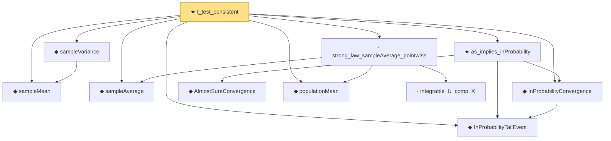

# Proof narrative — t_test_consistent

Root: **t_test_consistent** (theorem) `Statlib/HypothesisTesting/Asymptotic/TTestAsymptotic.lean:542` · topic `HypothesisTesting`
Closure: 11 declarations across 4 files. Generated from `proof_graph.json` — no files were moved.

Reading order (foundations first, headline last):

  ◆ `sampleMean` — def · `Statlib/HypothesisTesting/NormalTheory/VarianceTest.lean:15`  _(also used by 21: mle_asymptotic_normal, wald_statistic_asymptotic_chisq1, tStatistic_aemeasurable, …)_
  ◆ `sampleVariance` — def · `Statlib/HypothesisTesting/NormalTheory/VarianceTest.lean:19`  _(also used by 16: tStatistic_aemeasurable, t_statistic_asymptotic_normal, one_sample_t_confidence_interval, …)_
  ◆ `sampleAverage` — noncomputable def · `Statlib/StatFoundation/Convergence/LawOfLargeNumbers/UniformStrongLaw.lean:20`  _(also used by 4: t_statistic_asymptotic_normal, continuous_sampleAverage, strong_law_sampleAverage_finset_ae, …)_
  ◆ `InProbabilityTailEvent` — def · `Statlib/StatFoundation/Convergence/AnalysisTools/ConvergenceModes.lean:46`  _(also used by 8: CompleteConvergence, inProbabilityConvergence_of_tendstoInMeasure, isLittleOInProbability_implies_inProbabilityConvergence_zero, …)_
  ◆ `InProbabilityConvergence` — def · `Statlib/StatFoundation/Convergence/AnalysisTools/ConvergenceModes.lean:61`  _(also used by 73: tendstoInMeasure_of_inProbabilityConvergence, inProbabilityConvergence_of_tendstoInMeasure, inProbabilityConvergence_iff_tendstoInMeasure, …)_
    ◆ `AlmostSureConvergence` — def · `Statlib/StatFoundation/Convergence/AnalysisTools/ConvergenceModes.lean:35`  _(also used by 3: tendstoInMeasure_implies_subseq_as, inProbability_implies_subseq_as, complete_implies_as)_
  ★ `as_implies_inProbability` — theorem · `Statlib/StatFoundation/Convergence/AnalysisTools/ConvergenceModes.lean:886`
  ◆ `populationMean` — noncomputable def · `Statlib/StatFoundation/Convergence/LawOfLargeNumbers/UniformStrongLaw.lean:24`  _(also used by 3: strong_law_sampleAverage_finset_ae, continuous_populationMean, uniform_strong_law)_
    · `integrable_U_comp_X` — lemma · `Statlib/StatFoundation/Convergence/LawOfLargeNumbers/UniformStrongLaw.lean:29`
  · `strong_law_sampleAverage_pointwise` — lemma · `Statlib/StatFoundation/Convergence/LawOfLargeNumbers/UniformStrongLaw.lean:58`  _(also used by 1: strong_law_sampleAverage_finset_ae)_
★ `t_test_consistent` — theorem · `Statlib/HypothesisTesting/Asymptotic/TTestAsymptotic.lean:542` **← headline**

## Dependency diagram

