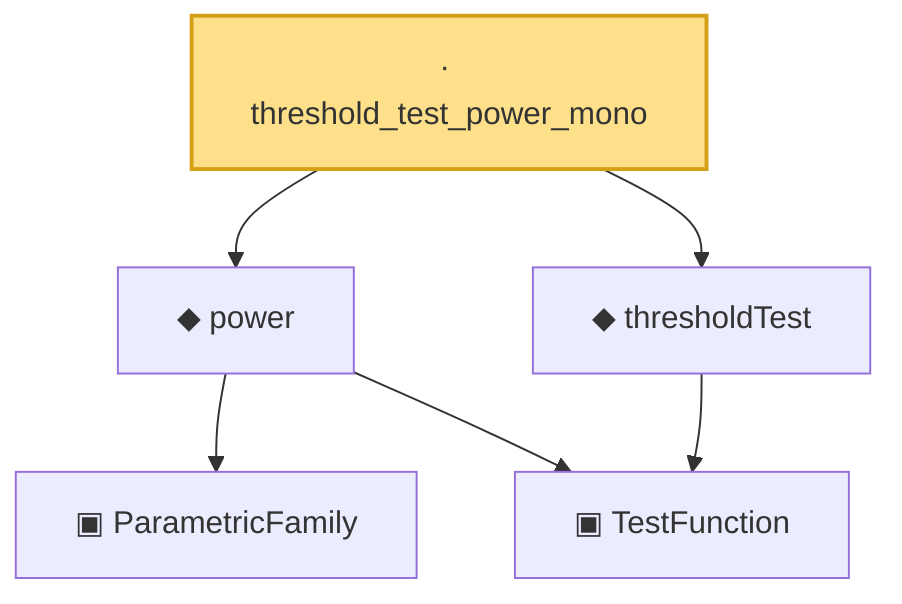

# Proof narrative — threshold_test_power_mono

Root: **threshold_test_power_mono** (lemma) `Statlib/HypothesisTesting/PValue/DecisionRule.lean:96` · topic `HypothesisTesting`
Closure: 5 declarations across 3 files. Generated from `proof_graph.json` — no files were moved.

Reading order (foundations first, headline last):

    ▣ `ParametricFamily` — structure · `Statlib/StatFoundation/Vocabulary/ParametricFamily.lean:22`  _(also used by 10: typeIError, typeIIError, size, …)_
    ▣ `TestFunction` — structure · `Statlib/HypothesisTesting/Vocabulary.lean:39`  _(also used by 23: power_add_typeII_eq_one, integrable_test_density, thresholdTest, …)_
  ◆ `power` — noncomputable def · `Statlib/HypothesisTesting/Vocabulary.lean:85`  _(also used by 17: power_add_typeII_eq_one, karlin_rubin, karlin_rubin_power_monotone, …)_
  ◆ `thresholdTest` — noncomputable def · `Statlib/HypothesisTesting/PValue/DecisionRule.lean:26`  _(also used by 2: pvalue_threshold_test_has_level, pvalue_threshold_power)_
· `threshold_test_power_mono` — lemma · `Statlib/HypothesisTesting/PValue/DecisionRule.lean:96` **← headline**

## Dependency diagram

