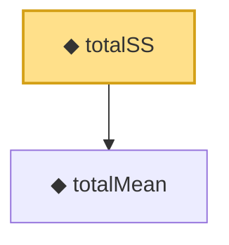

# Proof narrative — totalSS

Root: **totalSS** (def) `Statlib/HypothesisTesting/NormalTheory/ANOVA.lean:26` · topic `HypothesisTesting`
Closure: 2 declarations across 1 files. Generated from `proof_graph.json` — no files were moved.

Reading order (foundations first, headline last):

  ◆ `totalMean` — def · `Statlib/HypothesisTesting/NormalTheory/ANOVA.lean:14`  _(also used by 1: betweenSS)_
◆ `totalSS` — def · `Statlib/HypothesisTesting/NormalTheory/ANOVA.lean:26` **← headline**

## Dependency diagram

