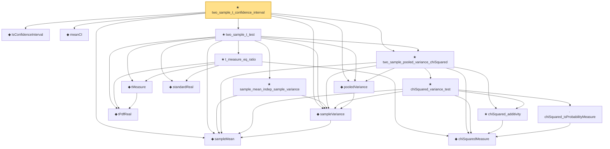

# Proof narrative — two_sample_t_confidence_interval

Root: **two_sample_t_confidence_interval** (theorem) `Statlib/HypothesisTesting/Inference/NormalTheoryConfidence.lean:262` · topic `HypothesisTesting`
Closure: 17 declarations across 7 files. Generated from `proof_graph.json` — no files were moved.

Reading order (foundations first, headline last):

  ◆ `IsConfidenceInterval` — def · `Statlib/HypothesisTesting/Inference/ConfidenceInterval.lean:33`  _(also used by 4: z_confidence_interval, one_sample_t_confidence_interval, variance_confidence_interval, …)_
  ◆ `meanCI` — def · `Statlib/HypothesisTesting/Inference/ConfidenceInterval.lean:27`  _(also used by 2: z_confidence_interval, one_sample_t_confidence_interval)_
  ◆ `sampleMean` — def · `Statlib/HypothesisTesting/NormalTheory/VarianceTest.lean:15`  _(also used by 17: mle_asymptotic_normal, wald_statistic_asymptotic_chisq1, tStatistic_aemeasurable, …)_
  ◆ `sampleVariance` — def · `Statlib/HypothesisTesting/NormalTheory/VarianceTest.lean:19`  _(also used by 11: tStatistic_aemeasurable, t_statistic_asymptotic_normal, t_test_consistent, …)_
  ◆ `pooledVariance` — def · `Statlib/HypothesisTesting/NormalTheory/VarianceTest.lean:2285`
    ◆ `tPdfReal` — noncomputable def · `Statlib/StatFoundation/Probability/TDistribution.lean:25`  _(also used by 3: t_isProbabilityMeasure, t_mean, t_variance)_
    ◆ `tMeasure` — noncomputable def · `Statlib/StatFoundation/Probability/TDistribution.lean:31`  _(also used by 4: one_sample_t_test, t_isProbabilityMeasure, t_mean, …)_
      ◆ `chiSquaredMeasure` — noncomputable def · `Statlib/StatFoundation/Probability/ChiSquared.lean:22`  _(also used by 9: single_square_law, wald_statistic_asymptotic_chisq1, score_statistic_asymptotic_chisq1, …)_
        · `chiSquared_isProbabilityMeasure` — lemma · `Statlib/StatFoundation/Probability/ChiSquared.lean:39`  _(also used by 4: wald_statistic_asymptotic_chisq1, score_statistic_asymptotic_chisq1, lrt_statistic_asymptotic_chisq1, …)_
      ★ `chiSquared_additivity` — theorem · `Statlib/StatFoundation/Probability/ChiSquared.lean:392`
      ★ `chiSquared_variance_test` — theorem · `Statlib/HypothesisTesting/NormalTheory/VarianceTest.lean:29`  _(also used by 5: one_sample_t_confidence_interval, variance_confidence_interval, one_sample_t_test, …)_
  ★ `two_sample_pooled_variance_chiSquared` — theorem · `Statlib/HypothesisTesting/NormalTheory/VarianceTest.lean:2293`
    ★ `sample_mean_indep_sample_variance` — theorem · `Statlib/HypothesisTesting/NormalTheory/TTest.lean:32`
    ◆ `standardReal` — abbrev · `Statlib/StatFoundation/RandomVariable/Gaussian/Standard.lean:31`  _(also used by 80: single_square_law, wald_statistic_asymptotic_chisq1, score_statistic_asymptotic_chisq1, …)_
    ★ `t_measure_eq_ratio` — theorem · `Statlib/StatFoundation/Probability/TDistribution.lean:573`  _(also used by 1: one_sample_t_test)_
  ★ `two_sample_t_test` — theorem · `Statlib/HypothesisTesting/NormalTheory/TTest.lean:2742`
★ `two_sample_t_confidence_interval` — theorem · `Statlib/HypothesisTesting/Inference/NormalTheoryConfidence.lean:262` **← headline**

## Dependency diagram

