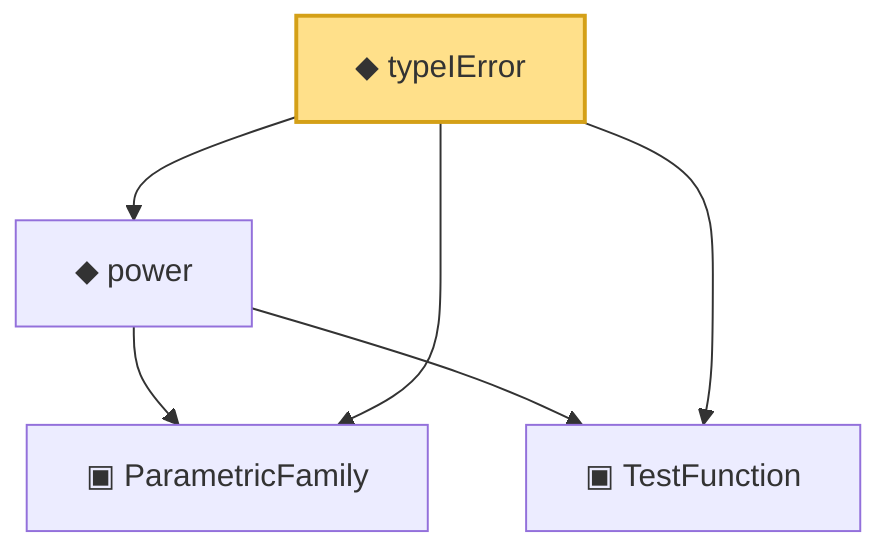

# Proof narrative — typeIError

Root: **typeIError** (noncomputable def) `Statlib/HypothesisTesting/Vocabulary.lean:90` · topic `HypothesisTesting`
Closure: 4 declarations across 2 files. Generated from `proof_graph.json` — no files were moved.

Reading order (foundations first, headline last):

  ▣ `ParametricFamily` — structure · `Statlib/StatFoundation/Vocabulary/ParametricFamily.lean:22`  _(also used by 9: typeIIError, size, HasLevel, …)_
  ▣ `TestFunction` — structure · `Statlib/HypothesisTesting/Vocabulary.lean:39`  _(also used by 22: power_add_typeII_eq_one, integrable_test_density, thresholdTest, …)_
  ◆ `power` — noncomputable def · `Statlib/HypothesisTesting/Vocabulary.lean:85`  _(also used by 17: power_add_typeII_eq_one, karlin_rubin, karlin_rubin_power_monotone, …)_
◆ `typeIError` — noncomputable def · `Statlib/HypothesisTesting/Vocabulary.lean:90` **← headline**

## Dependency diagram

